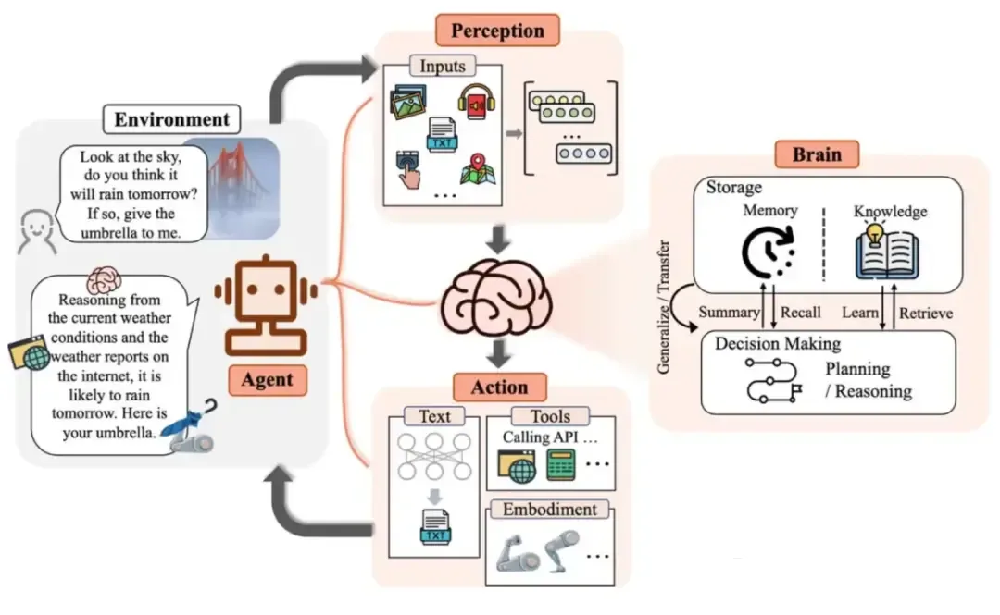
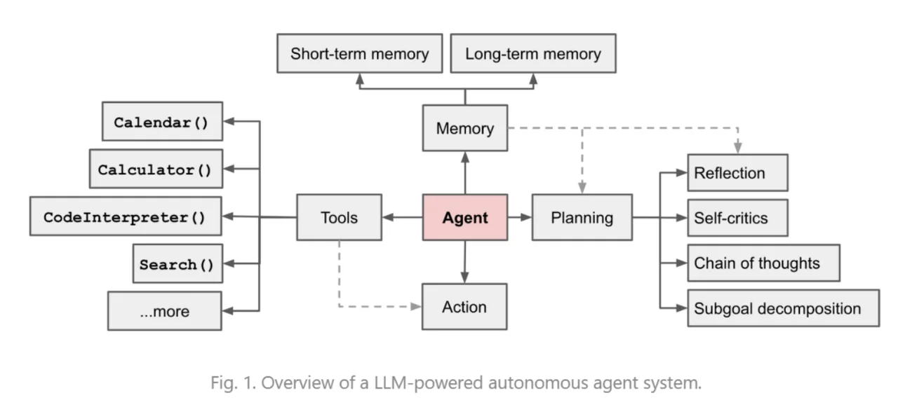

# Agent 概述

大模型存在的固有问题：**无法主动更新自己的知识，导致出现事实幻觉**。RAG（Retrieval-Augmented Generation，检索增强生成）可以一定程度上缓解这个问题，让大模型先在本地知识库中进行搜索，检查一下提示中的信息的真实性，如果真实，再进行输出；如果不真实，则进行修正。但如果本地知识库找不到相应的信息，就应该调用工具进行外部搜索，这就需要使用 Agent（Agent 能调用的工具不止外部搜索，还包括数学工具、编程工具等等）。

**Agent**（智能体）是一种能够自主决策、采取行动以达到某种目标的实体。在人工智能领域，Agent 是基于大模型技术构建的智能实体，能够感知和理解环境，并采取行动以完成特定任务。

## Agent 发展历程

Agent 的发展可以分为以下几个阶段：

### 传统 Agent 阶段（1990s-2010s）

早期的 Agent 研究主要基于符号推理和规则系统。这一时期的 Agent 具有以下特点：

- **基于规则的决策**：通过预定义的规则和逻辑进行推理
- **有限的学习能力**：主要依赖人工设计的规则，缺乏自主学习能力
- **封闭环境假设**：通常假设环境是已知且可控的

代表工作包括BDI（Belief-Desire-Intention）模型、多智能体系统（MAS）等。

### 强化学习 Agent 阶段（2010s-2020）

随着深度学习的发展，基于强化学习的 Agent 开始兴起。这一阶段的突破包括：

- **端到端学习**：通过与环境交互直接学习策略
- **复杂环境适应**：能够在不确定环境中做出决策
- **AlphaGo/AlphaStar**：展示了 Agent 在复杂博弈中的潜力

但这一阶段的 Agent 仍然面临泛化能力不足、训练数据需求大等问题。

### LLM Agent 阶段（2023-至今）

大语言模型的出现彻底改变了 Agent 的发展范式：

- **2023年3月**：AutoGPT 发布，标志着 LLM Agent 时代的开始
- **2023年10月**：OpenAI 推出 GPTs 和 Assistants API，让 Agent 开发门槛大幅降低
- **2024年**：多智能体框架（如 CrewAI、MetaGPT）快速发展
- **2025年**：MCP 协议、Agent Skills 等标准化方案出现，推动 Agent 生态成熟

LLM Agent 的核心优势在于：

1. **自然语言理解**：无需编写复杂的规则，通过自然语言即可定义任务
2. **泛化能力**：能够处理训练时未见过的新任务
3. **工具使用**：通过 Function Calling 机制调用外部工具
4. **推理能力**：具备 CoT（Chain of Thought，思维链）等推理能力

## Agent 与传统 AI 的区别

| 维度 | 传统 AI | LLM Agent |
|------|---------|-----------|
| **决策方式** | 基于规则或训练好的模型 | 基于大模型的推理能力 |
| **学习方式** | 需要大量标注数据进行训练 | 少样本或零样本学习 |
| **环境交互** | 通常在封闭环境中运行 | 可以与外部环境动态交互 |
| **任务泛化** | 专用于特定任务 | 可以处理多种不同类型的任务 |
| **可解释性** | 通常较难解释决策过程 | 通过 CoT 可以展示推理过程 |
| **开发成本** | 需要大量领域知识和数据 | 通过 Prompt 即可快速开发 |

从人机合作的角度出发，Agent 改变了人机合作的方式。截至现在，主要有三种模式：

- **人类主导**：代表是**SaaS+AI模式**，人类完成大多数工作，而AI只负责完成特定任务。例如AI只负责实现人脸识别、OCR等能力，嵌入到人类操作的SaaS软件中，其他功能AI不参与。

- **AI作为人类助手**：代表是**Copilot模式**，AI可以随时辅助人类完成各种任务，不再局限于特定的功能。

- **AI主导**：代表**Agent模式**，人类只负责提出需求，在AI负责完成的过程中，可能需要人类进行进一步的描述需求、点评AI生成内容质量、矫正AI理解等。而Agent正是通往AGI（Artificial General Intelligence，通用人工智能）的必经之路。

## Agent 核心架构

从结构上来说，一个Agent包括三个部分，如下图所示：

- **Perception（输入）：**Agent通过文字输入、传感器、摄像头、麦克风等等，建立起对外部世界或环境的感知。

- **Brain（大脑）：**大脑是Agent最重要的部分，包括信息存储、记忆、知识库、规划决策系统。

- **Action（行动）：**基于Brain给出的决策进行下一步行动，对于Agent来说，行动主要包括对外部工具的API 调用，或者对物理控制组件的信号输出。

从功能的角度来看，Agent 就像一个多功能的接口，它能够接触并使用一套工具。根据用户的输入，Agent会规划出一条解决用户问题的路线，决定其中需要调用哪些工具，并调用这些工具。Agent = 大语言模型+规划+记忆+工具使用，具备以下关键能力：

- **规划（Planning）**：最核心最关键的部分，负责拆解复杂任务为可执行的子任务，并规划执行任务的流程。同时Agent还会对任务执行的过程进行思考和反思，决定是否继续执行任务，并改进决策策略。

    - **任务分解**：将复杂任务分解为可执行的子任务，让大模型逐步解决，例如将订外卖分解为选择餐厅+选择菜品两步。关键技术例如CoT、LLM+P等。

    - **反思**：Agent 通过完善过去的行动决策和纠正以前的错误来不断改进。关键技术例如React、Reflexion等。

- **记忆（Memory）**：包括短期记忆和长期记忆，用于存储会话上下文和业务数据等信息，来优化未来行为。

    - **短时记忆**：即上下文学习，由于受到Transformer上下文窗口长度的限制，它是短暂的和有限的。

    - **长期记忆**：则可对应为外部的向量数据存储，Agent 可在查询时引用，并可通过快速检索进行访问。

- **工具使用（Tools）**：通过调用外部工具（如API、插件）扩展Agent的能力，如文档解析、代码编译等。

## Agent 开发框架详细对比

### 低代码框架

低代码框架无需代码就能在线完成Agent开发，适合快速原型验证和非技术人员使用。

| 框架 | 开发商 | 特点 | 适用场景 |
|------|--------|------|----------|
| **扣子coze** | 字节跳动 | 中文生态完善，支持插件市场 | 国内用户快速开发 |
| **通义千问** | 阿里巴巴 | 与阿里云生态深度集成 | 企业级应用 |
| **文心智能体** | 百度 | 集成百度搜索和知识图谱 | 需要百度生态的场景 |
| **元器智能体** | 腾讯 | 支持微信生态集成 | 微信生态应用 |
| **Dify** | Dify.AI | 开源可部署，支持私有化 | 数据敏感场景 |
| **Fastgpt** | Fastgpt | 轻量级，专注于知识库问答 | RAG场景 |

### 基础框架

利用大模型原生能力进行Agent开发，适合理解底层机制。

- **Function Calling**：OpenAI推出的工具调用机制，是所有Agent框架的基础。通过定义函数的JSON Schema，让大模型能够理解并调用外部工具。

### 代码框架

代码框架提供更大的灵活性和控制力，适合有编程能力的开发者。

| 框架 | 特点 | 学习曲线 | 适用场景 |
|------|------|----------|----------|
| **LangChain** | 生态最完善，组件丰富 | 中等 | 快速开发各种Agent应用 |
| **LangGraph** | 基于图的状态管理，适合复杂流程 | 较高 | 多步骤、有状态的任务 |
| **LlamaIndex** | 专注于数据索引和RAG | 中等 | 知识密集型应用 |

### 多智能体框架

多智能体框架支持多个Agent协作完成复杂任务。

| 框架 | 特点 | 适用场景 |
|------|------|----------|
| **CrewAI** | 角色扮演，支持任务委派 | 团队协作模拟 |
| **Swarm** | OpenAI出品，轻量级 | 简单的多Agent场景 |
| **MetaGPT** | 模拟软件开发团队 | 软件开发自动化 |
| **AutoGen** | 微软出品，支持人类参与 | 人机协作场景 |

### 框架选型建议

1. **快速验证想法**：选择低代码框架（如 Dify、coze）
2. **学习Agent原理**：从 Function Calling 开始，再学习 LangChain
3. **生产环境部署**：选择 LangGraph 或 LlamaIndex
4. **多Agent协作**：根据具体需求选择 CrewAI 或 MetaGPT
5. **数据敏感场景**：选择开源可私有化部署的框架（如 Dify、Fastgpt）

## 开放式问题：谈谈你对Agent的理解

> 这个问题准确来说，应该是谈谈你对基于大模型的Agent的理解（之前在介绍强化学习时，也有Agent的概念，本章中讲的Agent特指基于LLM的Agent）。

在Agent诞生之前，有两种方式能使机器智能化：

- **基于规则的方法**：将人类指令转化成机器能理解的规则符号，这需要有丰富经验的人类专家，并且容错很低。

- **基于强化学习的方法**：构建策略模型和奖励模型，需要大量的数据进行训练。

随着大模型的诞生，人类利用其在逻辑推理、工具应用、策略规划等方面的能力，构建以大模型为核心的Agent系统，极大的提升了机器的智能化程度。当然，为了进一步提升Agent的性能，还提出了CoT等规划方法、引入记忆和工具模块，使得Agent越来越逼近人类的思考方式。

**总结**：Agent 的核心价值在于将大模型的推理能力与外部工具和环境交互能力相结合，从而能够自主完成复杂的任务。从发展历程来看，Agent 正在从"被动响应"向"主动规划"演进，从"单一任务"向"多任务协作"发展。随着 MCP 协议、Agent Skills 等标准化方案的成熟，Agent 生态正在快速走向规范化和可互操作。