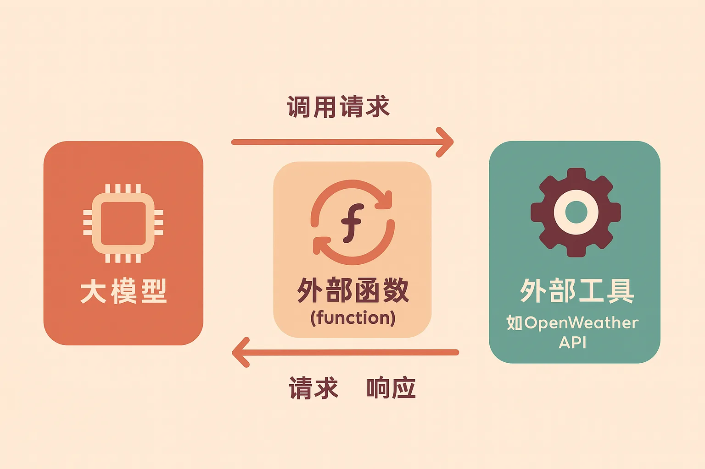
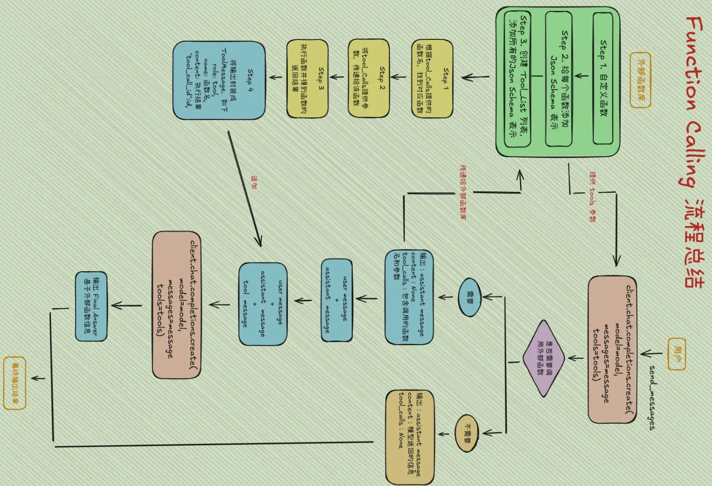
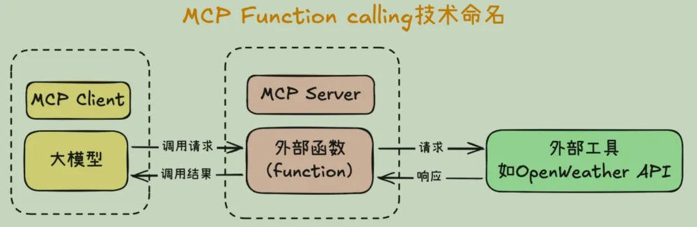
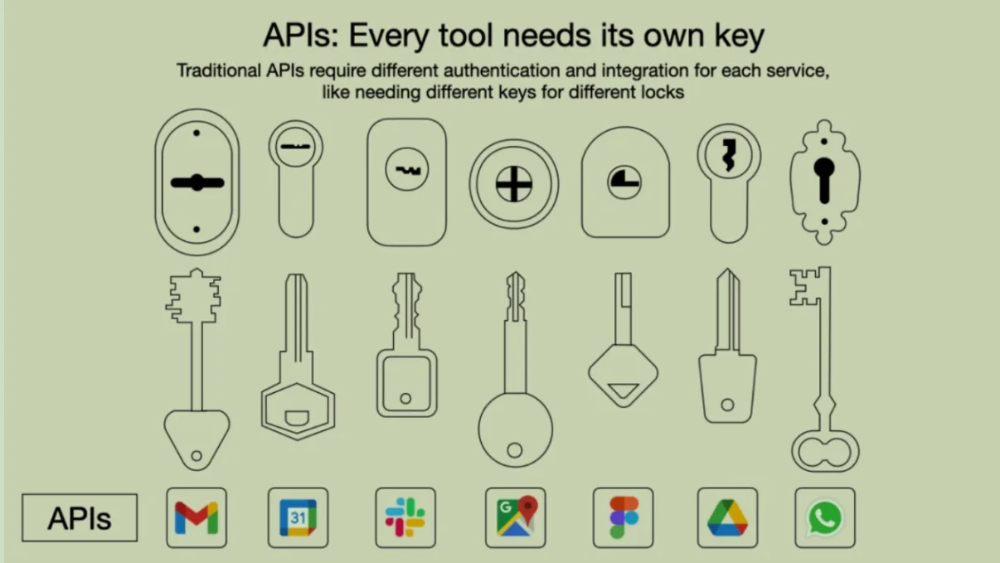
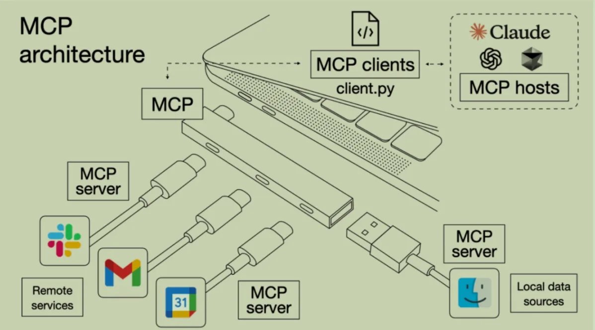

# MCP

## 从 Function calling 到 MCP

### Function calling

能调用外部工具，是大模型进化为智能体Agent的关键，如果不能使用外部工具，大模型就只能是个简单的聊天机器人，甚至连查询天气都做不到。**Function calling**就是解决这一问题的，作为大模型和外部工具之间的中介，使得大模型能间接的调用外部工具。根据用户的问题判定何时需要调用外部工具，并以结构化 JSON 输出调用信息，外部系统据此执行相应操作，再将结果回传给模型，最终由模型基于真实数据生成回答。


接下来结合Qwen模型介绍Function call的流程，首先定义了一个查询当前天气的函数：

```JSON
{
    "type": "function",
    "function": {
        "name": "get_current_weather",
        "description": "当你想查询指定城市的天气时非常有用。",
        "parameters": {
            "type": "object",
            "properties": {
                "location": {
                    "type": "string",
                    "description": "城市或县区，比如北京市、杭州市、余杭区等。",
                }
            },
            "required": ["location"]
        }
    }
}
```

#### 工具调用判定

大模型会在生成回答时判断用户需求是否超出自身知识范围，若需调用工具便会输出特殊标记（ 如 `\<tool\_call\>`）来表明需要调用函数。现有大模型经过微调，需要用工具时能够较高概率地正确调用，能正确的生成特殊标记。

#### 生成函数调用

在 `\<tool\_call\>` 标记后，模型输出严格遵循预先提供的 JSON Schema，包含 `name` 和 `arguments` 字段，描述要调用的函数名及参数 。

```Bash
<tool_call>
{"name": "get_current_weather", "arguments": {"city":"北京"}}
</tool_call>
```

在Qwen的系统信息中就包含JSON Schema格式的函数定义，通过提示词要求大模型返回包含函数名和参数的JSON对象，并放在 `\<tool\_call\>` ... `\</tool\_call\>` 标签内。并且模型也进行了函数调用的微调，保证模型能按格式生成调用。

#### 工具执行

外部调度器（Orchestrator）解析模型输出的 JSON 调用请求，将其映射到实际的工具/函数实现，并传入相应参数执行。具体流程为：

- **输出解析**：通过正则表达式匹配所有Json串，并反序列化为Python对象。

- **函数运行**：根据函数名映射到对应的函数，并将 `arguments` 中的字段作为参数，并调用对应的函数。

#### 模型输出

工具执行结果被封装成 `\<tool\_response\> \.\.\. \</tool\_response\>` 消息，追加到对话历史中，供模型下一轮生成时参考。Qwen会将工具响应作为用户信息插入对话，因为希望模型将工具响应作为新的信息源，让模型基于此再回答：

```Python
{
    'role': 'user',
    'content': '<tool_response>
        {"weather": [..气温信息..]}
        </tool_response>'
}
```

最后，再次调用大模型读取 `\<tool\_response\>` 中的信息，生成准确的最终答案。

### MCP

2024 年 11 月，Claude 母公司 Anthropic 正式推出了 MCP（Model Context Protocol）。这一技术协议旨在为Agent开发建立统一规范，通过约定共同遵守的技术标准，大幅提升多人协作开发Agent的效率。

MCP 着力解决智能体开发中一个核心痛点 —— 外部工具调用的技术门槛过高问题。由于大型语言模型自身缺乏与外部工具直接通信的能力，传统开发中只能依赖 "函数调用"（Function calling）作为中介桥梁，由大模型间接触发外部函数执行：



编写Function calling函数工作量很大（随便一个函数就要100+行代码），并且为了让大模型理解这个函数，需要用Json Schema格式编写功能说明，并设计提示词模板。

```JSON
**JSON Schema** 是一种用于描述和验证JSON数据结构的标准化格式，在Function calling中扮演**函数接口说明书**
的角色。其核心作用是为大模型提供精准的**函数调用规范**，确保模型生成的参数格式正确。下面的例子中，指明了
Function名字和功能，以及入参类型、参数可选值、是否必须和参数描述等信息。
{
  "name": "get_weather",
  "description": "查询指定地点的天气信息",
  "parameters": {
    "type": "object",
    "properties": {
      "location": {
        "type": "string",
        "description": "城市名称，如'北京'"
      },
      "unit": {
        "type": "string",
        "enum": ["celsius", "fahrenheit"],
        "description": "温度单位"
      }
    },
    "required": ["location"]
  }
}
```

```markdown
提示词模板是预定义的**结构化指令框架**，用于引导大模型准确触发函数调用。其本质是通过工程化设计，
**将自然语言指令转化为机器可解析的逻辑流**。例如：

你是一个智能天气助手，请按以下步骤响应用户：
1. **意图识别**：判断用户是否在询问天气
2. **参数提取**：
   - 若需查询天气，提取地点(location)和单位(unit)
   - 若未明确单位，默认使用摄氏制
3. **函数调用**：严格按JSON格式返回调用指令：
   {
     "function": "get_weather",
     "arguments": {"location": "北京", "unit": "celsius"}
   }
```



MCP统一了Function calling的运行规范：

- 首先是先统一名称，MCP把大模型运行环境称作 **MCP Client**，也就是MCP客户端，同时，把外部函数运行环境称作**MCP Server**，也就是MCP服务器。

- 然后，统一MCP客户端和服务器的运行规范，并且要求MCP客户端和服务器之间，也统一按照某个既定的提示词模板进行通信。



使用MCP的好处在于可以避免外部函数重复编写。 像查询天气、网页爬取、查询本地MySQL数据库这种通用的需求，只需要开发一个服务器就好，后续的开发者可以直接调用服务而不用重新实现。MCP开发工具支持Python、TS和Java等多种语言。想要使用MCP服务器就要构建MCP客户端（支持任意本地和在线大模型，甚至是Cursor）。而如果没有所需要的MCP服务器，就要自己开发，下面的代码给出了一个简单的服务器示例

```Python
# server.py
from mcp.server.fastmcp import FastMCP
# Create an MCP server
mcp = FastMCP("Demo")
# Add an addition tool
@mcp.tool()
def add(a:int,b:int)-> int:
    """Add two numbers"""
    return a+ b
# Add a dynamic greeting resource
@mcp.resource("greeting://{name}")
def get greeting(name:str)->str:
    """Get a personalized greeting"""
    return f"Hello, {name}!"
```

> MCP针对agent的tools模块，目前不涉及memory和planning模块。

下图形象的对比了Function calling调用API和使用MCP的差异，MCP就像转接口，将多种多样的API封装成统一格式的mcp server，允许client端的大模型调用。





> MCP是一种更底层的Agent开发框架，与之前介绍的[Agent开发框架](https://fp9qo5yj6d.feishu.cn/docx/AN61dRfiWoRUiRxhc6ucbmJwnGr#share-LttcdLPg7ojkvLxvjPHcZm9En5c)不冲突。

## MCP客户端

### uv环境管理

uv 是一个**Python 依赖管理工具**，类似于pip 和 conda ，但它更快、更高效，并且可以更好地管理 Python 虚拟环境和依赖项。它的核心目标是替代 pip 、 venv 和 pip-tools ，提供更好的性能和更低的管理开销。

uv **的特点**：

1. **速度更快**：相比 pip ， uv 采用 Rust 编写，性能更优。

2. **支持 PEP 582**：无需 virtualenv ，可以直接使用 pypackages 进行管理。

3. **兼容 **pip ：支持 requirements.txt 和 pyproject.toml 依赖管理。

4. **替代 **venv ：提供 uv venv 进行虚拟环境管理，比 venv 更轻量。

5. **跨平台**：支持 Windows、macOS 和 Linux。

```Python
# 安装uv
pip install uv
# **安装 Python 依赖，等效于pip install requests**
uv pip install pandas
# **创建虚拟环境，等效于python -m venv myenv**
uv venv myenv
# 激活虚拟环境
source myenv/bin/activate
# 安装所需的包，等效于pip install -r requirements.txt
uv pip install -r requirements.txt
# 运行 python 项目，等效于python script.py
uv run python script.py
```

### MCP客户端搭建

```Python
# 创建目录
uv init mcp-client 
cd mcp-client
# 创建虚拟环境并激活
uv venv
source .venv/bin/activate
# 安装 MCP SDK 
uv add mcp
```

创建一个简单的MCP客户端，核心功能有：

- 初始化 MCP 客户端

- 提供一个命令行交互界面

- 模拟 MCP 服务器连接

- 支持用户输入查询并返回「模拟回复」

- 支持安全退出

```python
import asyncio # 让代码支持异步操作 
from mcp import ClientSession # MCP 客户端会话管理 
from contextlib import AsyncExitStack # 资源管理（确保客户端关闭时释放资源）

class MCPClient:
    def __init__(self):
        """初始化 MCP 客户端"""
        # 核心概念：会话，可以获取外部工具列表，保存当前会话状态等功能，暂时不链接MCP服务器
        self.session = None
        # 异步通信资源管理器
        self.exit_stack = AsyncExitStack()
    async def connect_to_mock_server(self):
        """模拟 MCP 服务器的连接（暂不连接真实服务器）"""
        print("✅ MCP 客户端已初始化，但未连接到服务器")
    async def chat_loop(self):
        """运行交互式聊天循环"""
        print("\nMCP 客户端已启动！输入 'quit' 退出")
        while True:
            try:
                query = input("\nQuery: ").strip()
                if query.lower() == 'quit':
                    break
                print(f"\n🤖 [Mock Response] 你说的是：{query}")
            except Exception as e:
                print(f"\n⚠️ 发生错误: {str(e)}")
    async def cleanup(self):
        """清理资源"""
        await self.exit_stack.aclose() # 关闭资源管理器
async def main(): 
    client = MCPClient() # 创建 MCP 客户端 
    try: 
        await client.connect_to_mock_server() # 连接（模拟）服务器 
        await client.chat_loop() # 进入聊天循环 
    finally: 
        await client.cleanup() # 确保退出时清理资源
if __name__ == "__main__":
    asyncio.run(main())
```

### 接入在线模型

```python
import asyncio
import os
from openai import OpenAI
from dotenv import load_dotenv
from contextlib import AsyncExitStack
# 加载 .env 文件，确保 API Key 受到保护，需要在.env文件中写入：
    # BASE_URL="https://ai.devtool.tech/proxy/v1"
    # MODEL=gpt-4o
    # OPENAI_API_KEY="your_api_key"
load_dotenv()
class MCPClient:
    def __init__(self):
        """初始化 MCP 客户端"""
        self.exit_stack = AsyncExitStack()
        self.openai_api_key = os.getenv("OPENAI_API_KEY") # 读取 OpenAI API Key
        self.base_url = os.getenv("BASE_URL") # 读取 BASE YRL
        self.model = os.getenv("MODEL") # 读取 model
        if not self.openai_api_key:
            raise ValueError("❌ 未找到 OpenAI API Key，请在 .env 文件中设置OPENAI_API_KEY")
        self.client = OpenAI(api_key=self.openai_api_key, base_url=self.base_url)
    async def process_query(self, query: str) -> str:
        """调用 OpenAI API 处理用户查询"""
        messages = [{"role": "system", "content": "你是一个智能助手，帮助用户回答问题。"},
        {"role": "user", "content": query}]
        try:
        # 调用 OpenAI API,将 OpenAI API 变成异步任务，防止程序卡顿。
            response = await asyncio.get_event_loop().run_in_executor(
                None,
                lambda: self.client.chat.completions.create(
                    model=self.model,
                    messages=messages
                )
            )
            return response.choices[0].message.content
        except Exception as e:
            return f"⚠️ 调用 OpenAI API 时出错: {str(e)}"
    async def chat_loop(self):
        """运行交互式聊天循环"""
        print("\n🤖 MCP 客户端已启动！输入 'quit' 退出")
        while True:
            try:
                query = input("\n你: ").strip()
                if query.lower() == 'quit':
                    break
                response = await self.process_query(query) # 发送用户输入到 OpenAI API
                print(f"\n🤖 OpenAI: {response}")
            except Exception as e:
                print(f"\n⚠️ 发生错误: {str(e)}")
    async def cleanup(self):
        """清理资源"""
        await self.exit_stack.aclose()
async def main():
    client = MCPClient()
    try:
        await client.chat_loop()
    finally:
        await client.cleanup()
if __name__ == "__main__":
    asyncio.run(main())
```

### 部署本地模型

#### 使用vllm库部署QwQ-32B

模型比较大，采用huggingface担心网络不稳定，可以用modelscope下载模型

```Plain Text
pip install modelscope
modelscope download --model Qwen/QwQ-32B --local_dir ./QwQ-32B
```

安装vllm库

```Plain Text
pip install vllm
```

开启vllm

```Plain Text
vllm serve ./QwQ-32B --max-model-len 32768 # 32k上下文单卡
CUDA_VISIBLE_DEVICES=0,1 vllm serve ./QwQ-32B --tensor-parallel-size 2 # 128k上下文双卡
```

在jupyter中运行以下代码：

```Plain Text
from openai import OpenAI
openai_api_key = "EMPTY"
openai_api_base = "http://localhost:8000/v1"

client = OpenAI(
    api_key=openai_api_key,
    base_url=openai_api_base,
)
prompt = "在单词\"strawberry\"中，总共有几个R？"
messages = [
    {"role": "user", "content": prompt}
]
response = client.chat.completions.create(
    model="QWQ-32B/",
    messages=messages,
)

print(response.choices[0].message.content)
```

## MCP服务器端

Server端可以提供以下三种标准能力：

- **Resources：**资源，类似于文件数据读取，可以是文件资源或是API响应返回的内容。

- **Tools：**工具，第三方服务、功能函数，通过此可控制LLM可调用哪些函数。

- **Prompts：**提示词，为用户预先定义好的完成特定任务的模板。

### 通信机制

MCP目前支持两种传输方式：

- **标准输入输出（stdio）**：用于本地通信的传输方式。在这种模式下，MCP 客户端会将服务器程序作为子进程启动，双方通过标准输入（stdin）和标准输出（stdout）进行数据交换。这种方式适用于客户端和服务器在同一台机器上运行的场景，确保了高效、低延迟的通信。

- **HTTP+SSE**：适用于客户端和服务器位于不同物理位置的场景。在这种模式下，客户端和服务器通过 HTTP 协议进行通信，利用 SSE 实现服务器向客户端的实时数据推送。

### 天气查询服务器搭建

搭建了一个提供天气查询的工具的server，通过http请求查询天气。

```Plain Text
uv add httpx
```

```python
import json
import httpx
from typing import Any
from mcp.server.fastmcp import FastMCP
import os
from dotenv import load_dotenv

# 加载环境变量
load_dotenv(" .env")

# 初始化 MCP 服务器
mcp = FastMCP("weatherServer")

# OpenWeather API 配置
OPENWEATHER_API_BASE = "https://api.openweathermap.org/data/2.5/weather"
API_KEY = os.getenv("OpenWeather_API_KEY")  # 请替换为你自己的 OpenWeather API Key
USER_AGENT = "weather-app/1.0"

# 异步获取天气数据
async def fetch_weather(city: str) -> dict[str, Any] | None:
    """
    从 OpenWeather API 获取天气信息。
    :param city: 城市名称（需使用英文，如 Beijing）
    :return: 天气数据字典，若出错返回包含 error 信息的字典
    """
    params = {
        "q": city,
        "appid": API_KEY,
        "units": "metric",
        "lang": "zh_cn"
    }
    headers = {"User-Agent": USER_AGENT}
    # 使用 httpx.AsyncClient() 发送异步 GET 请求到 OpenWeather API。
    async with httpx.AsyncClient() as client:
        try:
            response = await client.get(OPENWEATHER_API_BASE, params=params, headers=headers, timeout=30.0)
            response.raise_for_status()
            return response.json()  # 返回字典类型
        except httpx.HTTPStatusError as e:
            return {"error": f"HTTP 错误: {e.response.status_code}"}
        except Exception as e:
            return {"error": f"请求失败: {str(e)}"}

# 天气数据格式化
def format_weather(data: dict[str, Any] | str) -> str:
    """
    将天气数据格式化为易读文本。
    :param data: 天气数据（可以是字典或 JSON 字符串）
    :return: 格式化后的天气信息字符串
    """
    # 如果传入的是字符串，则先转换为字典
    if isinstance(data, str):
        try:
            data = json.loads(data)
        except Exception as e:
            return f"无法解析天气数据: {e}"

    # 如果数据中含错误信息，直接返回错误提示
    if "error" in data:
        return f"{data['error']}"

    # 提取数据做容错处理
    city = data.get("name", "未知")
    country = data.get("sys", {}).get("country", "未知")
    temp = data.get("main", {}).get("temp", "N/A")
    humidity = data.get("main", {}).get("humidity", "N/A")
    wind_speed = data.get("wind", {}).get("speed", "N/A")

    # weather 是一个列表，因此此处用 [{}] 前先提供默认字典
    weather_list = data.get("weather", [{}])
    description = weather_list[0].get("description", "未知")

    return (
        f"🌍 {city}, {country}\n"
        f"🌡️ 温度: {temp}°C\n"
        f"💧 湿度: {humidity}%\n"
        f"🌬️ 风速: {wind_speed} m/s\n"
        f"☁️ 天气: {description}\n"
    )

@mcp.tool()
async def query_weather(city: str) -> str:
    """
    输入指定城市的英文名称，返回今日天气查询结果。
    :param city: 城市名称（需使用英文）
    :return: 格式化后的天气信息
    """
    data = await fetch_weather(city)
    return format_weather(data)

if __name__ == "__main__":
    # 以标准 I/O 方式运行 MCP 服务器，也就是本地进程间通信IPC，服务器作为子进程运行，
    # 并通过标准输入输出(stdin/stdout)进行数据交换
    mcp.run(transport='stdio')

```

接下来实现一个与调用这个server的client端，以与大模型对话的形式呈现，只有问天气查询的问题时调用工具，否则就是与大模型对话。

```python
import asyncio
import os
import json
import sys
from typing import Optional
from contextlib import AsyncExitStack

from openai import OpenAI
from dotenv import load_dotenv

from mcp import ClientSession, StdioServerParameters
from mcp.client.stdio import stdio_client

*# 加载环境变量*
load_dotenv()

**class** MCPClient:
    **def** __init__(self):
        """初始化 MCP 客户端"""
        self.exit_stack = AsyncExitStack()# **统一管理异步上下文**（如 MCP 连接）的生命周期。可以在退出（ cleanup ）时自动关闭
        self.openai_api_key = os.getenv("OPENAI_API_KEY")
        self.base_url = os.getenv("BASE_URL")
        self.model = os.getenv("MODEL")
        
        if not self.openai_api_key:
            raise ValueError("✕ 未找到 OpenAI API Key，请在 .env 文件中设置 OPENAI_API_KEY")
        
        self.client = OpenAI(api_key=self.openai_api_key, base_url=self.base_url)
        self.session: Optional[ClientSession] = None # 用于保存 **MCP 的客户端会话**，默认是 None ，稍后通过 connect_to_server 进行连接

    async **def** connect_to_server(self, server_script_path: str):
        """连接到 MCP 服务器并列出可用工具"""
        is_python = server_script_path.endswith('.py')
        is_js = server_script_path.endswith('.js')

        if not (is_python or is_js):
            raise ValueError("服务器脚本必须是 .py 或 .js 文件")
        # 判断服务器脚本是 **Python **还是 **Node.js**，选择对应的运行命令。
        command = "python" if is_python else "node"
        server_params = StdioServerParameters(
            command=command,
            args=[server_script_path],
            env=None
        )

        *# 启动服务器连接*
        stdio_transport = await self.exit_stack.enter_async_context(
            stdio_client(server_params)
        )
        self.stdio, self.write = stdio_transport
        self.session = await self.exit_stack.enter_async_context(
            ClientSession(self.stdio, self.write)
        )# 发送初始化消息给服务器，等待服务器就绪。

        await self.session.initialize()

        *# 列出可用工具*
        response = await self.session.list_tools()
        print("\n已连接到服务器，支持以下工具:", [tool.name for tool in response.tools])

    async **def** process_query(self, query: str) -> str:
        """使用大模型处理查询并调用工具"""
        messages = [{"role": "user", "content": query}]
        response = await self.session.list_tools()

        *# 构建可用工具列表*
        available_tools = [
            {
                "type": "function",
                "function": {
                    "name": tool.name, *# 工具的名字*
                    "description": tool.description, *# 外部函数的描述*
                    "parameters": tool.inputSchema  *# 如果要调用这个函数，需要的json_schema说明*
                }
            } for tool in response.tools
        ]

        *# 第一次模型调用*
        response = self.client.chat.completions.create(
            model=self.model,
            messages=messages,
            tools=available_tools
        )

        content = response.choices[0]
        *# 如何是需要使用工具，就解析工具*
        if content.finish_reason == "tool_calls":
            tool_call = content.message.tool_calls[0]
            tool_name = tool_call.function.name
            tool_args = json.loads(tool_call.function.arguments)

            *# 执行工具调用*
            print(f"\n\n[调用工具 {tool_name}，参数 {tool_args}]\n")
            result = await self.session.call_tool(tool_name, tool_args)
            
            *# 将模型返回的调用哪个工具数据和工具执行完成后的数据都存入messages中*
            messages.append(content.message.model_dump())
            messages.append({
                "role": "tool",
                "content": result.content[0].text,
                "tool_call_id": tool_call.id
            })
            *# 将工具调用的结果再返回给大模型用于生产最终的结果*
            response = self.client.chat.completions.create(
                model=self.model,
                messages=messages
            )
            return response.choices[0].message.content
        
        return content.message.content

    async **def** chat_loop(self):
        """运行交互式聊天循环"""
        print("\n客户端已启动！输入 'quit' 退出")

        while True:
            try:
                query = input("\n你: ").strip()
                if query.lower() == 'quit':
                    break

                response = await self.process_query(query)
                print(f"\nopenAI: {response}")

            except Exception as e:
                print(f"\n发生错误: {str(e)}")

    async **def** cleanup(self):
        """清理资源"""
        await self.exit_stack.aclose()

async **def** main():
    if len(sys.argv) < 2:
        print("用法: python client.py <服务端脚本路径>")
        sys.exit(1)

    client = MCPClient()
    try:
        await client.connect_to_server(sys.argv[1])
        await client.chat_loop()
    finally:
        await client.cleanup()

if __name__ == "__main__":
    asyncio.run(main())
```

```Plain Text
uv run client.py server.py
```

**MCPClient 的主要职责**：

- **启动 MCP 服务器**（通过 StdioServerParameters ）

- **建立 MCP 会话**，列出可用工具

- **处理用户输入**，将其发送给 OpenAI 模型

- **如果模型想调用 MCP 工具（Function Calling）**，就执行 call_tool

- **将结果重新发给模型**，并返回最终回答

### 测试服务器

Anthropic提供了一个非常便捷的debug工具：Inspector。借助Inspector，我们能够非常快捷的调用各类server，并测试其功能。

```Plain Text
mcp dev xx.py
```

**在线服务器导航**：

- MCP官方服务器合集：https://github.com/modelcontextprotocol/servers

- MCP Github热门导航：https://github.com/punkpeye/awesome-mcp-servers

- https://mcp.so/

- https://mcpservers.cn/

- https://smithery.ai/

### 用MCP实现秒回功能

视频：https://mp.weixin.qq.com/s/0EILiRUgHlNtPrCdDJm28g

代码：https://github.com/saintGeorge13/wx-mcp/tree/main
