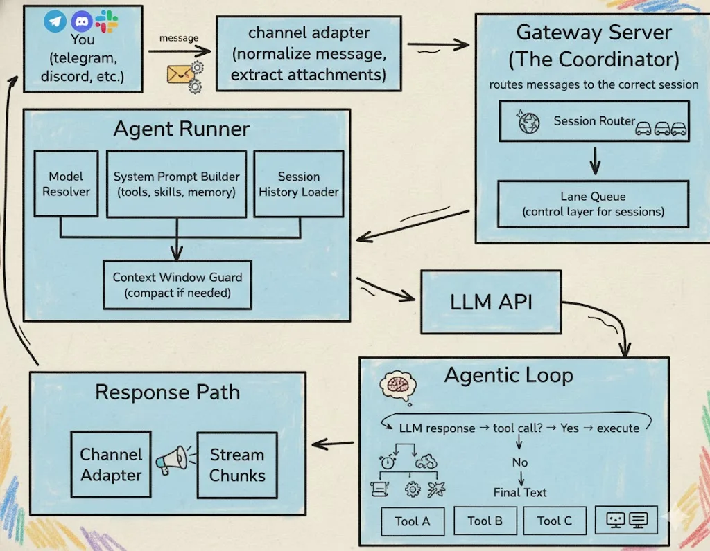

# OpenClaw 原则

看到星球里的同学提到这个问题[https://t.zsxq.com/uKDAc](https://t.zsxq.com/uKDAc)

OpenClaw这个项目本身主要是开发岗的工作，其中一些特殊skills的开发才会是算法岗的工作范畴。

作为 2026 年开年爆火的开源 AI Agent 项目，阿里云、腾讯云、百度智能云等厂商也纷纷推出OpenClaw一键部署功能，可见其技术影响力。

> 阿里云的部署教程在https://mp.weixin.qq.com/s/Ll49bAhMf_v8LhbZQOUMrw

本文将从**定位、架构、底层内核、设计亮点**四个维度，把 OpenClaw 的运行原理讲透，从技术环节到核心组件，从记忆机制到安全策略，让你既能理解整体逻辑，也能轻松应对面试。

先附上项目核心地址，方便大家对照：

- 官网：https://openclaw.ai/

- 主仓库：[https://github.com/openclaw/openclaw](https://github.com/openclaw/openclaw)

- 技能仓库（ClawHub）：[https://clawhub.ai/](https://clawhub.ai/)（数千个社区贡献的插件功能）

首先明确定位：OpenClaw 绝非简单的聊天机器人，而是将**本地算力 + 大模型 Agent 自动化**发挥到极致的开源智能体框架。它最核心的设计亮点是**将推理引擎与执行环境解耦**，通过标准化协议实现复杂任务的自主编排，让 AI 能在本地设备上完成文件操作、命令执行、跨平台消息响应等一系列自动化工作。

### 架构：基于通道的任务流水线

OpenClaw 遵循 "核心极小、分层清晰" 的设计哲学，所有用户指令的处理都遵循标准化的流水线流程，从消息接收至结果返回，共分为**5 个技术环节**，环环相扣且职责明确：

1. **Channel Adapters：消息标准化入口**

作为 OpenClaw 与外部交互的第一道关口，负责接收来自 Telegram、WhatsApp、飞书、Discord 等各类 IM 工具的消息，核心做两件事：**标准化预处理**（将不同 IM 的消息格式统一，规避格式差异带来的解析问题）+**附件提取**（自动识别并提取图片、文档、音频等附件内容）。每个 IM 软件都有专属的 Adapter，保证不同渠道的消息能被系统统一识别，这是 OpenClaw 实现多渠道适配的基础。

2. **Gateway：系统中枢，指令分发与结果回传核心**

Gateway 是 OpenClaw 的** 协调器**，相当于整个系统的大脑中枢，负责接收各个 Channel 的标准化用户指令，精准分发到对应的 Agent 处理，同时接收 Agent 的执行结果，再转发回对应的 IM 渠道。

设计亮点：

- 采用 **基于通道（Channel）的命令队列**，默认序列化执行，每个会话都有专属执行通道，保证单个会话的操作有序进行，从根源规避传统 `async/await` 异步嵌套带来的状态冲突、调试困难等问题；

- 支持灵活的任务运行模式，低风险、可并行的任务可显式声明并行运行，兼顾执行有序性和效率；

- 默认 WebSocket 端点：ws://127.0.0.1:18789，是各类客户端与 Gateway 的统一通信入口。

3. **Agent Runner：推理引擎，AI 决策与工具调度核心**

Agent Runner 是 OpenClaw 的**推理执行核心**，相当于 AI 的思考与行动中枢，包含三个模块：**LLM（大模型，负责思考决策）、tools（实际可调用的工具，如文件读写、网络检索、shell 命令执行）、skills（工具的使用方法，如 GitHub 检索技能）**，主要负责以下四个功能：

1. **动态拼接系统提示词**：将会话历史与核心配置文件 `AGENT\.md` 拼接为完整提示词，传递给 LLM，让大模型掌握上下文和行为规则；

2. **智能模型选择**：根据 API 配置选择适配模型，高流量场景可自动启动备用模型，保证服务稳定性；

3. **模型推理与工具调用**：LLM 接收提示词后，判断是否需要调用工具，工具执行结果实时返回给 LLM，再由 Agent 通过 Gateway 回传至对应channel；

4. **上下文窗口维护**：当上下文接近模型阈值时，自动对上下文进行压缩，或终止无效请求，避免 Token 浪费和推理失败。

OpenClaw支持多 Agent 模式，各个 Agent 互相独立，拥有专属配置和记忆，可同时处理不同任务。

4. **Agent Loop：任务执行闭环，基于 ReAct 范式的自主推理**

Agent Loop 是 OpenClaw 实现**复杂任务自主编排**的核心，全程采用经典的 **ReAct 范式**：LLM 负责 `Thought`（思考，判断下一步该做什么）、tools 负责 `Action`（行动，执行具体工具命令），工具执行结果作为 `Observation`（观察，反馈给 LLM）。这个思考 - 执行 - 反馈的过程会反复循环（默认上限 20 次），直至 LLM 判断得到最终有效结果，再终止循环并返回，让 AI 能自主完成多步骤的复杂任务。

5. **Memory 持久化记忆：会话数据留存，保证任务连贯性**

任务执行结果会通过原渠道回传到对应的 IM 软件中，同时系统会将 **全量会话数据**（包含工具调用记录、执行结果、对话内容等）以 `\.jsonl` 格式持久化存储，既方便用户回溯任务过程，也为后续的上下文理解、记忆检索提供数据支撑，这是 OpenClaw 实现长任务连贯性的基础。

### 配置：7 个 Markdown 文件，定义 Agent 的灵魂与规则

安装 OpenClaw 后，在 `\~/openclaw/workspace` 目录下能看到 7 个核心 Markdown 文件，这 7 个文件是 OpenClaw 的**配置文件**，定义了 Agent 的身份、行为准则、记忆规则、工具配置等关键信息，也是 Agent 能按规则工作的基础：

1. **`AGENTS\.md`**：OpenClaw的核心指南，定义了 Agent 的行为规范、会话流程、内存管理（日常日志 + 长期记忆）、安全规则、群聊参与原则、工具使用说明，以及心跳机制的配置方式，是 Agent 的操作手册；

2. **`BOOTSTRAP\.md`**：首次启动时的引导文件，用于与用户对话确定 Agent 的身份（名称、性格、风格、表情符号），并更新 IDENTITY.md 和 USER.md，完成引导后可删除；

3. **`HEARTBEAT\.md`**：定期检查清单，用于配置周期性任务（如邮件查收、日历提醒、天气查询、服务器状态检测），Agent 会在心跳轮询时执行这些任务；

4. **`IDENTITY\.md`**：Agent 的身份证，记录名称、类型、风格、表情符号和头像路径，定义 Agent 的外在标识；

5. **`SOUL\.md`**：Agent 的 "灵魂内核"，定义核心价值观和行为准则，强调真诚帮助、有主见、主动解决问题，同时明确边界和隐私保护原则，拒绝 "讨好型 AI"；

6. **`TOOLS\.md`**：环境特定的工具配置信息，记录本地可调用工具的具体参数、运行环境等；

7. **`USER\.md`**：用户专属档案，记录用户基本信息、关心事项、项目背景、操作偏好等，帮助 Agent 更精准地理解和服务用户。

### OpenClaw 的底层：Pi 内核，轻量且稳定的推理引擎

OpenClaw 的底层并非传统的 Web 应用，而是一个基于 **TypeScript 开发的命令行应用（CLI）**，运行在 Node.js 环境下（因此安装要求 Node.js≥22），其底层核心是 **Pi 内核**—— 这是理解 OpenClaw轻量、稳定、可扩展的关键：

1. **Pi 内核的定位**

Pi 是一个**通用轻量推理引擎，负责模型抽象、流式推理、Agent Loop 和工具执行等底层机制**，其设计遵循 "极简主义"：将核心能力收敛到几个底层原语（**read、write、edit、bash**），保证核心引擎的稳定性，同时预留丰富的扩展接口，让上层架构（OpenClaw）能在此基础上构建复杂的工具栈。

2. **OpenClaw 与 Pi 内核的融合方式**

**OpenClaw 通过SDK 方式将 Pi 内核嵌入到 Gateway 架构中**，实现对会话生命周期、权限边界、工具注入的系统级掌控，具体融合逻辑：

- 清空 Pi 内核自带的内置工具，避免与上层工具冲突；

- 通过 `customTools` 接口，将 OpenClaw 自定义的工具链完整注入 Pi 内核；

- **实现推理引擎、工具链、skills 的三层解耦**：Pi 负责如何执行，OpenClaw 负责有哪些工具可用，Skills 由用户定义如何组合工具解决具体问题。

这种解耦设计的优势：底层推理引擎不会因上层业务逻辑的增加而臃肿，同时让**算法工程师**开发新Skills时，无需关心底层工具调用逻辑，专注于业务场景即可，大幅提升开发效率。

### 设计亮点：从记忆到安全，打造可落地的本地智能体

OpenClaw 能成为爆款开源项目，核心在于其围绕 "本地运行、自主执行、稳定可靠" 设计的一系列特性，涵盖**记忆机制、系统操作能力、Skills 扩展、心跳机制、安全机制**五大核心：

#### 记忆机制：混合检索 + 上下文管理，保证长任务连贯性

OpenClaw 的记忆系统分为**短期记忆 + 长期记忆**两层，搭配混合检索和上下文压缩策略，从根源避免长任务失忆：

- **短期记忆**：以 `memory/YYYY\-MM\-DD\.md` 文件存储，仅追加每天的上下文日志，会话开始时自动读取当天和昨天的日志，保证近期任务的连贯性；

- **长期记忆**：以 `MEMORY\.md` 文件存储，持久化保存关键聊天内容、用户偏好、重要决策，跨会话长期保留；

- **混合检索**：将短期和长期记忆切分为 chunk，采用**向量检索 + 关键词匹配**的混合方式，快速精准调取相关记忆；

- **上下文压缩**：当上下文接近模型阈值时，先执行 Memory Flush，强制 Agent 将关键状态写入硬盘文件，再进行压缩总结，确保长任务不因上下文修剪而丢失关键信息。

#### 技术护栏：强大的本地系统操作能力

这是 OpenClaw 区别于传统云端 AI 的优势，能直接操作本地电脑，支持四种能力，覆盖绝大多数自动化场景：

- **Shell 命令执行**：通过 exec 工具支持三种运行环境，兼顾灵活性和安全性 —— **沙箱（Docker 容器，高风险任务）、本地宿主机（常规任务）、远程设备（跨设备操作）**；

- **文件系统操作**：支持读、写、编辑各类格式文件，实现本地文件的自动化管理；

- **浏览器工具**：基于 Playwright 开发，抛弃传统 AI 的图像截图识别，采用**语义快照（Semantic Snapshot）** 技术，基于页面可访问性树生成文本化表征；

    - ✨ 优势：文本表征大小不足 50KB（截图通常为 5MB 级），极大节省 Token 消耗，且模型能通过 `\[ref=1\] button \&\#34;Sign In\&\#34;` 这类标识精准定位页面元素；

- **进程管理**：可创建、终止本地进程，控制电脑运行状态，实现全流程自动化。

#### Skills：能力边界扩展，基于标准化规范的灵活开发

Skills 是由 Anthropic 提出并主导的开放能力标准，开发者通过编写 `SKILL\.md`（包含自然语言描述、命令示例和参数说明）即可定义新技能。LLM 通过阅读这份 Markdown 说明书，在运行时动态学会使用工具。一份完整的 `SKILL\.md` 通常包含以下部分：

- **自然语言描述 **：明确告知 Agent 该工具的用途、适用场景及物理限制（例如："此工具用于管理 GitHub 仓库，请谨慎执行删除操作"）。

- **命令示例 **：展示具体的 CLI 调用方式。通过 Few-shot 学习，模型能精准掌握命令行的拼写规范。

- **参数说明**：详细解释各个参数的语义和取值范围

- **安全红线 **：规定哪些行为是被禁止的，例如敏感 API 密钥的传输路径规则。

- **接口与返回结构**：定义 API 的 Base URL、请求方法以及期望的 JSON 返回格式

详细见[居居的大模型八股速记](https://my.feishu.cn/docx/KonZd1ykIoQRnGxDJxIccd18nCe#share-HHeVdK59hofVGLxIED0cWXm2nXf)

#### 心跳机制：从被动响应到主动自治，实现定时任务

在 `HEARTBEAT\.md` 中进行设置，通过类似 Cron 的定时机制定义周期性任务（如每 4 小时检查一次服务器状态、每天早上推送天气提醒）。这使得 Agent 能够从被动响应转变为主动自治，具备了 7×24 小时运行的能力，也是 OpenClaw 能成为数字员工的关键。

#### 安全机制：有限权限设计，平衡灵活性与风险

为了避免本地高权限操作带来的安全隐患，OpenClaw 参考 Claude Code 的安全策略，设计了多重安全防护，核心是**有限权限管控**：

- **命令白名单**：用户可对各类命令进行单次允许、始终允许或拒绝，基础安全命令（如 head、grep）直接放行，高风险命令需用户授权；

- **危险语法拦截**：默认拦截包含命令替换、重定向（如 `\>` 到 `/etc/hosts`）等危险的 Shell 语法结构，从根源避免恶意操作或误操作。

### 同类替代框架：轻量版选型参考

除了 OpenClaw 原版，社区还推出了多款轻量版替代框架，各有优势，适合不同场景，更适合深度研究代码细节，可参考：

1. **Nanobot**（[https://github.com/HKUDS/nanobot](https://github.com/HKUDS/nanobot)）：香港大学数据科学实验室等社区推出的**超轻量 Python 版**OpenClaw 替代品，主打同类核心能力，代码量缩小 99%，更易研究和二次开发；

2. **NanoClaw**（[https://github.com/qwibitai/nanoclaw](https://github.com/qwibitai/nanoclaw)）：极简 + 安全优先版替代品，用不到 1k 行 TypeScript 重写核心逻辑，强调 OS 容器级隔离，代码量少到能 8 分钟读完，适合轻量部署和安全要求高的场景。

### 总结

OpenClaw 的原理，总结来说就是：

- 定位是**本地算力 + 大模型自动化的开源智能体**，解耦推理引擎与执行环境；

- 所有指令遵循 **Channel Adapters→Gateway→Agent Runner→Agent Loop→Memory 持久化**的流水线处理；

- 底层依赖 **Pi 轻量内核**，实现推理与业务的解耦；

- 五大关键设计（记忆、系统操作、Skills、心跳、安全）让其能落地为实用的本地数字员工。
