# Planning

智能体会把大型任务**分解为子任务**，并规划执行任务的流程；智能体会对任务执行的过程进行**思考和反思**，从而决定是继续执行任务，或判断任务完结并终止运行。目前Agent大部分的planning逻辑，是通过提示词（**Prompt**），手动告诉 LLM 它该怎么思考、怎么分步执行的。实际系统里常常先通过**人工/程序硬编码**固定主干流程以及有严格要求的核心业务，再在需要模型能力的节点中（例如创新、总结、标注、推理等任务），通过 Prompt 来让模型做局部规划或执行，从而在灵活和可控之间找到平衡。

- **Prompt 更像"指导"或"原则"**，让模型在这些原则内自由思考、制定和执行流程，适合需要**灵活应变**、**创造性**或**自动化**程度高的场景。

- **人工/程序硬编码的流程**，适合高度**可控、可预测、合规、安全**的任务；这些场景往往我们不希望模型自由发挥。

举个例子，比如在电商系统中，身份信息验证不能出错，售后政策有明确规定，这些都适合人工编码。而智能客服则可以通过prompt指导LLM来进行回复。

## Prompt 与硬编码的适用场景

### 什么时候用 Prompt 让 LLM 来决定或规划

1. **需要模型自行推理或发挥创造力时**

    - **问题不确定、场景复杂**：例如，你需要一个解决方案，但并不清楚最佳方案是什么，需要模型自己做大量推断。

    - **希望模型能灵活应对多变场景**：场景可能临时发生变化，或者问题本身没有"标准化"的解决流程；这时借助 LLM 自主推理和生成方案更高效。

    - **需要模型产生更多可能性**：尤其在创意、撰写文案、构思初稿等需要发散思维的任务中，你希望模型做不同尝试、给出多种备选方案。

2. **人力成本/维护成本高**

    - **不要人为写死过多逻辑**：有时业务频繁变化，如果完全硬编码，会导致需要经常改程序。通过 Prompt 动态让模型来生成、优化策略或流程，可减少手动维护的成本。

3. **辅助决策或自动化**

    - 你只需要告诉模型"目标"或"限制条件"，让模型自己"分解"并"规划"下一步操作，而非固定给出所有步骤。

### 什么时候要用人为定义/硬编码

1. **流程固定，可控性要求高**

    - **强流程化/标准化**：如某些业务流程、法务流程、风控流程等，规定必须走固定的若干步骤、检查点。例如KYC（Know Your Customer，实名认证）等合规步骤，这种就适合在业务代码里"写死"或严格定义。

    - **合规或安全要求高**：不能容忍模型输出违反规定的内容；需要可解释、可审计。人工定义好的流程更可控，审计上也更简单。

2. **不需要太多"模型推理"**

    - **简单稳定的逻辑**：比如根据用户选择，进入下一个固定页面或固定问答，不需要模型判断或发挥创造力。手动硬编码更加直接、高效。

    - **高准确度要求 + 可预期**：有些核心业务关键性很高（例如金融交易的步骤），一旦出错会造成损失，这时往往宁可牺牲灵活度，也要保证流程的绝对稳定和可验证。

3. **需要结合大量外部系统或特定算法**

    - **与数据库、API 或传统程序强绑定**：如果中间步骤牵涉到很多传统逻辑（比如数据库查询、多层调用），而这些逻辑又必须严格按某个顺序走，这种更适合在编程逻辑里"定死"流程，而不是让模型自由调度。

### 将人为定义和LLM规划相结合

实际系统里常常"先在人为代码中固定主干流程"，再在需要模型能力的节点中，通过 Prompt 来让模型做局部规划或执行，从而在灵活和可控之间找到平衡。

1. **大框架"定死"，关键节点用 Prompt**：先用人工代码或流程图固定好业务主流程，在需要创造力或不确定性强的地方，让模型根据 Prompt 来规划或填充内容。

2. **在 Prompt 中嵌入关键信息和限制条件**：比如你可以在 Prompt 里告诉模型"这里要先检查一下输入是否合法，否则直接返回失败"，再让模型自己决定在什么条件下执行具体动作。

3. **LLM 生成"初步规划"，再由人工/代码做校验或修订**：例如让模型生成一个方案，然后可以通过代码或人工来审核它，如果不符合要求，再让模型重新迭代或直接由人来修正最终执行流程。

## 一些关键考量点

1. **是否允许模型发挥主观创造力或灵活应对**

    - 如果需要，倾向于多用 Prompt，让 LLM 自行规划。

    - 如果不行（必须"100% 按照规定"），就多在程序里硬编码。

2. **可控性 / 风险承受度**

    - 重要环节、合规要求极高场景 → 人工+程序严格定义

    - 容错度高或创新、探索场景 → 让模型自由生成

3. **维护成本**

    - 需求变化频繁，需要经常改 → 用 Prompt 可能更灵活

    - 需求相对稳定 → 硬编码也没问题

4. **可解释性 / 审计要求**

    - 模型生成的内容难以完全审计或解释 → 重要核心部分需人工定义

    - 非关键部分，可以让 LLM 去生成

## 总结

1. **固定 & 硬编码**：

    - 常见于需要**高可控性、固定逻辑**或**合规要求**的部分，或对**数据处理、权限管理**、**业务规则**等有严格要求的场景。

    - 其优势是：结果可预期、容易审计、维护简单。

    - 劣势是：缺乏灵活性，不易处理未知变化或新需求。

2. **Prompt & LLM**：

    - 适合对**自然语言处理**、**创造性或不确定性**较高的任务，或**需要做推理/归纳/总结**时。

    - 优势是：可以减少人工或传统编程的复杂度，快速给出多种方案或文案，能适应变化的场景。

    - 劣势是：输出可能有不确定性，需要一定的验证或控制策略。

## 基础方法

### CoT（Chain of Thought，思维链）

思维链将复杂的问题分解为更简单的任务，逐步解决问题，使用CoT能在算数、常识和推理任务都提高了性能。但这会增加推理的时间。CoT可以分为Few-Shot 和Zero-Shot（Zero-Shot 只需要在prompt中加入"让我们一步步的思考"）两种。使用Langchain可以轻松的实现CoT：

```Python
# 创建聊天模型
from langchain.chat_models import ChatOpenAI
llm = ChatOpenAI(temperature=0)
# 设定 AI 的角色和目标
role_template = "你是一个xx工作的AI助手,目标是xx"

# CoT 的关键部分，AI 解释推理过程，并加入一些先前的对话示例（Few-Shot Learning）
cot_template = """
请你按部就班的思考，先理解用户需求，再进行信息检索，再做出决策
一些示例:xx
"""
from langchain.prompts import ChatPromptTemplate, HumanMessagePromptTemplate, SystemMessagePromptTemplate
system_prompt_role = SystemMessagePromptTemplate.from_template(role_template)
system_prompt_cot = SystemMessagePromptTemplate.from_template(cot_template)

# 用户的询问
human_template = "{human_input}"
human_prompt = HumanMessagePromptTemplate.from_template(human_template)

# 将以上所有信息结合为一个聊天提示
chat_prompt = ChatPromptTemplate.from_messages([system_prompt_role, system_prompt_cot, human_prompt])
prompt = chat_prompt.format_prompt(human_input="xx").to_messages()

# 接收用户的询问，返回回答结果
response = llm(prompt)
print(response)
```

### ToT（Tree of Thoughts，思维树）

在需要多步骤推理的任务中，引导语言模型搜索一棵由连贯的语言序列（解决问题的中间步骤）组成的思维树，而不是简单地生成一个答案。ToT框架的核心思想是：让模型生成和评估其思维的能力，并将其与搜索算法（如广度优先搜索和深度优先搜索）结合起来，进行系统性地探索和验证。对于每个任务，将其分解为多个步骤，为每个步骤提出多个方案，在多条思维路径中搜寻最优的方案。

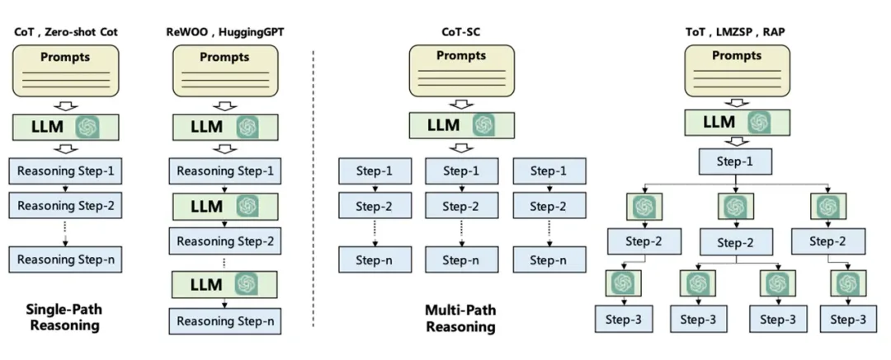

### LLM+P

大型语言模型不擅长解决长期规划问题。相反，一旦以一种规范的方式给出问题，传统的规划方法就能够运用有效的搜索算法快速找到正确的，甚至是最优的解决方案。LLM+P把这两者的优势结合起来，接收一个用自然语言描述的规划问题，将语言描述转化为一个用规划领域定义语言（PDDL，Planning Domain Definition Language）编写的文件，然后利用传统规划方法快速找到解决方案，最后将找到的解决方案翻译回自然语言。

PDDL包含领域定义和问题定义两部分：

- **领域定义**：描述可能的动作、动作前提条件、和导致结果。

- **问题定义**：描述一个具体的规划问题，包含初始状态和目标状态

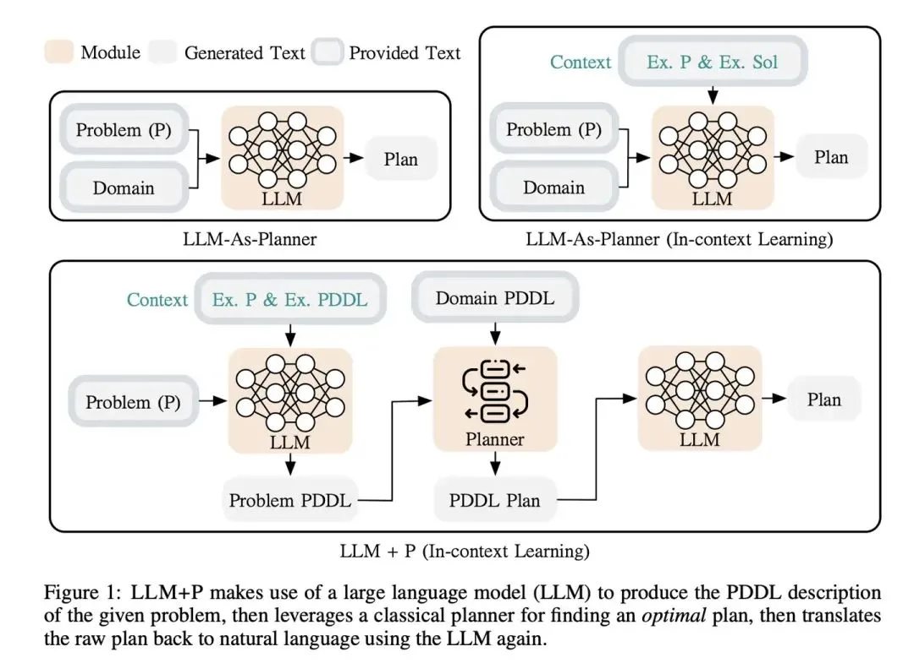

### ReAct（Reasoning + Acting）

ReAct: Synergizing Reasoning and Acting in Language Models（不是前端哪个react框架）。其实现了"行动"和"推理"之间的协同作用，使得大模型能够作为智能代理，**生成推理痕迹和任务特定行动来实现更大的协同作用**。

ReAct的任务解决轨迹是**Thought-Action-Observation，**可以简化为模型按照**Reasoning-Acting**框架。Reasoning包括了对当前环境和状态的观察，并生成推理轨迹。这使模型能够诱导、跟踪和更新操作计划，甚至处理异常情况。ReAct的每一个推理过程都会被详细记录在案，这也改善大模型解决问题时的可解释性和可信度；Acting在于指导大模型采取下一步的行动，比如与外部源（如知识库或环境）进行交互并且收集信息，或者给出最终答案。

对比只使用CoT，会导致模型存在幻觉，没有与外部工具交互的功能。而将ReAct框架与CoT结合，就能够让大模型在推理过程同时使用内部知识和获取到的外部信息，提升模型的可解释性和可信度。

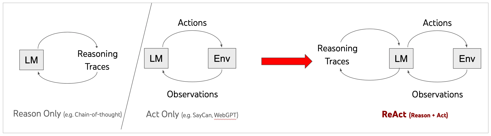

langchain实现了ReAct框架：

```Python
llm = ChatOpenAI(model=os.environ["LLM_MODELEND"], temperature=0)
tools = load_tools(["serpapi", "llm-math"], llm=llm)
agent = initialize_agent(
    tools, llm, agent=AgentType.ZERO_SHOT_REACT_DESCRIPTION, verbose=True)
agent.run(prompt)
```

React+CoT的训练流程如下，注意之前每轮的输出会加入prompt作为后续轮次模型的输入。

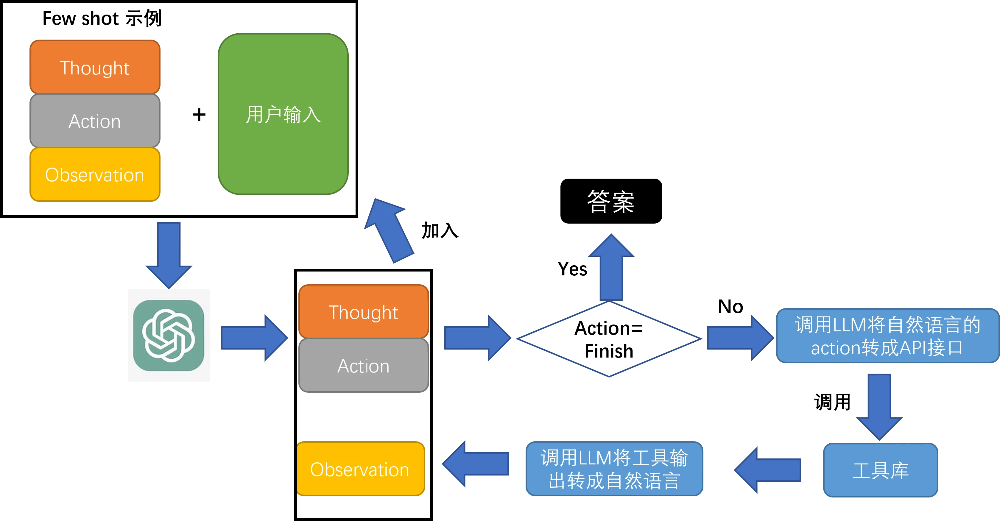

## 规划算法

### ReWoo

ReAct 提示词结构是 Thought→ Action→ Observation, React每一轮思考都要将之前所有的响应加入prompt，会消耗大量的token。ReWoo将推理过程与外部观察分离，将 Observation 隐式地嵌入到下一步的执行单元中了，即由下一步骤的执行器自动去 observe 上一步执行器的输出，从而显著减少了token消耗。

ReWoo包含三个部分：

- **Planner**：负责将用户问题分解为子任务并确定执行顺序，每个子任务都分配给Worker；

- **Worker**：利用工具检索外部知识提供证据；

- **Solver**：负责综合所有任务和证据，生成最终答案。

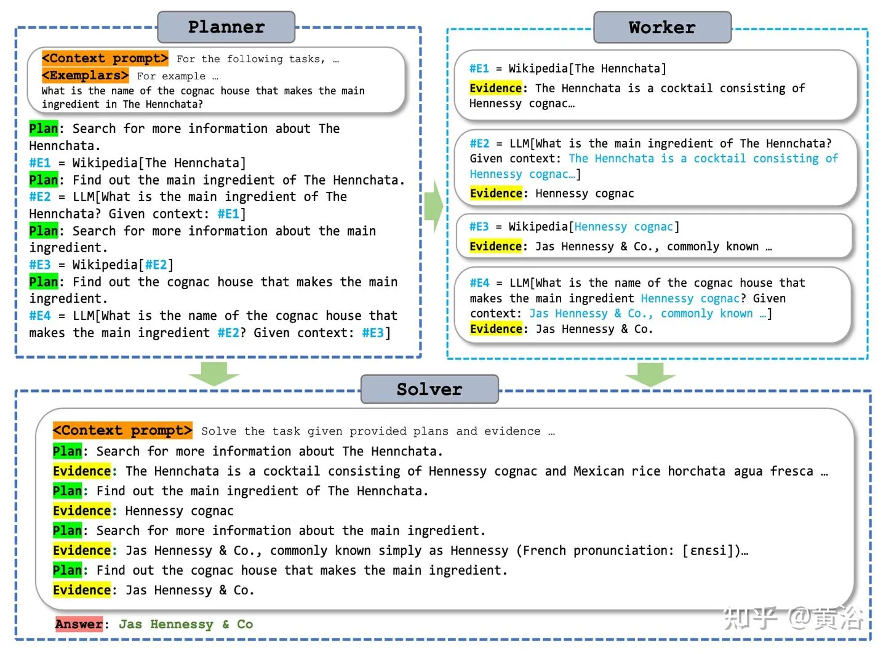

如下图所示，React每一轮的都要将上下文、示例和之前轮次的相应输入到LLM中，带来大量的冗余，并且可能需要调用LLM很多次；ReWoo中Planner负责生成一个子任务列表，并调用Worker从工具中获取证据，根据列表循环执行完成任务，避免了将prompt中一样的内容反复交给LLM，这个过程最少只调用了两次LLM（Planner和Solver各一次）。ReWoo的另一个优点是简化微调过程，由于Planner不依赖于工具的输出，因此可以在不实际调用工具的情况下对Planner进行微调。

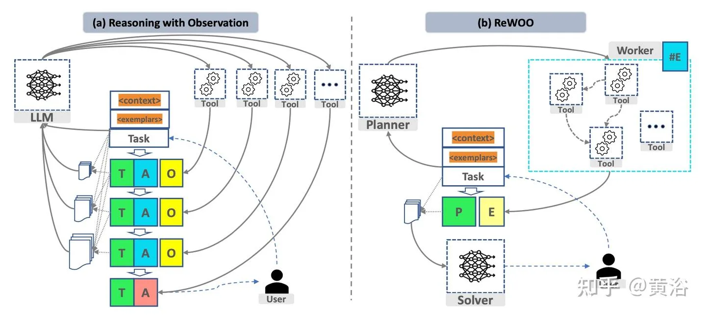

### Plan and Solve

这个方法在零样本思维链的基础上进行优化。Zero-shot-CoT知识简单的在prompt中加入"让我们逐步思考"，面临着计算错误、缺失步骤错误和语义误解错误等三个问题。Plan and solve解决了缺失步骤错误，先制定计划将任务分解为子任务，再按照计划执行子任务。

这个方法整体感觉偏向提示工程。prompt应该满足以下条件：

- 引导LLMs确定子任务并完成这些子任务,

- 指导LLMs更加关注计算和中间结果，并尽可能确保它们的正确执行。

最终的prompt格式为："Q: [X]. A: Let's first understand the problem，extract relevant variables and their corresponding numerals, and devise a plan.Then let's carryout the plan, calculate intermediate results(pay attention to calculation and common sense), solve the problem step by step, and show the answer."

Plan-and-solve的思想的一大应用就是Plan-and-Execute。Plan-and-Execute相比ReWOO，最大的不同就是加入了**Replan**机制，整体的思考流程如下图。Planner负责生成任务列表，replanner负责当完成一个子任务时进行重新思考，并将原有计划和已经完成的步骤加入prompt中，更新任务列表。

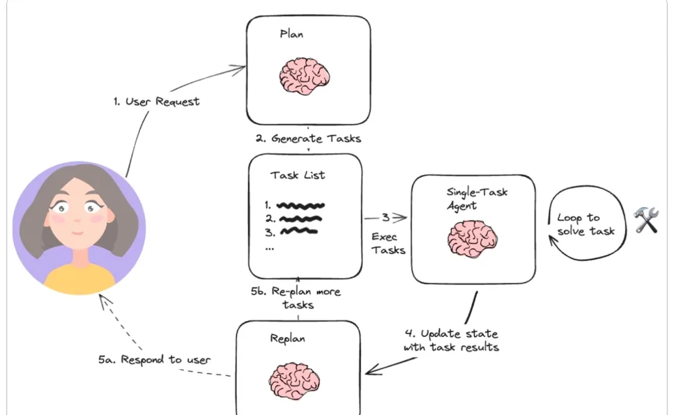

### LLMCompiler

这个方法的主要思想是通过并行function call来提高效率，比如询问微软的市值需要增长多少才能超过苹果的市值，可以并行的查询微软市值和苹果市值。主要包含4个模块：

- **函数调用规划器**：负责理解用户输入，拆分成可执行的子任务，并确定它们之间的依赖关系，形成任务依赖的有向无环图（DAG）。该部分需要用到大模型，最好用户为规划器提供一些上下文示例。

- **任务获取单元**：根据**贪婪策略**，将可以执行的任务发给执行器，并用执行后的输出替换后续任务的占位符。无需LLM

- **执行器**：多个执行器并发执行，可以调用用户提供的工具。

- **动态重规划**：对于复杂的任务，可能需要根据中间结果进行重新规划，由函数调用规划器生成新的子任务和它们之间的依赖关系。

函数调用规划器负责生成一个包含任务及其相互依赖关系的 DAG（Directed Acyclic Graph，有向无环图）。然后，任务获取单元根据任务的依赖关系将这些任务并行调度到执行器。在本例中，任务 $1 和 $2 被同时获取，以并行执行两个独立的搜索任务。每个任务执行完成后，结果将被转发给任务获取单元，用实际值替换其占位符变量，同时解除被依赖任务的阻塞（例如，任务 $3 中依赖 $1 和 $2）。所有任务执行完成后，最终答案将被传递给用户。

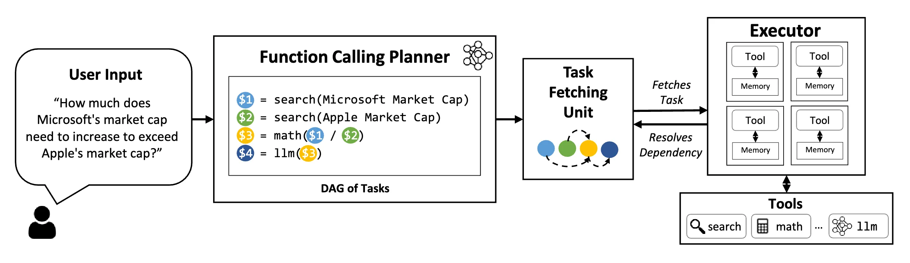

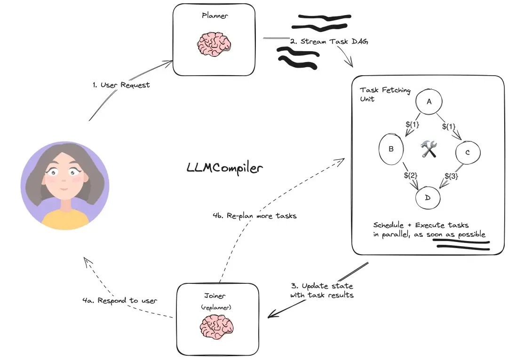

## 反思

### Reflexion

Reflexion采用了强化学习的思想，Reflexion代理在生成每一个轨迹后，进行启发式评估，生成反思文本并保留在记忆缓冲区中，以诱导在随后的尝试中做出更好的决策。首先介绍基本概念：

- **启发式函数：**用于确定轨迹是否效率低下或包含幻觉应当停止。

- **效率低下**：长时间未成功完成的轨迹。

- **幻觉**：定义为一系列连续相同的行动，这些行动导致在环境中观察到相同的结果。

Reflexion包含三个不同的模型：

- **执行者**（Actor）用 $M_a$ 表示，它生成文本和动作。利用llm根据状态观察生成文本和动作，采用类似强化学习的设置，从策略采样行动，并从环境接受观察，生成轨迹，可以采用React框架。

- **评估者模型**（Evaluator），由 $M_e$ 表示，它对 $M_a$ 产生的输出进行打分，评估行动的价值，将轨迹作为输入，计算奖励分数。

- **自我反思模型**（Self-Reflection model），用 $M_{sr}$ 表示，它协助执行者自我提升。 通过生成自我反思来为未来的尝试提供有价值的反馈，存储到记忆中。Memory 存储短期记忆和长期记忆。在推理时，Actor根据短期和长期记忆做出决策，轨迹历史作为短期记忆，而Self-Reflection模型的输出则存储在长期记忆中。

在提示词方面，要求让大模型针对问题在回答前进行反思和批判性思考，反思包括有没有漏掉(missing)或者重复(Superfluous)，然后回答问题，回答之后再有针对性的修改(Revise)

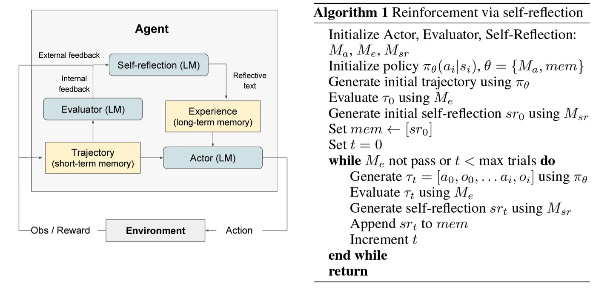

### Self Discover

Self-discover 的核心是让大模型在更小粒度上 task 本身进行反思，比如前文中的 Plan&Slove 是反思 task 是不是需要补充，而 Self-discover 是对 task 本身进行反思。

本方法主要分为两个阶段：利用SELF-DISCOVER 构建了任务特定的推理结构，应用推理结构解决问题。其中第一步又可以分为以下三个操作：

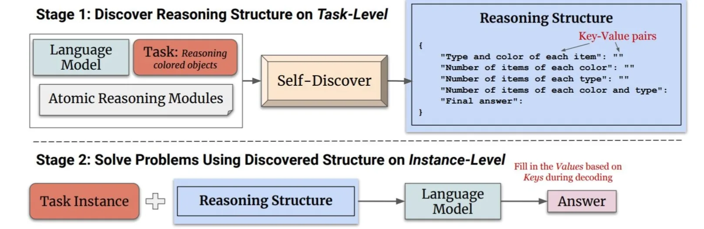

- **选择**：模型从一组原子推理模块（例如"批判性思维"和"逐步思考"）中选择对于解决特定任务有用的模块。模型通过一个元提示来引导选择过程，这个元提示结合了任务示例和原子模块描述。选择过程的目标是确定哪些推理模块对于解决任务是有助的。

- **适应**：一旦选定了相关的推理模块，下一步是调整这些模块的描述使其更适合当前任务。这个过程将一般性的推理模块描述，转化为更具体的任务相关描述。例如对于算术问题，"分解问题"的模块可能被调整为"按顺序计算每个算术操作"。同样，这个过程使用元提示和模型来生成适应任务的推理模块描述。

- **实施**：在适应了推理模块之后，Self-Discover框架将这些适应后的推理模块描述转化为一个结构化的可执行计划。这个计划以键值对的形式呈现，类似于JSON，以便于模型理解和执行。这个过程不仅包括元提示，还包括一个人类编写的推理结构示例，帮助模型更好地将自然语言转化为结构化的推理计划。

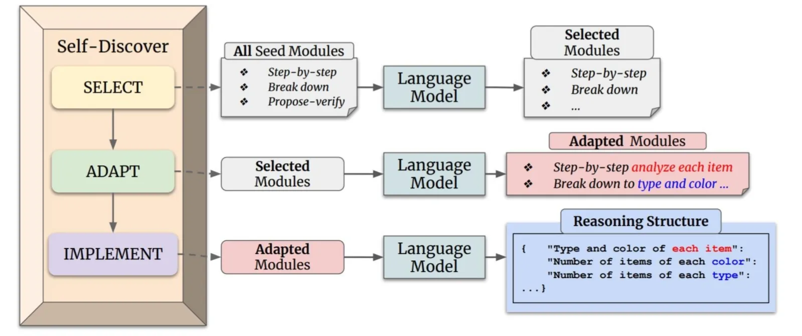

### LATS（Language Agent Tree Search）

LATS算法《Language Agent Tree Search Unifies Reasoning Acting and Planning in Language Models》融合了**ToT、React、Plan&solve、Reflection和强化学习**等思想，作为对以上算法的总结。

#### 预备知识

给定自然语言x和y，模型 $p_\theta(x)$ 的任务是推理出最接近y的答案，通常prompt和x一起作为输入，生成过程可以表示为 $y = p_theta(prompt_{IO}(x)) $。

React框架引入了外部环境的交互，定义行动空间 $a \in A$ 和 CoT的推理路径 $z \in Z$，将两者合并为最后的行动空间 $\hat{A} = A \cup Z$，外部环境的观察定义为o。给定观察o，下一个行动的生成表示为

$$a_t \sim P(a | o, \mathcal{P})$$

CoT、ToT和React框架面临着以下问题：1）CoT和React的自回归训练会忽略特定状态的潜在连续名词 2）CoT和ToT只依赖LLM自有的能力，可能造成幻觉。3）以上方法无法利用过去的经验。

**蒙特卡洛树搜索**（Monte Carlo Tree Search，MCTS）是一种决策树算法，树的结点表示状态，边表示行动。从初始状态根节点出发，每轮训练包含2个步骤：1）从当前状态p中探索多个子状态s，并采样n个动作。2）采取**上置信度（UCT，Upper Confidence Bound for Trees）**最高的动作，定义为：

$$UCT(s) = \frac{Q(s)}{N(s)} + c \sqrt{\frac{\ln N(\text{parent}(s))}{N(s)}}$$

V(s)表示节点s的期望value，N(s)表示访问节点s的次数，w是权重参数。当一个episode结束时，进行反向传播，用奖励r更新路径上的每个节点的value值：

$$V(s) = V(s) + \alpha [r - V(s)]$$

#### LATS方法

本文提出的LATS遵循**React**框架的Thought-Action-Observation流程，参照**蒙特卡洛树**，每轮采样n个行动产生多个轨迹，以克服LLM的随机性并扩大探索域，从而找到最优轨迹。

LATS包含以下图中的6个步骤，并循环迭代，直到采样了k个轨迹后任务完成或者计算资源限制。其中 $p_theta $ 同时作为agent，value function和反馈生成器，充分利用LLM的表征能力。

- **selection**：根据蒙特卡洛树选择UCT值最大的下一个节点。

- **expansion**：从当前状态p采样n个行动，与环境交互得到n个子节点。

- **evaluation**：为每个子节点计算value值，参考ToT，通过提示工程将 $p_theta $ 作为一个评估值函数，并且这里还引入了环境反馈。还引入了基于**self-consistency**的启发，认为选择次数更多的action更精确：

$$a^* = \arg\max_a N(a)$$

- **simulation：**重复之前的过程直到到达终点状态，如果达到最优解就直接结束，反之进行 Backpropagation和reflection。

- **backpropagation**：更新蒙特卡洛树中轨迹上的每一个节点，$N(s_i) = N_{old}(s_{i}) + 1, V(s_i) = \frac{V_{old}(s_{i})(N(s_{i})-1 )+ r}{N(s_i)}$，其中r是奖励。

- **reflection**：通过提示工程，让 $p_theta $ 根据轨迹和奖励进行self-relection，总结推理过程中的错误，并选择更好的选项。将错误的轨迹和relection存储在记忆中，在随后的迭代中，这些被加入到agent和value函数的上下文。

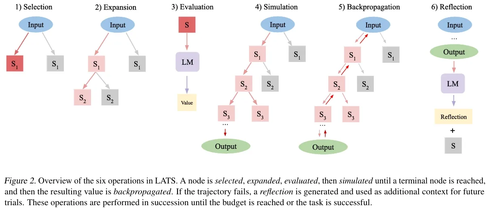

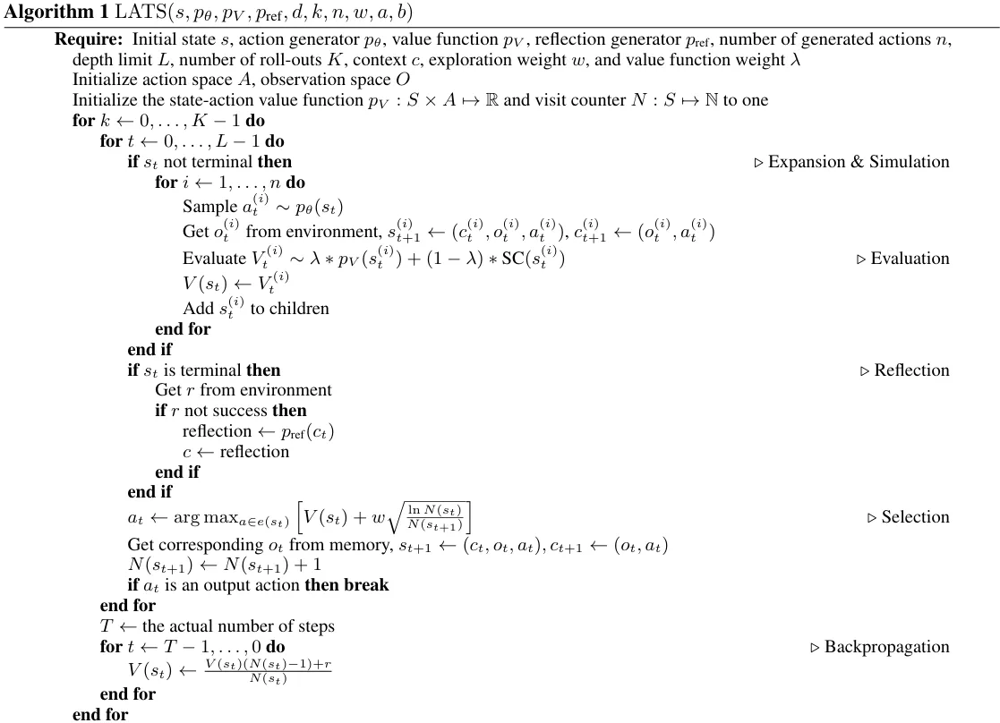

## 近期热门规划框架

### BabyAGI

BabyAGI 使用一个"**Task List**"来管理所有待办任务。它有三个主要组件：

1. **Task Creation Agent**：根据当前任务、执行结果，不断新建子任务。

2. **Task Prioritization Agent**：对现有任务重新排序，决定执行顺序。

3. **Execution Agent**：真正去执行当前的任务（通常是调用LLM/工具等）。

**循环流程**

1. 从 "**Task List**" 中取出最高优先级的任务。

2. 调用 **Execution Agent** 去执行。

3. 把执行结果（Result）交给 **Task Creation Agent**，是否需要生成新的子任务？

4. 把更新后的任务列表给 **Task Prioritization Agent**，排序并循环。

### AutoGPT

AutoGPT 也有一个任务/目标管理系统，也能生成子任务并执行。它侧重更丰富的"工具"支持，如联网、读取/写入文件、执行代码等，包含以下模块：

1. **AI Config**：存放 AI 的角色、名称、目标等基础信息。

2. **Memory**：把过去的重要信息存下来，供下一步参考。

3. **Planner**（或类似角色）: 生成下一步要干啥。

4. **Command Executor**：解析 LLM 返回的命令，然后在外部执行相应操作。