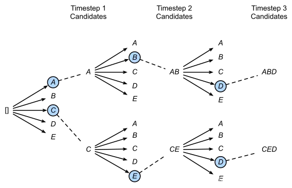
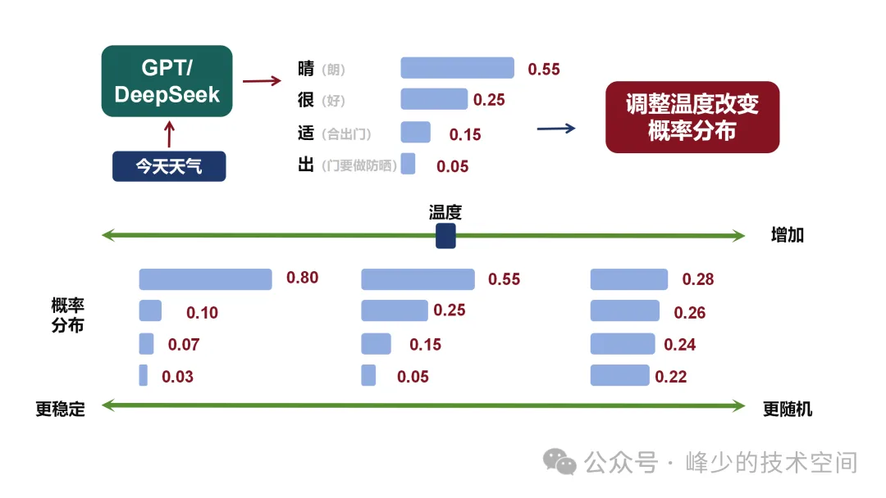

# Decoding

经过一系列自注意力操作后，需要将一个Token对应的$d$维向量映射到词表维度的向量，然后经过Softmax输出对这个Token的预测向量。解码（Decoding）就是根据预测向量选择该Token对应的单词的过程。

## Greedy Search（贪心搜索）

迭代地预测每个Token时，每次都**选择概率最大的单词**，将选中的Token添加到序列中，继续预测下一个Token，速度非常快。

> 面临问题：一旦有一个错误，就会影响后续的预测；生成的文本会比较单调，因为容易陷入局部最优，很难找到最优解。可以通过惩罚重复的字段进行缓解。
> 应用场景：适用于对推理速度要求高、对文本质量要求不高的场景。

## Beam Search（集束搜索）

**Beam Search是对贪心策略的一个改进。在每一个时间步，不再只保留当前分数最高的1个输出，而是保留`num_beams`个。当`num_beams=1`时，集束搜索就退化成了贪心搜索**。这是一种启发式图搜索算法，通常用在图的解空间比较大的情况下。为了减少搜索所占用的空间和时间，在每一步深度扩展的时候，剪掉一些质量比较差的节点，保留一些质量较高的节点。这样减少了空间消耗，并提高了时间效率。通常选择概率最高的完整序列作为最终输出。

### Beam Search 算法详解

**算法流程**：

1. **初始化**：维护`num_beams`个候选序列，每个序列初始分数为0。

2. **扩展**：对每个候选序列，计算所有可能的下一个Token的概率，将候选序列与新Token组合成新的候选序列。

3. **剪枝**：从所有新生成的候选序列中，保留分数最高的`num_beams`个。

4. **终止**：当某个序列生成了结束标记`<EOS>`，则将其加入最终输出列表，并从候选列表中移除。

5. **重复**：重复步骤2-4，直到达到最大长度或所有序列都已终止。

**Beam Search 示例**（假设`num_beams=2`，词表大小为3）：

```
时间步1：
  候选序列: ["A"(0.4), "B"(0.3), "C"(0.3)]
  保留: ["A"(0.4), "B"(0.3)]

时间步2：
  从"A"扩展: ["A A"(0.16), "A B"(0.12), "A C"(0.12)]
  从"B"扩展: ["B A"(0.12), "B B"(0.09), "B C"(0.09)]
  合并并排序: ["A A"(0.16), "A B"(0.12), "A C"(0.12), "B A"(0.12), ...]
  保留: ["A A"(0.16), "A B"(0.12)]

时间步3：
  继续扩展...
```

**Beam Search 的分数计算**：

对于长度为$L$的序列，其得分为：

$$\text{Score}(y_1, y_2, ..., y_L) = \frac{1}{L^\alpha} \sum_{t=1}^{L} \log P(y_t | y_1, ..., y_{t-1}) \tag{1}$$

其中$\alpha$是长度惩罚参数（Length Penalty），用于平衡序列长度和概率。

- 当$\alpha = 0$时，退化为标准Beam Search，倾向于选择短序列。
- 当$\alpha > 0$时，对长序列进行奖励，鼓励生成更长的文本。

> 面临问题：有可能存在潜在的最佳方案被丢弃，因此Beam Search算法是不完全的，一般用于解空间较大的系统中；计算成本比贪心更高。



## Top-k 抽样

**思路**：从Token列表中选择$k$个作为候选，**然后根据它们的似然分数进行采样**。模型从最可能的$k$个选项中随机选择一个。如果$k=3$，模型将从最可能的3个单词中随机选择一个。

**采样过程**：

1. 获取所有Token的概率分布$P$。
2. 将概率从高到低排序，选择前$k$个Token。
3. 对这$k$个Token的概率重新归一化。
4. 从归一化后的分布中随机采样一个Token。

$$P'(y_i) = \frac{P(y_i)}{\sum_{j \in \text{top-k}} P(y_j)} \tag{2}$$

> 面临问题：**在分布陡峭的时候仍会采样到概率小的单词，或者在分布平缓的时候只能采样到部分可用单词**。$k$不太好选：$k$设置越大，生成的内容可能性越大；$k$设置越小，生成的内容越固定；设置为1时，和贪心解码效果一样。

## Top-p 抽样/核采样（Nucleus Sampling）

**思路**：**候选词列表是动态的，从Token列表中按百分比选择候选词**。模型从累计概率大于或等于$p$的最小集合中随机选择一个。如果$p=0.9$，选择的单词集将是概率累计到0.9的那部分。

**Top-p 采样算法**：

1. 获取所有Token的概率分布$P$，并按概率从高到低排序。
2. 计算累积概率：$C(y_i) = \sum_{j=1}^{i} P(y_j)$。
3. 找到最小的候选集合$V$，使得$\sum_{y_i \in V} P(y_i) \geq p$。
4. 对集合$V$中的Token概率重新归一化。
5. 从归一化后的分布中随机采样一个Token。

**Top-p 采样示例**（假设$p=0.9$）：

| Token | 概率 | 累积概率 | 是否选入候选 |
|-------|------|----------|--------------|
| "the" | 0.35 | 0.35 | ✓ |
| "a" | 0.25 | 0.60 | ✓ |
| "an" | 0.20 | 0.80 | ✓ |
| "one" | 0.10 | 0.90 | ✓ |
| "this" | 0.05 | 0.95 | ✗ |
| ... | ... | ... | ✗ |

Top-p采样方法往往与Top-k采样方法结合使用，每次选取两者中最小的采样范围进行采样，可以减少预测分布过于平缓时采样到极小概率单词的几率。如果$k$和$p$都启用，则$p$在$k$之后起作用。

Top-p越高，候选词越多，多样性越丰富。Top-p越低，候选词越少，越稳定。

> 面临问题：采样概率$p$设置太低模型的输出太固定，设置太高，模型输出太过混乱。

## Temperature（温度参数）



**思路**：通过温度参数，在采样前调整每个词的概率分布。**温度越低，概率分布差距越大，越容易采样到概率大的字；温度越高，概率分布差距越小，增加了低概率字被采样到的机会。**

### Temperature 的数学原理

设原始logits为$z_i$，温度参数为$\tau$（$\tau > 0$），则调整后的概率分布为：

$$P(y_i) = \frac{\exp(z_i / \tau)}{\sum_{j} \exp(z_j / \tau)} \tag{3}$$

**Temperature 的影响**：

- **当$\tau \to 0$时**：概率分布趋近于One-hot分布，最大概率的Token趋近于1，其他趋近于0。等价于贪心搜索。

- **当$\tau = 1$时**：概率分布保持原始分布不变。

- **当$\tau \to \infty$时**：概率分布趋近于均匀分布，所有Token被采样的概率相等。

**不同温度下的概率分布示例**：

| Token | 原始概率 | $\tau=0.5$ | $\tau=1.0$ | $\tau=2.0$ |
|-------|----------|------------|------------|------------|
| "the" | 0.40 | 0.55 | 0.40 | 0.31 |
| "a" | 0.30 | 0.30 | 0.30 | 0.29 |
| "an" | 0.20 | 0.12 | 0.20 | 0.24 |
| "one" | 0.10 | 0.03 | 0.10 | 0.16 |

参数Temperature（常见的取值范围：0-2）设的越高，生成文本的自由创作空间越大，更具多样性。温度越低，生成的文本越偏保守，更稳定。

一般来说，Prompt越长，描述得越清楚，模型生成的输出质量就越好，置信度越高，这时可以适当调高Temperature的值；反过来，如果Prompt很短，很含糊，这时再设置一个比较高的Temperature值，模型的输出就很不稳定了。

## 联合采样（Top-k & Top-p & Temperature）

Top-k、Top-p、Temperature都是属于**随机采样**的方法，即在采样的过程中加入了一定的随机性，这可能会导致生成的句子容易不连贯，上下文比较矛盾。为了缓解这种随机性，将Top-k、Top-p、Temperature联合起来使用。使用的先后顺序是**Top-k → Top-p → Temperature**。

## 解码策略对比

| 策略 | 类型 | 优点 | 缺点 | 适用场景 |
|------|------|------|------|----------|
| **Greedy Search** | 确定性 | 速度快，实现简单 | 容易陷入局部最优，文本单调 | 对速度要求高、对质量要求低 |
| **Beam Search** | 确定性 | 能找到较优序列，质量较高 | 计算成本高，可能丢失全局最优 | 机器翻译、文本摘要 |
| **Top-k** | 随机性 | 增加多样性，避免重复 | $k$值难以选择，分布不自适应 | 对话生成、创意写作 |
| **Top-p** | 随机性 | 候选集自适应，更灵活 | $p$值需要调优 | 开放式文本生成 |
| **Temperature** | 随机性 | 控制生成的随机性程度 | 单独使用效果有限 | 与其他方法联合使用 |

## 实际应用建议

1. **对话生成**：推荐使用Top-p + Temperature，$p \in [0.7, 0.9]$，$\tau \in [0.7, 1.0]$。

2. **机器翻译**：推荐使用Beam Search，`num_beams \in [4, 8]`。

3. **文本摘要**：推荐使用Beam Search + 长度惩罚。

4. **创意写作**：推荐使用Top-k + Top-p + Temperature，增加多样性。

5. **代码生成**：推荐使用较低的Temperature（$\tau \in [0.2, 0.5]$），确保代码正确性。
