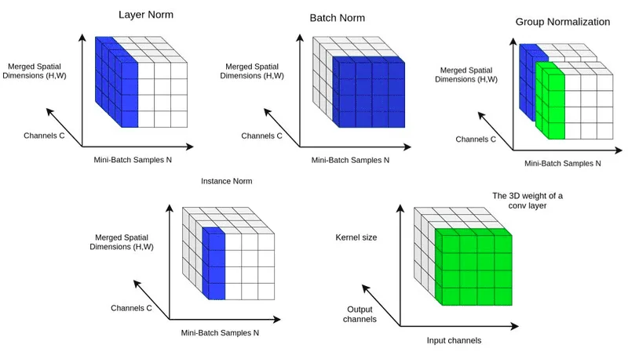

# Normalization

归一化（Normalization）旨在**将数据的数值范围缩放到正态分布**，通常是为了消除不同特征之间的量纲差异，使得数据更加适合进行后续的分析和处理，保证网络的稳定性。对于有很多层的深度模型，如果数据分布在某一层出现明显的偏移误差，随着网络的加深这一问题会加剧**（内部协变量偏移，Internal Covariate Shift，ICS）**。通过使用归一化，可以减轻内部协变量偏移，稳定训练过程，避免出现梯度消失和梯度爆炸；使数据远离Sigmoid激活函数的饱和区，加速模型收敛；避免模型对某些数据的过拟合，提升模型的泛化能力。

> 对于NLP任务来说，最常用的是Layer Normalization和RMSNorm。

## Batch Normalization（BN，批归一化）

在神经网络的每一层中，对**每个Mini-batch**的输入进行归一化处理。

优点：加速网络训练、防止梯度问题、优化正则化效果、降低学习率要求，并有助于缓解过拟合，从而显著提升神经网络的性能和稳定性。

**缺点：BN对Batch Size的大小敏感；要求数据长度一致；受离群数据的影响很严重。**

## Layer Normalization（LN，层归一化）

在神经网络的每一层中，对每个样本的**所有特征通道**进行归一化处理。

对于同样的输入$X$，LayerNorm的计算可以表示为：

1. 首先计算每个样本的特征值的均值和标准差：

$$\mu = \frac{1}{d} \sum_{i=1}^{d} x_i \tag{1}$$

$$\sigma = \sqrt{\frac{1}{d} \sum_{i=1}^{d} (x_i - \mu)^2} \tag{2}$$

2. 使用均值$\mu$和标准差$\sigma$对输入$X$进行归一化：

$$X_{\text{norm}} = \frac{X - \mu}{\sigma + \epsilon} \tag{3}$$

3. 最后，将归一化的数据$X_{\text{norm}}$乘以可学习的权重$w$并加上偏置$b$：

$$Y = w \cdot X_{\text{norm}} + b \tag{4}$$

**优点：在训练样本较小、样本间相互影响较大的情况下更稳定，主要应用于RNN。**

```python
class LayerNorm(nn.Module):
    # features: (bsz, max_len, hidden_dim)
    def __init__(self, features, eps=1e-6):
        super(LayerNorm, self).__init__()
        self.a_2 = nn.Parameter(torch.ones(features))
        self.b_2 = nn.Parameter(torch.zeros(features))
        self.eps = eps

    def forward(self, x):
        # 就是在统计每个样本所有维度的值，求均值和方差，所以就是在hidden dim上操作
        # 相当于变成[bsz*max_len, hidden_dim], 然后再转回来, 保持是三维
        mean = x.mean(-1, keepdim=True)  # mean: [bsz, max_len, 1]
        std = x.std(-1, keepdim=True)    # std: [bsz, max_len, 1]
        # 注意这里也在最后一个维度发生了广播
        return self.a_2 * (x - mean) / (std + self.eps) + self.b_2
```

## Instance Normalization（IN，实例归一化）

对**每个样本的每个特征通道**进行归一化。

**优点：更适用于图像生成等任务中，每个样本的特征通道独立于其他样本的情况。**

## Group Normalization（GN，组归一化）

IN和LN的融合，在神经网络的每一层中，**将特征分成若干组，对每个组的特征进行归一化处理。**

**优点：适用于样本较小、样本间相互影响较大，但又不需要对整个Mini-batch进行归一化的情况。**

总结：

- Batch Normalization对Batch的维度去做归一化，也就是针对不同样本的同一特征做操作；Layer Normalization对Hidden的维度去做归一化，也就是针对单个样本的不同特征做操作。

- Batch Normalization是对这批样本的同一维度特征（每个神经元）做归一化；Layer Normalization是对这单个样本的所有维度特征做归一化。

- Instance Normalization是在每个通道的维度进行归一化；Group Normalization是IN和LN的融合。

下图很好地总结了以上介绍的几种归一化方法的示意。



## RMSNorm

LayerNorm每次都需要计算均值和方差，而RMSNorm没有去中心化的操作，只有缩放的操作，**只需要计算方差，计算量更小**。这也是LLaMA模型使用的归一化方法。

对于给定的输入$X$（其中$X$是一个$n \times d$的矩阵，$n$是批次大小，$d$是特征维度），RMSNorm的计算可以表示为：

1. 计算均方根，同时加上一个小的常数$\epsilon$以避免除以零：

$$\text{RMS}(x) = \sqrt{\frac{1}{d} \sum_{i=1}^{d} x_i^2 + \epsilon} \tag{5}$$

2. 最后，使用得到的RMS值对输入$X$进行归一化，并乘以可学习的权重参数$w$：

$$Y = X \cdot \frac{1}{\text{RMS}(x)} \cdot w \tag{6}$$

```python
class RMsNorm(torch.nn.Module):
    def __init__(self, dim: int, eps: float = 1e-6):
        super().__init__()
        self.eps = eps
        self.weight = nn.Parameter(torch.ones(dim))

    def _norm(self, x):
        return x * torch.rsqrt(x.pow(2).mean(-1, keepdim=True) + self.eps)

    def forward(self, x):
        output = self._norm(x.float()).type_as(x)
        return output * self.weight
```

## Pre-Norm 与 Post-Norm 在 Transformer 中的应用

归一化在Transformer中的位置对模型训练和性能有重要影响，主要有两种方式：

### Post-Norm（后归一化）

原始Transformer使用的就是Post-Norm，将归一化放在残差连接之后：

$$x_{t+1} = \text{LayerNorm}(x_t + F_t(x_t)) \tag{7}$$

**优点**：
- 在最优设置下性能更好
- 更适合微调，梯度消失特性对预训练模型有利

**缺点**：
- 训练不稳定，需要学习率Warmup
- 容易出现梯度消失，难以训练深层网络

**适用场景**：
- 较浅的Transformer网络（如BERT-Base）
- 任务不太复杂时
- 预训练模型的微调阶段

### Pre-Norm（前归一化）

将归一化放在残差连接之前：

$$x_{t+1} = x_t + F_t(\text{LayerNorm}(x_t)) \tag{8}$$

**优点**：
- 训练更稳定，不需要Warmup
- 梯度传播更顺畅，适合深层网络
- 收敛速度更快

**缺点**：
- 最终性能通常不如Post-Norm
- 多层叠加更多是增加宽度而非深度

**适用场景**：
- 深层Transformer模型（如GPT-3、LLaMA）
- 大规模预训练
- 对训练稳定性要求高的场景

### 两者在主流模型中的应用

| 模型 | 归一化方式 | 说明 |
|------|------------|------|
| BERT | Post-Norm | 原始Transformer结构 |
| GPT-2 | Pre-Norm | 改进训练稳定性 |
| GPT-3 | Pre-Norm | 支持更深网络 |
| LLaMA | Pre-Norm + RMSNorm | 使用RMSNorm加速训练 |
| Qwen | Pre-Norm + RMSNorm | 同上 |
| PaLM | Pre-Norm + RMSNorm | 同上 |

### DeepNorm

DeepNorm通过引入缩放因子$\alpha$来改善Post-Norm的训练稳定性：

$$X_{t+1} = \text{LayerNorm}(\alpha X_t + F_t(X_t)) \tag{9}$$

其中$\alpha > 1$，用于保障快速通道的系数能保持比较大。这种方式结合了Post-Norm的性能优势和Pre-Norm的训练稳定性。

## RMSNorm 的优势分析

相比于LayerNorm，RMSNorm具有以下显著优势：

### 1. 计算效率更高

- **LayerNorm**需要计算均值和方差两个统计量，涉及两次遍历。
- **RMSNorm**只需要计算均方根，计算量减少约50%。
- 在大规模模型中，这种计算节省会累积成显著的训练加速。

### 2. 训练更稳定

- **RMSNorm**没有去中心化操作，只进行缩放，受异常特征值的影响更小。
- 减轻了内部协变量偏移的影响，梯度更加稳定。
- 在训练深层模型时表现更好。

### 3. 加快收敛速度

- **RMSNorm**降低了训练初期模型需要调整的幅度。
- 在相同训练条件下，通常能更快收敛。
- 减少了训练所需的计算资源。

### 4. 实际性能对比

在多个基准测试中，使用RMSNorm的模型（如LLaMA）在保持或超越LayerNorm模型性能的同时，训练速度提升了10-20%。

### 5. 适用场景

- **大语言模型预训练**：RMSNorm是首选，如LLaMA、Qwen等。
- **小模型或简单任务**：LayerNorm仍然足够，且实现更简单。
- **对训练速度要求高的场景**：推荐使用RMSNorm。

## 归一化方法选择建议

1. **小型模型、简单任务**：LayerNorm即可满足需求。

2. **大型语言模型预训练**：推荐Pre-Norm + RMSNorm，如LLaMA结构。

3. **预训练模型微调**：可考虑Post-Norm，利用其梯度消失特性保护预训练知识。

4. **训练稳定性要求高**：Pre-Norm + RMSNorm是最佳选择。

5. **追求极致性能**：可在Post-Norm基础上使用DeepNorm等改进技术。
