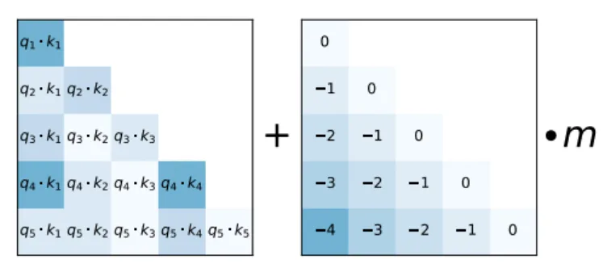
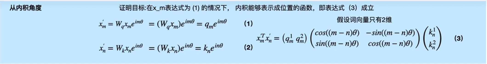
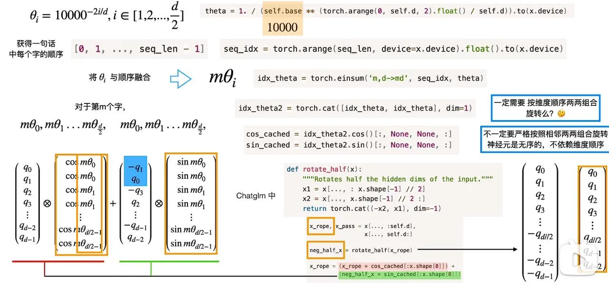

# 位置编码

卷积具有局部性，天然地注意到了元素之间的相对位置。而基于自注意力的**Transformer模型则对位置不敏感**，因此必须要把元素的位置信息加入到嵌入向量中。

## 绝对位置编码

绝对位置编码直接将位置信息加到文本的嵌入向量中，被早期的BERT、GPT-2等模型中使用。绝对位置编码又可以分为可学习的和固定的两种。

- **可学习绝对位置编码**：直接对不同的位置随机初始化一个位置嵌入（Position Embedding），加到文本的嵌入向量上输入给模型，**作为参数进行训练**。这种方法引入了大量的可学习参数，需要大量的数据才能训练。

- **固定的绝对位置编码**：代表是《Attention is All You Need》论文中的三角位置编码。

位置$pos$对应的位置向量在偶数位和奇数位的值分别为：

$$PE_{(pos,2i)} = \sin\left(\frac{pos}{10000^{2i/d_{\text{model}}}}\right) $$

$$PE_{(pos,2i+1)} = \cos\left(\frac{pos}{10000^{2i/d_{\text{model}}}}\right) $$

其中$d_{\text{model}}$是位置编码的长度，$i \in [0,1,...,(d_{\text{model}} - 1) / 2]$。采用这种设计，**$pos+k$位置的位置编码可以用$pos$位置的位置编码线性表示，体现了其相对位置关系。**

这里的相对位置关系指的是两个Token之间的，而绝对位置编码中每个位置的编码是固定的。相对位置编码则直接考虑两个Token之间的相对位置。

> 证明：需要用到三角公式，定义$w_i = \frac{1}{10000^{2i / d_{\text{model}}}}$

$$PE_{(pos+k,2i)} = \sin(w_i \cdot (pos + k)) = \sin(w_i pos)\cos(w_i k) + \cos(w_i pos)\sin(w_i k) $$

$$PE_{(pos+k,2i+1)} = \cos(w_i \cdot (pos + k)) = \cos(w_i pos)\cos(w_i k) - \sin(w_i pos)\sin(w_i k) $$

$$PE_{(pos+k,2i)} = \cos(w_i k)PE_{(pos,2i)} + \sin(w_i k)PE_{(pos,2i+1)} $$

$$PE_{(pos+k,2i+1)} = \cos(w_i k)PE_{(pos,2i+1)} - \sin(w_i k)PE_{(pos,2i)} $$

> 为了计算$pos+k$和$pos$之间的距离，可以通过计算它们之间的内积：

$$PE_{pos} \cdot PE_{pos+k} = \sum_{i=0}^{d/2-1} \sin(w_i pos) \cdot \sin(w_i (pos + k)) + \cos(w_i pos) \cdot \cos(w_i (pos + k))$$

$$= \sum_{i=0}^{d/2-1} \cos(w_i (pos - (pos + k))) = \sum_{i=0}^{d/2-1} \cos(w_i k) $$

> 可以看到$pos+k$和$pos$之间的内积随着相对距离的增加而减小，符合文本中Token之间一般距离越远关系越弱的原理。但是由于相对距离的对称性，**三角位置编码无法区分方向**，即$pos+k$与$pos$和$pos-k$与$pos$之间的距离是一样的。实现三角位置编码的代码如下：

```python
class PositionalEncoding(nn.Module):
    def __init__(self, d_model, dropout, max_len=5000):
        super().__init__()
        self.dropout = nn.Dropout(p=dropout)  # 初始化dropout层
        
        # 计算位置编码并将其存储在pe张量中
        pe = torch.zeros(max_len, d_model)                # 创建一个max_len x d_model的全零张量
        # 生成0到max_len-1的整数序列，并添加一个维度
        position = torch.arange(0, max_len).unsqueeze(1)
        # 计算div_term，用于缩放不同位置的正弦和余弦函数
        div_term = torch.exp(torch.arange(0, d_model, 2) *
                             -(math.log(10000.0) / d_model))
        # 对于d_model的偶数索引，使用正弦函数；对于奇数索引，使用余弦函数
        pe[:, 0::2] = torch.sin(position * div_term)
        pe[:, 1::2] = torch.cos(position * div_term)
        pe = pe.unsqueeze(0)                  # 在第一个维度添加一个维度，以便进行批处理
        
    # 定义前向传播函数
    def forward(self, x):
        # 将输入x与对应的位置编码相加
        x = x + self.pe[:, : x.size(1)]
        # 应用dropout层并返回结果
        return self.dropout(x)
```

**总结**：绝对位置编码实现简单，存在以下缺点：

- 尽管能包含一定的相对位置信息，但是这种信息仅仅保存在位置编码内部，**在计算自注意力时，这种位置信息就被破坏了。**

- 一个Token的位置编码是什么由其在句子中的绝对位置决定，但是**真正重要的往往不是绝对位置，而是它与其他Token之间的关系。**

- **对输入的长度敏感**，一旦输入变化则需要重新调整。

## 相对位置编码

相对位置编码将两个Token的相对位置信息添加到对应的注意力值中。

### ALiBi（Attention with Linear Biases）

在计算注意力时，对前边位置的分数进行惩罚，如图所示：



- 传统的绝对位置编码在训练时会为每个位置分配一个固定的向量，模型可能会过度拟合这些特定长度的模式。而**ALiBi通过在注意力分数计算中直接使用线性偏置，减少了模型对特定序列长度的依赖，从而提高了对未见过的序列长度的泛化能力。**

- **ALiBi的位置偏差随距离线性增长**，这种设计让模型在处理不同长度的序列时，可以自然地根据距离调整注意力权重，无需显式学习位置编码的复杂周期性结构。

- 由于线性偏置的引入直接与序列中元素的位置相关，没有固定大小的编码矩阵限制，理论上模型可以更容易地处理任意长度的序列，从而展现出良好的长度外推性能。

- 通过直接在注意力分数上施加与距离相关的线性惩罚，**ALiBi鼓励模型关注更近的位置，同时不完全排除远处的依赖**，从而在一定程度上平衡了局部和全局依赖的学习，这对于处理长序列尤其有利。

### XLNET

三角位置编码在计算注意力时的表示如下：

$$\boldsymbol{A}_{t,s} = \boldsymbol{q}_t^T \boldsymbol{k}_s = (\boldsymbol{x}_t + \boldsymbol{p}_t)^T \boldsymbol{W}_Q^T \boldsymbol{W}_K (\boldsymbol{x}_s + \boldsymbol{p}_s) $$

$$\boldsymbol{A}_{t,s} = \boldsymbol{x}_t^T \boldsymbol{W}_Q^T \boldsymbol{W}_K \boldsymbol{x}_s + \boldsymbol{x}_t^T \boldsymbol{W}_Q^T \boldsymbol{W}_K \boldsymbol{p}_s + \boldsymbol{p}_t^T \boldsymbol{W}_Q^T \boldsymbol{W}_K \boldsymbol{x}_s + \boldsymbol{p}_t^T \boldsymbol{W}_Q^T \boldsymbol{W}_K \boldsymbol{p}_s$$

$$
\boldsymbol{p}_t = \left[\cdots, \sin \frac{t}{10000^{2n/d}}, \cos \frac{t}{10000^{2n/d}}, \cdots\right]^T \in \mathbb{R}^d 
$$
从绝对位置编码出发：

$$\boldsymbol{q}_i^T \boldsymbol{k}_j = \boldsymbol{x}_i \boldsymbol{W}_Q^T \boldsymbol{W}_K \boldsymbol{x}_j + \boldsymbol{x}_i \boldsymbol{W}_Q^T \boldsymbol{W}_K \boldsymbol{p}_j^T + \boldsymbol{p}_i \boldsymbol{W}_Q^T \boldsymbol{W}_K \boldsymbol{x}_j^T + \boldsymbol{p}_i \boldsymbol{W}_Q^T \boldsymbol{W}_K \boldsymbol{p}_j^T $$

XLNET将$\boldsymbol{p}_j$替换成相对位置向量$\boldsymbol{R}_{i-j}$，$\boldsymbol{p}_i$替换成可训练的向量$\boldsymbol{u}$和$\boldsymbol{v}$：

$$\boldsymbol{x}_i \boldsymbol{W}_Q^T \boldsymbol{W}_K \boldsymbol{x}_j^T + \boldsymbol{x}_i \boldsymbol{W}_Q^T \boldsymbol{W}_K \boldsymbol{R}_{i-j}^T + \boldsymbol{u} \boldsymbol{W}_Q^T \boldsymbol{W}_K \boldsymbol{x}_j^T + \boldsymbol{v} \boldsymbol{W}_Q^T \boldsymbol{W}_K \boldsymbol{R}_{i-j}^T $$

$$\boldsymbol{r}_{t-s} = \left[\cdots, \sin \frac{t-s}{10000^{2n/d}}, \cos \frac{t-s}{10000^{2n/d}}, \cdots\right]^T \in \mathbb{R}^d $$

### T5

（11）式中的每一项可以理解为"输入-输入"、"输入-位置"、"位置-输入"、"位置-位置"四项注意力的组合。由于**输入信息与位置信息应该是独立（解耦）**的，它们不应该有过多的交互，所以"输入-位置"、"位置-输入"两项注意力可以删掉，"位置-位置"实际上是一个依赖于$(t,s)$的一个标量。

此外，通过固定的桶函数$b(t-s)$，将$t-s$从$[-128,128]$压缩至$[0,31]$，再对每个$b(t-s)$训练对应的偏移量$r_{b(t-s)}$。

$$\boldsymbol{A}_{t,s} = \boldsymbol{x}_t^T \boldsymbol{W}_Q^T \boldsymbol{W}_K \boldsymbol{x}_s + r_{b(t-s)} $$

### DeBERTa

与T5相反，**扔掉"位置-位置"一项，只保留剩下三项**。通过$\delta(t,s)$将$t-s$直接截断在区间$(-k,k]$内。

$$\boldsymbol{A}_{t,s} = \boldsymbol{x}_t^T \boldsymbol{W}_Q^T \boldsymbol{W}_K \boldsymbol{x}_s + \boldsymbol{x}_t^T \boldsymbol{W}_Q^T \boldsymbol{W}_K \boldsymbol{P}_{\delta(t,s)} + \boldsymbol{x}_s^T \boldsymbol{W}_K^T \boldsymbol{W}_Q \boldsymbol{P}_{\delta(s,t)} $$

DeBERTa在Softmax时校正系数为$\sqrt{3d}$，不是默认的$\sqrt{d}$。此外，指出NLP的大多数任务可能都只需要相对位置信息，但确实有些场景下绝对位置信息更有帮助，于是它将整个模型分为两部分来理解。以Base版的MLM预训练模型为例，它一共有13层，前11层只使用相对位置编码，这部分称为Encoder，后面2层加入绝对位置信息，这部分它称之为Decoder；至于下游任务的微调阶段，则是使用前11层的Encoder加上1层的Decoder来进行。

## 旋转位置编码 RoPE

RoPE实现了绝对位置编码和相对位置编码的统一，它**通过绝对位置编码的形式，实现了相对位置编码的效果。**

**RoPE将输入序列的位置信息通过旋转操作嵌入到自注意力的计算中**，为不同位置的Token分配差异化旋转角度，使位置信息与Token语义特征深度融合，显著增强模型对长序列的建模能力及对相对位置关系的敏感度。RoPE的频率（base）是可学习的，在自注意力公式中结合了明确的相对位置依赖性。

RoPE保持了序列长度的灵活性、随相对距离的增加而衰减的Token间依赖性。其原理如下图，针对词嵌入维度$d_{\text{model}}$为2的情况，$x_m^{'}$表示经过RoPE后的结果：



### 从内积的角度推导

$$x_m' = W_q x_m e^{im\theta} = (W_q x_m) e^{im\theta} = q_m e^{im\theta} $$

$$x_n' = W_k x_n e^{in\theta} = (W_k x_n) e^{in\theta} = k_n e^{in\theta} $$

$$x_m'^T x_n' = \begin{pmatrix} q_m^1 & q_m^2 \end{pmatrix} \begin{pmatrix} \cos((m-n)\theta) & -\sin((m-n)\theta) \\ \sin((m-n)\theta) & \cos((m-n)\theta) \end{pmatrix} \begin{pmatrix} k_n^1 \\ k_n^2 \end{pmatrix} $$

其中 $q_m = \begin{pmatrix} W_q^{11} & W_q^{12} \\ W_q^{21} & W_q^{22} \end{pmatrix} \begin{pmatrix} x_m^1 \\ x_m^2 \end{pmatrix} = \begin{pmatrix} q_m^1 \\ q_m^2 \end{pmatrix}$

二维向量可以表示成虚数形式：$q_m = q_m^1 + i q_m^2$

由欧拉公式$e^{im\theta} = \cos(m\theta) + i\sin(m\theta)$，且$i^2 = -1$：

$$q_m e^{im\theta} = (q_m^1 + i q_m^2)(\cos(m\theta) + i\sin(m\theta))$$
$$= (q_m^1 \cos(m\theta) - q_m^2 \sin(m\theta)) + i(q_m^2 \cos(m\theta) + q_m^1 \sin(m\theta))$$

再写成向量形式：

$$= [q_m^1 \cos(m\theta) - q_m^2 \sin(m\theta), q_m^2 \cos(m\theta) + q_m^1 \sin(m\theta)] = \begin{pmatrix} \cos(m\theta) & -\sin(m\theta) \\ \sin(m\theta) & \cos(m\theta) \end{pmatrix} \begin{pmatrix} q_m^1 \\ q_m^2 \end{pmatrix}$$

代入到内积中：

$$x_m'^T x_n' = \left(\begin{pmatrix} \cos(m\theta) & -\sin(m\theta) \\ \sin(m\theta) & \cos(m\theta) \end{pmatrix} \begin{pmatrix} q_m^1 \\ q_m^2 \end{pmatrix}\right)^T \begin{pmatrix} \cos(n\theta) & -\sin(n\theta) \\ \sin(n\theta) & \cos(n\theta) \end{pmatrix} \begin{pmatrix} k_n^1 \\ k_n^2 \end{pmatrix}$$

$$= \begin{pmatrix} q_m^1 & q_m^2 \end{pmatrix} \begin{pmatrix} \cos(m\theta) & \sin(m\theta) \\ -\sin(m\theta) & \cos(m\theta) \end{pmatrix} \begin{pmatrix} \cos(n\theta) & -\sin(n\theta) \\ \sin(n\theta) & \cos(n\theta) \end{pmatrix} \begin{pmatrix} k_n^1 \\ k_n^2 \end{pmatrix}$$

$$= \begin{pmatrix} q_m^1 & q_m^2 \end{pmatrix} \begin{pmatrix} \cos((m-n)\theta) & -\sin((m-n)\theta) \\ \sin((m-n)\theta) & \cos((m-n)\theta) \end{pmatrix} \begin{pmatrix} k_n^1 \\ k_n^2 \end{pmatrix}$$

对于多维的旋转位置编码，可以简化为以下形式：

可以看到矩阵中有很多元素是0，如果用矩阵乘法，其实有很多计算是无用的。

$$\begin{pmatrix} \cos m\theta_0 & -\sin m\theta_0 & 0 & 0 & \cdots & 0 & 0 \\ \sin m\theta_0 & \cos m\theta_0 & 0 & 0 & \cdots & 0 & 0 \\ 0 & 0 & \cos m\theta_1 & -\sin m\theta_1 & \cdots & 0 & 0 \\ 0 & 0 & \sin m\theta_1 & \cos m\theta_1 & \cdots & 0 & 0 \\ \vdots & \vdots & \vdots & \vdots & \ddots & \vdots & \vdots \\ 0 & 0 & 0 & 0 & \cdots & \cos m\theta_{d/2-1} & -\sin m\theta_{d/2-1} \\ 0 & 0 & 0 & 0 & \cdots & \sin m\theta_{d/2-1} & \cos m\theta_{d/2-1} \end{pmatrix} \begin{pmatrix} q_0 \\ q_1 \\ q_2 \\ q_3 \\ \vdots \\ q_{d-2} \\ q_{d-1} \end{pmatrix}$$

$$\Rightarrow \begin{pmatrix} q_0 \\ q_1 \\ q_2 \\ q_3 \\ \vdots \\ q_{d-2} \\ q_{d-1} \end{pmatrix} \otimes \begin{pmatrix} \cos m\theta_0 \\ \cos m\theta_0 \\ \cos m\theta_1 \\ \cos m\theta_1 \\ \vdots \\ \cos m\theta_{d/2-1} \\ \cos m\theta_{d/2-1} \end{pmatrix} + \begin{pmatrix} -q_1 \\ q_0 \\ -q_3 \\ q_2 \\ \vdots \\ -q_{d-1} \\ q_{d-2} \end{pmatrix} \otimes \begin{pmatrix} \sin m\theta_0 \\ \sin m\theta_0 \\ \sin m\theta_1 \\ \sin m\theta_1 \\ \vdots \\ \sin m\theta_{d/2-1} \\ \sin m\theta_{d/2-1} \end{pmatrix}$$

$$\theta_i = 10000^{-2i/d}, \quad i \in \left[1, 2, ..., \frac{d}{2}\right] $$

$d$一定是偶数。

结合代码来看，在ChatGLM中，因为内积计算与顺序无关，巧妙地将所有负数和正数分开。



### 从公式的角度推导

要计算$m$和$n$之间的距离，假设查询向量$q_m$和键向量$k_n$之间的内积可以用函数$g(x_m', x_n', m-n)$表示，函数$g(x_m', x_n', m-n)$的定义如下：

$$g(x_m', x_n', m-n) = \text{Re}[(W_q x_m)(W_k x_n)^* e^{i(m-n)\theta}] $$

$*$表示共轭复数：$k_n = k_n^1 + ik_n^2$，$k_n^* = k_n^1 - ik_n^2$

由欧拉公式$e^{i(m-n)\theta} = \cos((m-n)\theta) + i\sin((m-n)\theta)$：

$$= \text{Re}[q_m k_n^* e^{i(m-n)\theta}] $$

$$= \text{Re}[(q_m^1 + iq_m^2)(k_n^1 - ik_n^2)(\cos((m-n)\theta) + i\sin((m-n)\theta))] $$

$$= \text{Re}[((q_m^1 k_n^1 + q_m^2 k_n^2) + i(q_m^2 k_n^1 - q_m^1 k_n^2))(\cos((m-n)\theta) + i\sin((m-n)\theta))] $$

$$= \text{Re}[((q_m^1 k_n^1 + q_m^2 k_n^2)\cos((m-n)\theta) - (q_m^2 k_n^1 - q_m^1 k_n^2)\sin((m-n)\theta)$$
$$+ (q_m^1 k_n^1 + q_m^2 k_n^2)i\sin((m-n)\theta) + i(q_m^2 k_n^1 - q_m^1 k_n^2)\cos((m-n)\theta)] $$

不要复数，只保留实数部分：

$$= (q_m^1 k_n^1 + q_m^2 k_n^2)\cos((m-n)\theta) - (q_m^2 k_n^1 - q_m^1 k_n^2)\sin((m-n)\theta) $$

总结下RoPE的流程：首先计算得到$Q$和$K$矩阵，然后对$Q$和$K$向量的元素按顺序，两两一组应用RoPE，例如：

$$\mathbf{f}(\mathbf{x}, m) = [(x_0 + ix_1)e^{im\theta_0}, (x_2 + ix_3)e^{im\theta_1}, \ldots, (x_{d-2} + ix_{d-1})e^{im\theta_{d/2-1}}]^\top$$

那么对于$m$和$n$之间的考虑位置距离的注意力就是：

$$a(m, n) = \text{Re}\langle \mathbf{f}(\mathbf{q}, m), \mathbf{f}(\mathbf{k}, n) \rangle$$
$$= \text{Re} \left[ \sum_{j=0}^{d/2-1} (q_{2j} + iq_{2j+1})(k_{2j} - ik_{2j+1})e^{i(m-n)\theta_j} \right] $$
$$= \sum_{j=0}^{d/2-1} (q_{2j}k_{2j} + q_{2j+1}k_{2j+1})\cos((m-n)\theta_j) + (q_{2j}k_{2j+1} - q_{2j+1}k_{2j})\sin((m-n)\theta_j)$$

得到的注意力随$m$与$n$之间的距离增大而减小，**注意对$V$矩阵不需要应用RoPE**。

### 改进：xPOS

RoPE能扩展到任意长度，但其外推性能较差：虽然RoPE可以拓展到任意长度，但对于语言建模等生成任务，无法在测试长序列性能时，维持其在训练长度序列上的表现。xPos在旋转的基础上，在旋转角度向量的每个维度上都包含了独特的指数衰减因子，以及Blockwise Causal Attention，让模型忽略相距较远的语义：

$$\boldsymbol{A}_{t,s} = \text{Re} \left[ \sum_{n=1}^{d/2} \left(\zeta_n^{-t} e^{it\theta_n} \tilde{\boldsymbol{q}}_t^{(n)}\right)^* \zeta_n^s e^{is\theta_n} \tilde{\boldsymbol{k}}_s^{(n)} \right] = \sum_{n=1}^{d/2} \text{Re} \left[ \tilde{\boldsymbol{q}}_t^{(n)*} \tilde{\boldsymbol{k}}_s^{(n)} \zeta_n^{s-t} e^{i(s-t)\theta_n} \right] $$

$$\zeta_n = \frac{1 + \gamma}{2n/d + \gamma}, \quad \gamma = 0.4, \quad \theta_n = 10000^{-2n/d} $$
