# 自注意力

## 前言

在自然语言处理任务中，输入往往是变长的序列（如一句话、一段语音、一张图片的RGB通道），如何处理这些不同数目、不同长度的输入是一个核心问题。

根据任务需求，输出主要有三种形式：

- **每个向量对应一个标签**：每个标签可能是一个数值（回归问题），也可能是一个类别（分类问题）。例如词性标注、语音识别、用户购买意向预测等。

	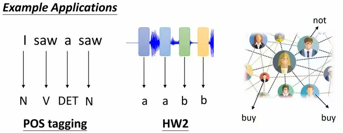

- **整个序列对应一个标签**：例如情感分析、判断分子是否具有亲水性等。

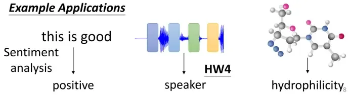

- **机器自主决定输出标签数量**：即序列到序列（Seq2Seq）任务，输入和输出都是长度不固定的序列。

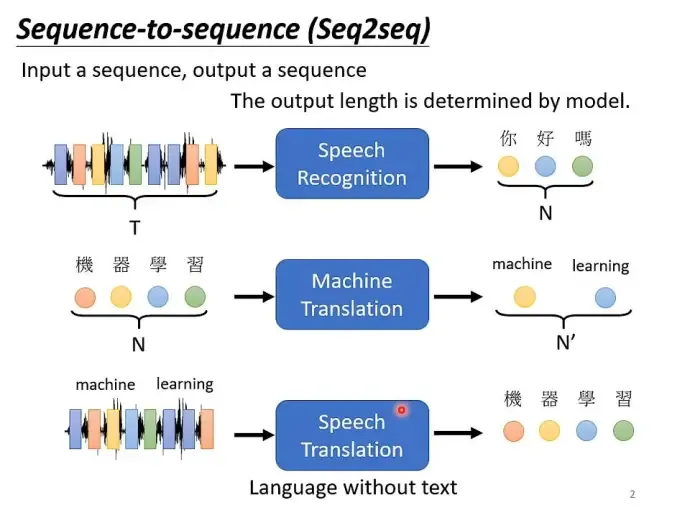

Seq2Seq通过编码器-解码器（Encoder-Decoder）结构实现。传统Seq2Seq的一个主要问题是：在处理长序列时，为了计算两个距离较远的单词之间的关系，需要通过梯度的形式进行传递，容易导致梯度爆炸和梯度消失问题。自注意力（Self-Attention）机制能有效解决这一问题。

以第一种情况（序列标注）为例，在这种场景下需要考虑上下文信息。例如句子中的两个"saw"明显词性不同，如果直接分别输入全连接层（FC），会输出相同的结果。因此需要考虑上下文，将当前向量与前后若干个向量一起输入FC。

但当任务需要考虑整个序列时，设置过大的窗口会导致FC参数量过大且容易过拟合。这正是自注意力机制要解决的问题。

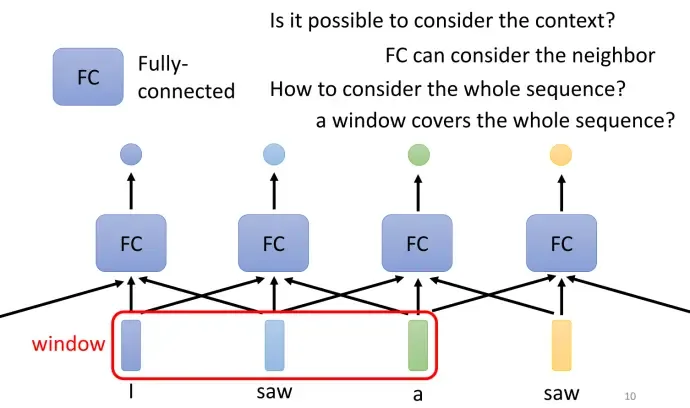

## Self-Attention 原理

自注意力是一种**将单个序列的不同位置关联起来，以计算同一序列表示的注意力机制**。可以将自注意力理解为感受野可学习的卷积神经网络（CNN），CNN是自注意力的特例。在数据量充足时，自注意力的表现优于CNN。

**全局建模能力对比**

- **自注意力**：在全局建模能力上具有明显优势，能够显式地捕捉序列中任意两个元素之间的关系，无论它们之间的距离有多远。这使得自注意力在处理长距离依赖和全局信息方面非常强大。

- **CNN**：在局部特征提取方面非常有效，但在全局建模能力上可能不如自注意力。然而，通过设计特定的网络结构（如使用全局池化层或多尺度卷积），CNN也可以在一定程度上捕捉全局信息。

自注意力会**考虑整个序列的上下文信息**，输入若干个向量，输出相同数量的向量。自注意力可以与全连接层叠加使用：自注意力处理整个序列的上下文，全连接层处理单个向量。

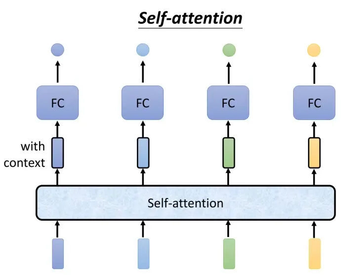

- **运作原理**：

输入是一个序列，可能是网络的输入或隐藏层的输出。输出的向量b是考虑了整个序列上下文后的结果。

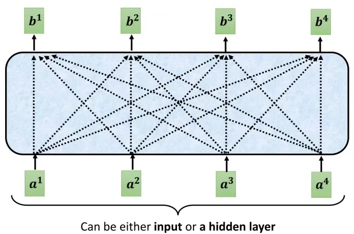

如何产生向量$b_1$？

1. 找出序列中与$a_1$相关的其他向量。关联程度用$\alpha$表示，将两个向量作为输入，常见的计算方式有：

- **点积（Dot Product）**（Transformer使用）：$a_1$和$a_2$分别乘以矩阵$W^q$和$W^k$，得到查询向量$q$和键向量$k$，再进行点积运算。

- **加法（Additive）**：将$q$和$k$拼接后输入激活函数。

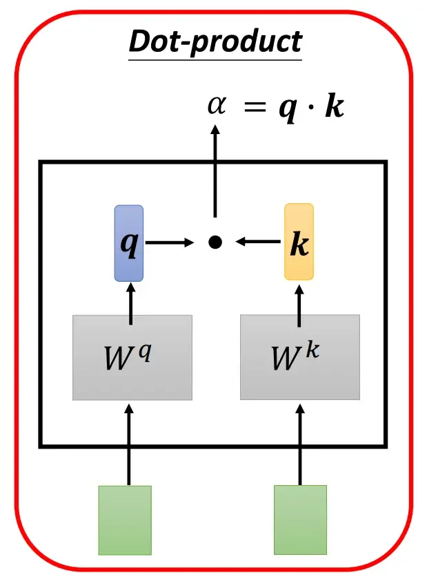

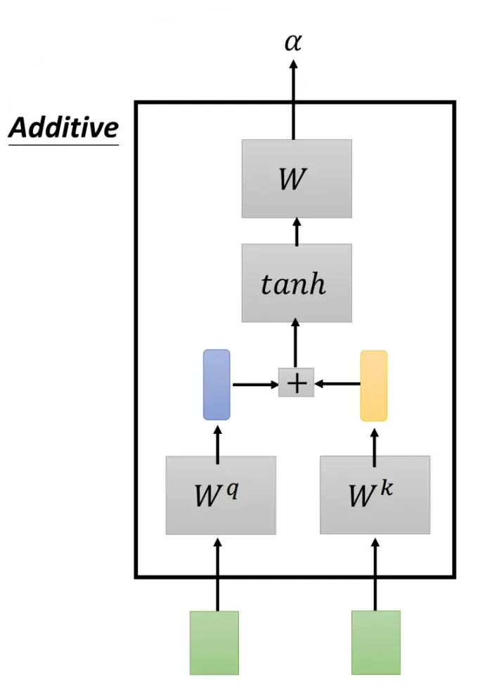

2. 如何将生成的$\alpha$应用到自注意力中？

$\alpha_{1,1} = q^1 \cdot k^1$，经过Softmax进行归一化处理（$q$和$k$分别对应查询向量Query和键向量Key，$q^1 k^2$表示第二个向量对第一个向量的影响程度）。

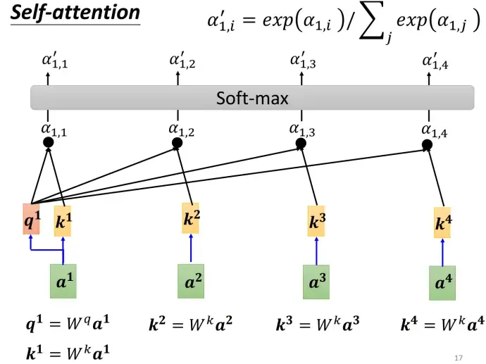

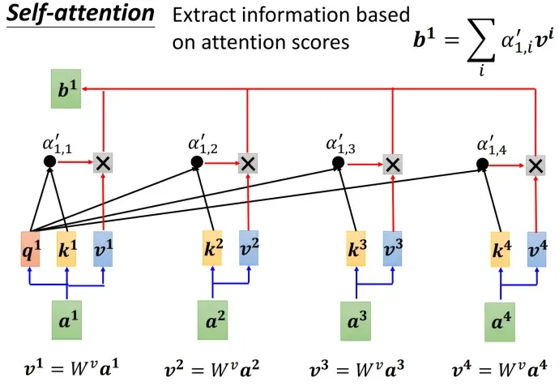

转化为矩阵格式，可学习参数为$W^q$、$W^k$、$W^v$三个矩阵。注意力矩阵$A'$乘以值矩阵$V$即得到自注意力的输出$O$。

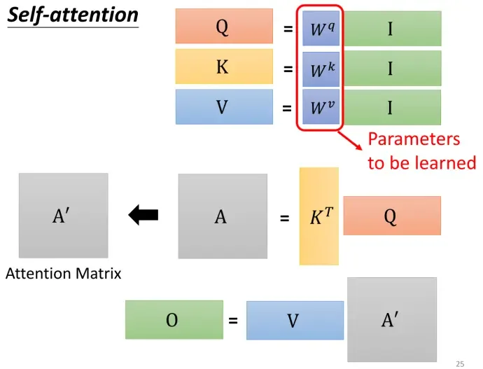

$$\text{Attention}(Q,K,V) = \text{softmax}\left(\frac{QK^T}{\sqrt{d_k}}\right)V$$

其中$d_k$是$Q$、$K$矩阵的列数，即向量维度。

除以$\sqrt{d_k}$是为了平滑Softmax的结果，防止进入Softmax的饱和区导致梯度值过小而难以训练。

**Self-Attention与RNN/LSTM的对比**：

1. 引入自注意力后**更容易捕获句子中长距离的相互依赖特征**。RNN或LSTM虽然也能捕获长距离特征，但对于远距离的相互依赖特征，需要经过若干时间步的信息累积才能将两者联系起来，距离越远，有效捕获的可能性越小。

2. 自注意力和RNN都能处理时序数据，每个向量都考虑了整个序列，但RNN需要按顺序计算，无法并行；**自注意力可以并行计算**，训练效率更高。

## Self-Attention 改进

1. **位置编码（Positional Encoding）**：自注意力虽然考虑了所有的输入向量，但没有考虑向量的位置信息。可以通过位置编码来解决这个问题，即**将位置信息添加到输入序列中，让输入数据本身就带有位置信息**。

上面的输入向量$a$是无序的，需要对$a$加上位置向量$e$。$e$可以通过多种方法产生（**正弦位置编码、位置嵌入、可学习编码、RNN**等）。

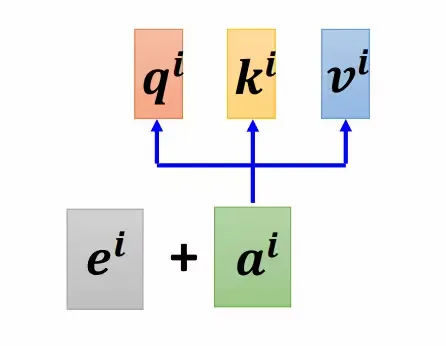

2. **多头注意力（Multi-Head Attention）**：把输入序列投影为多组不同的Query、Key、Value，并行分别计算后，再把各组计算的结果合并作为最终的结果。类似CNN中的多个通道（Channel），生成多组$W^q$、$W^k$、$W^v$矩阵。具体来说，$V$、$K$、$Q$三个矩阵通过$h$个线性变换，分别得到$h$组矩阵，每一组经过注意力计算得到$h$个注意力输出，进行拼接（Concat）后通过一个线性变换得到输出，其维度与输入词向量的维度一致。其中$h$就是多头注意力机制的"头数"。

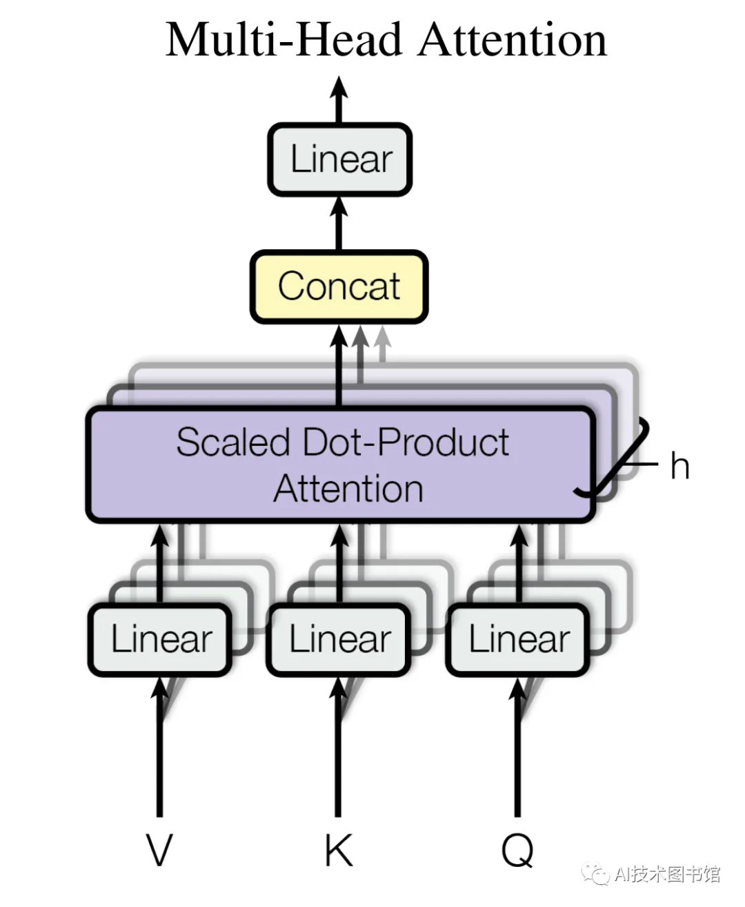

## Self-Attention 代码

```python
import torch.nn as nn
import numpy as np
import torch
import math

# 多头注意力
class MHA(nn.Module):
    def __init__(self, num_head, dimension_k, dimension_v, d_k, d_v, d_o):
        # d_k表示head dimension，d_k * num_head就是embedding的长度
        super().__init__()
        self.num_head = num_head
        self.d_k = d_k
        self.d_v = d_v
        self.d_o = d_o
        self.fc_q = nn.Linear(dimension_k, num_head * d_k)
        self.fc_k = nn.Linear(dimension_k, num_head * d_k)
        self.fc_v = nn.Linear(dimension_v, num_head * d_v)
        self.fc_o = nn.Linear(num_head * d_v, d_o)
        self.softmax = nn.Softmax(dim=2)

    def forward(self, q, k, v, mask):
        batch, n_q, dimension_q = q.size()
        batch, n_k, dimension_k = k.size()
        batch, n_v, dimension_v = v.size()

        q = self.fc_q(q)
        k = self.fc_k(k)
        v = self.fc_v(v)
        q = q.view(batch, n_q, self.num_head, self.d_k).permute(2, 0, 1, 3).contiguous().view(-1, n_q, self.d_k)
        k = k.view(batch, n_k, self.num_head, self.d_k).permute(2, 0, 1, 3).contiguous().view(-1, n_k, self.d_k)
        v = v.view(batch, n_v, self.num_head, self.d_v).permute(2, 0, 1, 3).contiguous().view(-1, n_v, self.d_v)

        attention = torch.matmul(q, k.transpose(-1, -2)) / math.sqrt(self.d_k)
        mask = mask.repeat(self.num_head, 1, 1)
        attention = attention + mask
        attention = self.softmax(attention)

        output = torch.matmul(attention, v)
        output = output.view(self.num_head, batch, n_q, self.d_v).permute(1, 2, 0, 3).contiguous().view(batch, n_q, -1)
        output = self.fc_o(output)
        return attention, output

# 多查询注意力
class MQA(nn.Module):
    def __init__(self, num_head, dimension_k, dimension_v, d_k, d_v, d_o):
        super().__init__()
        self.num_head = num_head
        self.d_k = d_k
        self.d_v = d_v
        self.d_o = d_o
        self.fc_q = nn.Linear(dimension_k, num_head * d_k)
        self.fc_k = nn.Linear(dimension_k, d_k)
        self.fc_v = nn.Linear(dimension_v, d_v)
        self.fc_o = nn.Linear(num_head * d_v, d_o)
        self.softmax = nn.Softmax(dim=2)

    def forward(self, q, k, v, mask):
        batch, n_q, dimension_q = q.size()
        batch, n_k, dimension_k = k.size()
        batch, n_v, dimension_v = v.size()

        q = self.fc_q(q)
        k = self.fc_k(k)
        v = self.fc_v(v)
        q = q.view(batch, n_q, self.num_head, self.d_k).permute(2, 0, 1, 3).contiguous().view(-1, n_q, self.d_k)
        k = k.repeat(self.num_head, 1, 1)
        v = v.repeat(self.num_head, 1, 1)

        attention = torch.matmul(q, k.transpose(-1, -2)) / math.sqrt(self.d_k)
        mask = mask.repeat(self.num_head, 1, 1)
        attention = attention + mask
        attention = self.softmax(attention)

        output = torch.matmul(attention, v)
        output = output.view(self.num_head, batch, n_q, self.d_v).permute(1, 2, 0, 3).contiguous().view(batch, n_q, -1)
        output = self.fc_o(output)
        return attention, output

batch = 10
num_head = 8
n_q, n_k, n_v = 2, 4, 4  # 序列长度
dimension_q, dimension_k, dimension_v = 128, 128, 64  # embedding维度
d_k, d_v, d_o = 16, 16, 8
q = torch.randn(batch, n_q, dimension_q)
k = torch.randn(batch, n_k, dimension_k)
v = torch.randn(batch, n_v, dimension_v)
mask = torch.full((batch, n_q, n_k), -np.inf)
mask = torch.triu(mask, diagonal=1)

mha = MHA(num_head, dimension_k, dimension_v, d_k, d_v, d_o)
attention, output = mha(q, k, v, mask)
print(attention.size(), output.size())

mqa = MQA(num_head, dimension_k, dimension_v, d_k, d_v, d_o)
attention, output = mqa(q, k, v, mask)
print(attention.size(), output.size())
```
