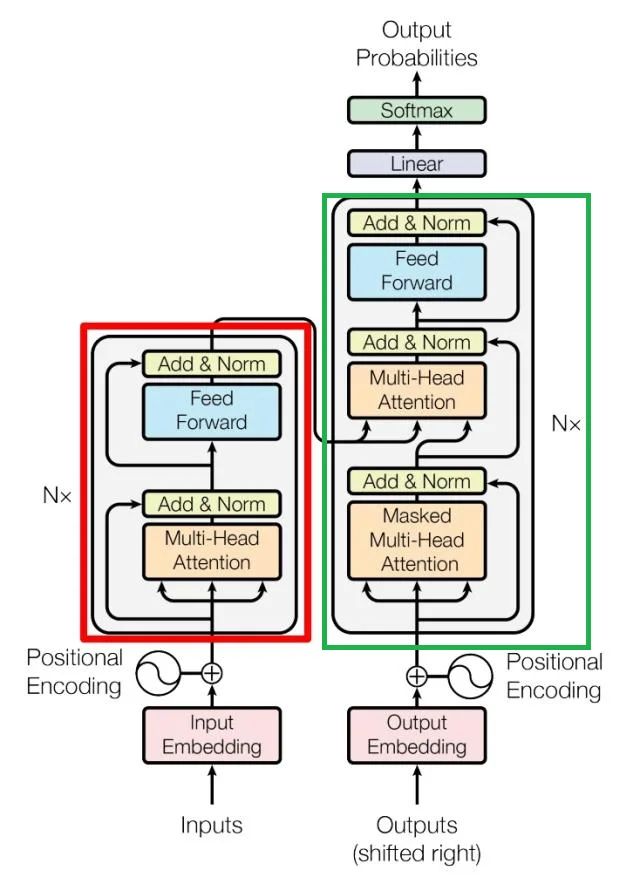
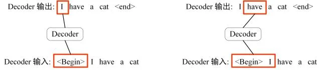
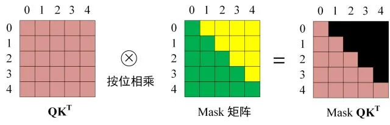
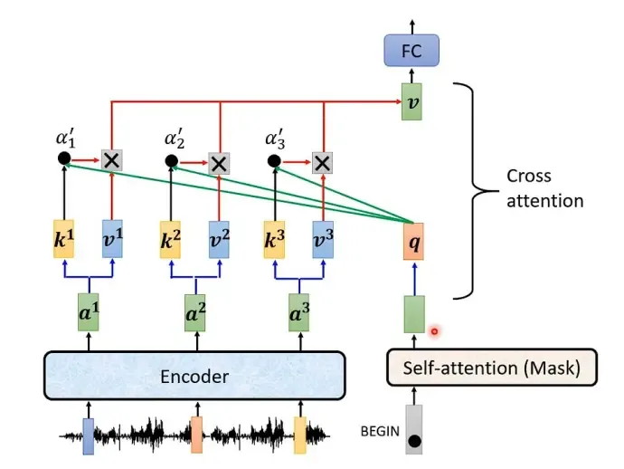

# Transformer

## Embedding

由输入的嵌入向量（Embedding）和位置编码（Positional Encoding）相加得到，后面的文章详细介绍。

- 输入的嵌入向量可以通过**Word2Vec、BERT、OpenAI Embedding API**等方式获取，目的是将文本映射到连续的向量空间（把文本变成模型能处理的向量）。

- 位置编码是为了捕捉输入中Token的顺序信息，常用的有RoPE、绝对位置编码等。

## Encoder

上图中红色部分就是编码器（Encoder），由**多头注意力（Multi-Head Attention）、残差连接与归一化（Add & Norm）、前馈网络（Feed Forward）、残差连接与归一化（Add & Norm）**组成。输入为矩阵$X \in R^{n \times d}$，其中$n$是输入序列的长度，$d$是嵌入向量的维度（简单理解为嵌入会把一个Token转成一个$d$维向量）。每一个Encoder Block都会输出一个矩阵$X \in R^{n \times d}$。最终Encoder的输出就是编码信息矩阵。

### Add & Norm

包含两次层归一化（Layer Normalization，**对每个样本的特征维度进行标准化**，可以加速训练过程和提高模型的泛化性能）和残差连接操作，分别是：

$$\text{LayerNorm}(X + \text{MultiHeadAttention}(X))$$
$$\text{LayerNorm}(X + \text{FeedForward}(X))$$

> 这种归一化方式被称为后归一化（Post-Norm），本文后面会详细介绍。

### Feed Forward

两个简单的全连接层。

$$\max(0, XW_1 + b_1)W_2 + b_2$$

## Decoder

上图中绿色部分就是解码器（Decoder），其中第一个多头注意力使用了掩码矩阵。第二个多头注意力使用了**交叉注意力（Cross-Attention）**。Decoder之后会有一个Softmax层用来预测下一个Token。

### 掩码矩阵

如下图所示，解码过程中会将之前预测的输出作为当前预测的输入。通过掩码矩阵可以防止第$i$个Token知道$i+1$个Token之后的信息。

**掩码矩阵在自注意力的Softmax之前使用。**

$$\text{Attention}(Q, K, V) = \text{softmax}\left(\frac{QK^T}{\sqrt{d_k}}\right)V$$

其中$d_k$是$Q$、$K$矩阵的列数，即向量维度。

### Cross-Attention

**这里的K和V矩阵是由Encoder的编码信息矩阵计算得到的，Q是由上一个Decoder Block计算得到的。**

### Softmax

由于之前使用了掩码矩阵，第$i$个单词的预测只包含了前$i$个单词的信息。Softmax会输出一个长度为$m$的向量（$m$是词表长度），其中元素加和为1，每个元素表示预测该Token的概率。然后根据解码策略（后面的文章详细介绍）确定输出哪个Token。

## Transformer 总结

- **优点**：支持并行计算（RNN需要顺序计算），具有捕获长距离语义依赖的能力，已衍生出大量后续模型。

- **缺点**：计算复杂度为$O(n^2)$，需要大量数据进行训练。

## Transformer 原始架构的局限性

尽管Transformer在自然语言处理领域取得了巨大成功，但原始架构仍存在一些局限性：

1. **计算复杂度高**：自注意力机制的计算复杂度为$O(n^2)$，其中$n$是序列长度。对于长序列，计算和内存开销会急剧增加，这限制了Transformer处理超长文本的能力。

2. **位置编码的局限性**：原始Transformer使用固定的三角位置编码，虽然能编码绝对位置信息，但在处理训练时未见过的序列长度时，泛化能力有限。

3. **缺乏递归结构**：与RNN不同，Transformer没有递归结构，需要通过位置编码显式地注入位置信息，且对位置信息的建模能力有限。

4. **对大规模数据的依赖**：Transformer需要大量数据进行训练，在小数据集上容易过拟合，性能不如传统的序列模型。

5. **注意力头的冗余**：多头注意力机制中，部分注意力头可能学习到相似的模式，存在一定的参数冗余。

这些局限性推动了后续研究，如稀疏注意力机制、线性注意力、Flash Attention等改进方案的提出。

## Pre-Norm 和 Post-Norm 的区别

**前归一化（Pre-Norm）**和**后归一化（Post-Norm）**分别指将归一化操作放在残差连接之前和之后。

$$\text{Pre Norm: } x_{t+1} = x_t + F_t(\text{Norm}(x_t)) \tag{1}$$
$$\text{Post Norm: } x_{t+1} = \text{Norm}(x_t + F_t(x_t)) \tag{2}$$

**先说结论：Pre-Norm结构往往更容易训练，但最终效果通常不如Post-Norm**。参考文献是《Understanding the Difficulty of Training Transformers》和《RealFormer: Transformer Likes Residual Attention》。

这里指的是Post-Norm在最优设置下的性能优于Pre-Norm，而不是在相同配置下。因为Post-Norm更难训练，需要一些额外的操作（比如需要添加学习率Warmup）。

### Pre-Norm 效果为什么更差

对于Pre-Norm，迭代可以得到：

$$x_{t+1} = x_t + F_t(\text{Norm}(x_t))$$
$$= x_{t-1} + F_{t-1}(\text{Norm}(x_{t-1})) + F_t(\text{Norm}(x_t)) \tag{3}$$
$$= \cdots$$
$$= x_0 + F_0(\text{Norm}(x_0)) + \cdots + F_{t-1}(\text{Norm}(x_{t-1})) + F_t(\text{Norm}(x_t))$$

其中每一项都是同一量级的（苏剑林认为这一说法并不准确，这是一个基于直觉的判断，即为了追求稳定的梯度，认为每一层的更新量都比较接近），那么有$x_{t+1}=O(t+1)$，也就是说第$t+1$层跟第$t$层的差别就相当于$t+1$与$t$的差别。当$t$较大时，$x_{t+1}$和$x_t$的相对差别是很小的，因此就有：

$$F_t(\text{Norm}(x_t)) + F_{t+1}(\text{Norm}(x_{t+1}))$$
$$\approx F_t(\text{Norm}(x_t)) + F_{t+1}(\text{Norm}(x_t)) \tag{4}$$
$$= \begin{pmatrix} 1 & 1 \end{pmatrix} \begin{pmatrix} F_t \\ F_{t+1} \end{pmatrix} (\text{Norm}(x_t))$$

这个公式的意思是由于$x_{t+1}$和$x_t$的相对差别小，$F_{t+1}(\text{Norm}(x_{t+1}))$和$F_{t+1}(\text{Norm}(x_{t}))$很接近，原本是一个$t$层的模型与$t+1$层拼接，**近似等效于一个更宽的$t$层模型**。在Pre-Norm中多层叠加的结果更多是增加宽度而不是深度，层数越多，这个层就越"虚"。而**对于深度学习模型，深度比宽度更重要**。

### Post-Norm 为什么更难训练

**先说结论：Post-Norm严重削弱了残差的恒等分支，所以反而失去了残差"易于训练"的优点，通常要Warmup并设置足够小的学习率才能使它收敛。**

假设初始状态的$x$和$F(x)$的方差均为1，且二者相互独立。归一化操作为了将方差降为1，这样初始阶段的Post-Norm相当于：

$$x_{t+1} = \frac{x_t + F_t(x_t)}{\sqrt{2}} \tag{5}$$

迭代下去就得到了：

$$x_l = \frac{x_{l-1}}{\sqrt{2}} + \frac{F_{l-1}(x_{l-1})}{\sqrt{2}}$$
$$= \frac{x_{l-2}}{2} + \frac{F_{l-2}(x_{l-2})}{2} + \frac{F_{l-1}(x_{l-1})}{\sqrt{2}} \tag{6}$$
$$= \cdots$$
$$= \frac{x_0}{2^{l/2}} + \frac{F_0(x_0)}{2^{l/2}} + \frac{F_1(x_1)}{2^{(l-1)/2}} + \frac{F_2(x_2)}{2^{(l-2)/2}} + \cdots + \frac{F_{l-1}(x_{l-1})}{2^{1/2}}$$

**残差的本意是为了给前面的层添加一个快速通道，保障梯度快速回传。而Post-Norm削弱了这个快速通道，残差名存实亡，容易导致梯度消失，难以训练。**

**梯度消失**指的是在深度网络的反向传播阶段，梯度在从输出层向输入层传播的过程中逐渐变小，最终趋于接近零。前面的层梯度较小乃至不更新，会导致后面层的输入质量变低，从而导致模型准确率降低。为了缓解梯度消失，可以采用残差连接，补上一个梯度为常数的项。

**梯度消失在微调模型时是优点**。因为微调希望优先调整后面的层，而前面的层少调整，避免破坏预训练学到的知识。梯度消失正好对前面的层调整较弱。所以，预训练好的Post-Norm模型，往往比Pre-Norm模型有更好的微调效果。

> **为什么Adam优化器比SGD优化器更容易收敛（受梯度消失影响小）？**
> Adam优化器的更新公式如下：
> 1. 梯度的一阶动量（动量）估计：

$$m_t = \beta_1 m_{t-1} + (1 - \beta_1) g_t$$

这里，$g_t$是当前梯度，$m_t$是一阶动量（梯度的指数加权移动平均），$\beta_1$是平滑参数，通常取0.9。

2. 梯度的二阶动量（方差）估计：

$$v_t = \beta_2 v_{t-1} + (1 - \beta_2) g_t^2$$

$v_t$是二阶动量（梯度平方的指数加权移动平均），$\beta_2$是平滑参数，通常取0.999。

3. 偏差修正：由于动量和方差在初始时刻可能较小，需要进行偏差修正：

$$\hat{m}_t = \frac{m_t}{1 - \beta_1^t}, \quad \hat{v}_t = \frac{v_t}{1 - \beta_2^t}$$

4. 参数更新：使用修正后的动量和方差计算每个参数的更新值：

$$\theta_{t+1} = \theta_t - \eta \frac{\hat{m}_t}{\sqrt{\hat{v}_t} + \epsilon}$$

> Adam每一轮的更新量是$O(\eta)$量级的，理论上只要梯度的绝对值大于随机误差，那么对应的参数都会有常数量级的更新量；而SGD的更新量正比于梯度，梯度过小会导致参数不更新，因此受梯度消失影响更严重。

与之对比的Pre-Norm保留了完整的快速通道：

$$x_l = x_0 + F_0(x_0) + F_1(x_1/\sqrt{2}) + F_2(x_2/\sqrt{3}) + \cdots + F_{l-1}(x_{l-1}/\sqrt{l}) \tag{7}$$

### Warmup 学习率对 Post-Norm 的作用

Warmup学习率指学习率随着轮数逐渐增长到目标学习率。如果不进行Warmup学习率，那么后面的层学习会很快，但由于前面的层梯度消失，学习的并不好，导致后面的层是建立在糟糕的输入上的。这会导致模型陷入局部最优，最坏的情况下，前面的层学习效果过于差，后面层每轮的更新变成了随机常数，Loss发散成NaN。

而使用Warmup，就留给模型足够多的时间进行"预热"。在这个过程中，主要是抑制了后面的层的学习速度，并且给了前面的层更多的优化时间，以促进每个层的同步优化。

### DeepNorm

对输入乘上一个$\alpha > 1$，保障快速通道的系数能保持比较大。

$$X_{t+1} = \text{Norm}(\alpha X_t + F_t(X_t)) \tag{8}$$

总结：

- **Post-Norm**：适合较浅的Transformer网络，或者任务不太复杂时，它可以取得更好的准确性。

- **Pre-Norm**：对于深层Transformer模型，它的梯度更加稳定，收敛性有保障，因此通常在深度模型中表现得更好。
