# RAG

**RAG（Retrieval-Augmented Generation，检索增强生成）** 是一种结合 **信息检索** 和 **文本生成** 的技术，旨在通过引入外部知识库提升生成模型的事实准确性、相关性和多样性。其核心思想是：在生成答案前，先从大规模文档库中检索相关上下文，再基于检索结果生成最终输出。RAG 就像是让大模型开卷考试，不必再死记硬背所有知识，而是根据用户问题先去查参考书，然后再进行回复。

下图参考：[RAG From Scratch](https://www.youtube.com/playlist?list=PLfaIDFEXuae2LXbO1_PKyVJiQ23ZztA0x)

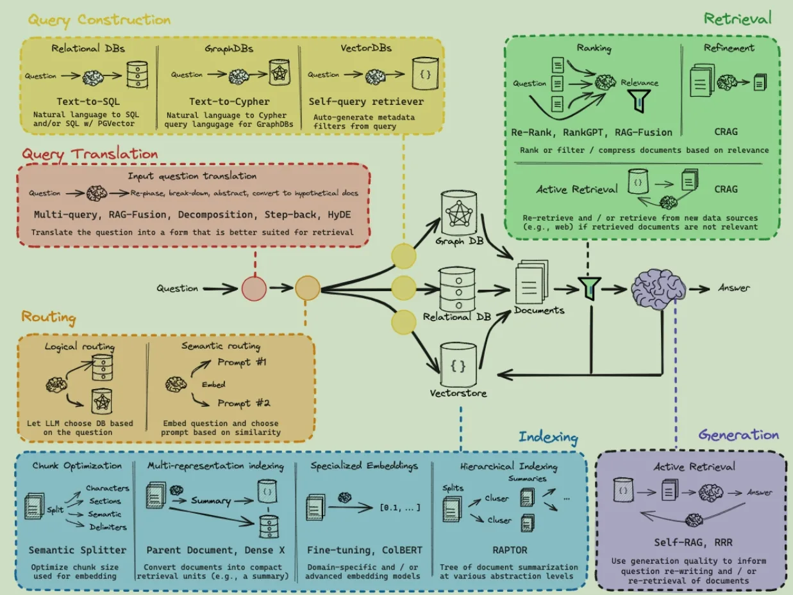

**RAG 有哪些好处？**

- **提升生成内容的准确性**：通过引入外部知识库的信息，能够在生成文本时补充模型自身的知识缺陷，提高生成内容的准确性和可靠性。尤其是在特定领域中，RAG 可能检索到相比模型训练时更丰富的知识。

- **即时更新知识**：RAG 模型具备检索库的更新机制，可以实现知识的即时更新，无需重新训练模型，从而提供与最新信息相关的回答。

- **增强可解释性**：由于 RAG 模型的答案直接来自检索库，其回复具有很强的可解释性，用户可以核实答案的准确性，从信息来源中获取支持。

- **缓解幻觉问题**：让大模型避免对不了解的内容进行胡说八道。

- **本地数据的隐私性**：很多企业数据不能上传云端或进行模型训练，RAG 允许在本地部署知识库，保障数据安全。

**RAG 对比模型微调**：

## 基本步骤

### Indexing：建库

- **数据收集与处理**：系统从各种数据源（如文本文件、PDF、网站、数据库或 API）中收集数据，并转换成统一的纯文本格式。

- **数据分割**：将处理后的文本分割成适当大小的块，以便于后续的检索和管理，常用分割方法有固定长度分块、重叠分块等，此过程可以省略，详见 3.2 Chunking-free RAG 篇。

- **向量化表示**：使用预训练的模型（如 BERT、BGE 等）将文本块转换为向量表示，这些向量捕获了文本的语义信息，详见 1.7 embedding 篇。

- **索引构建**：将这些向量存储在专门的数据库中，构建索引结构（如倒排索引或向量索引），以便快速检索，详见 3.3 向量索引篇。

Indexing 阶段可以离线运行，不参与与用户的实时交互。

### Retrieval：检索

- **查询编码**：当用户提交查询时，使用相同的编码器将查询转换为向量表示。

- **相似性计算**：计算查询向量与索引中的文档向量之间的相似度，常用的相似性度量方法包括余弦相似度和欧氏距离。

- **排序与选择**：根据相似度得分对文档进行排序，并选取排名最高的前 K 个文档或文档片段作为与查询最相关的文档。

- **查询优化**：进行重新排序或过滤，以提高检索结果的质量，详见 3.4 ReRank 篇。

### Generation：生成

- **上下文整合**：将检索到的文档片段与用户的原始查询结合，形成一个连贯的提示（prompt），为生成模型提供丰富的上下文信息。

- **生成响应**：生成 LLM 模型基于这些上下文信息和原始查询生成最终的回答。生成的文本不仅利用了检索到的信息，还结合了模型的语言生成能力，以确保回答的准确性和流畅性。

- **输出优化**：在生成阶段，可能会加入后处理步骤，如答案的置信度评估、多候选答案筛选、格式解析等，以确保生成的答案是相关且准确的。

Retrieval 和 Generation 阶段在线运行，对每个用户查询都会实时执行，确保系统能够利用最新的知识库信息提供准确回答。

下图描述了 RAG 的基本流程，文档存储在向量数据库中，新的用户查询进来之后，首先向量数据库中检索相关的文档，将检索到的文档加到 prompt 中，由大模型负责生成回复。

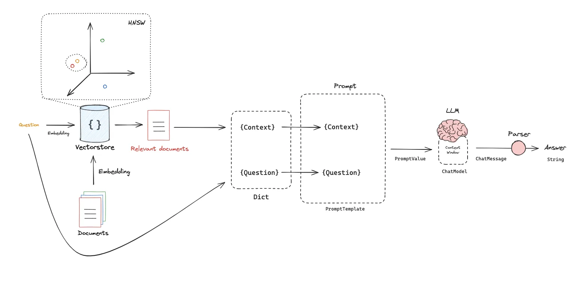

**RAG 的核心优化方法主要有两方面**：

- 如何根据用户查询检索到所有最相关的知识

- 如何根据知识生成准确的回复，并且支持多轮交互

## Query Translation

属于 RAG Pipeline 的第一阶段，目的是为了将 question 变成更容易检索的形式，提升 retrieval 的效果。

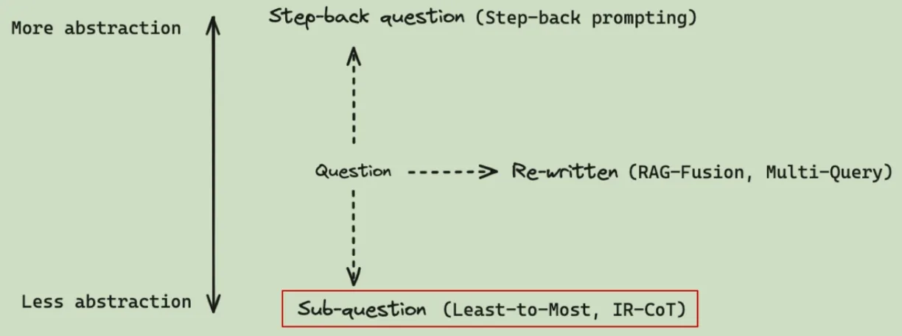

### Multi Query

将 question 从多个角度重写（例如同义词替换、相似语义拓展、删除冗余词、纠正错误和标准化表述等），再每个 question 上都 retrieval，查询结果取并集，获取更全面的文档集合。

```Python
def get_unique_union(documents: list[list]): 
    """ Unique union of retrieved docs """ 
    flattened_docs = [dumps(doc) for sublist in documents for doc in sublist] 
    # 获取唯一文档 
    unique_docs = list(set(flattened_docs)) 
    return [loads(doc) for doc in unique_docs] 
```

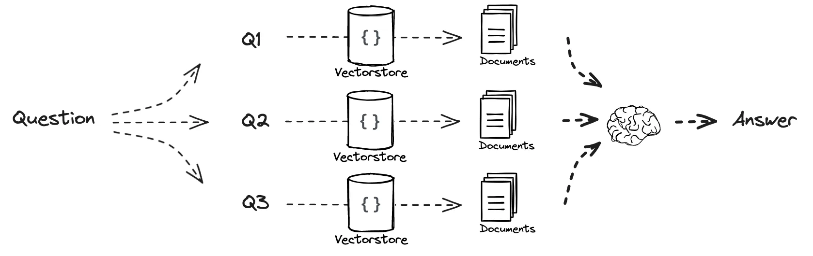

### RAG Fusion

对于检索到的文档做相互排名（Reciprocal Rank Fusion，RRF），通过加权各个 question 在文档中的查询结果，得到一个综合排名，并取前几名。

```Python
def reciprocal_rank_fusion(results: list[list], k=60): 
    # k: 参数，默认值为60。用于平滑排名得分，使得较高的排名对得分的影响更大，但不会过于极端。 
    """ 
    存储每个唯一文档的融合得分 
    """ 
    fused_scores = {} 
    for docs in results: 
        for rank, doc in enumerate(docs): 
            doc_str = dumps(doc) 
            if doc_str not in fused_scores: 
                fused_scores[doc_str] = 0 
            previous_score = fused_scores[doc_str] 
            # 使用RRF公式更新文档的得分 
            fused_scores[doc_str] += 1 / (rank + k) 
    # 根据融合得分对文档进行降序排序: 
    reranked_results = [ (loads(doc), score) 
    for doc, score in sorted(fused_scores.items(), key=lambda x: x[1], reverse=True) ] 
    return reranked_results 
```

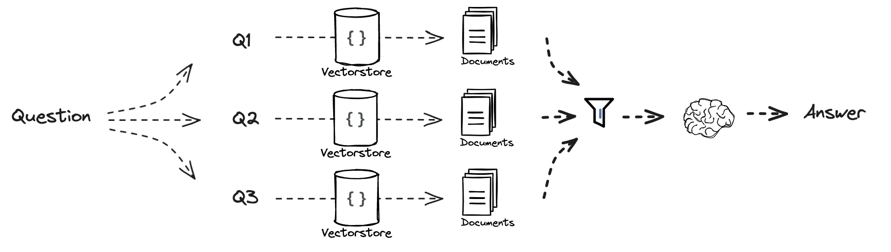

### Decomposition

将原始 query 拆解成多个子问题，主要有两种实现方式：

- 每个子问题都会影响后续子问题的提问和解答过程，类似逐步推理。

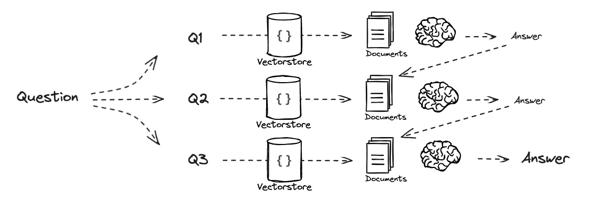

```Python
q_a_pairs = "" 
for q in questions: 
    rag_chain = ( 
    {"context": itemgetter("question") | retriever, 
    "question": itemgetter("question"), 
    "q_a_pairs": itemgetter("q_a_pairs")} 
    | decomposition_prompt 
    | llm 
    | StrOutputParser())
    answer = rag_chain.invoke({"question":q,"q_a_pairs":q_a_pairs}) 
    q_a_pair = format_qa_pair(q,answer) 
    q_a_pairs = q_a_pairs + "\n---\n"+ q_a_pair 
    # 通过累积`q_a_pairs`，之前的问题和答案不断地加入到背景信息中，
    # 使得LLM在处理当前问题时能参考之前问答的内容
```

- 每个子问题互相不影响，最后合并答案。

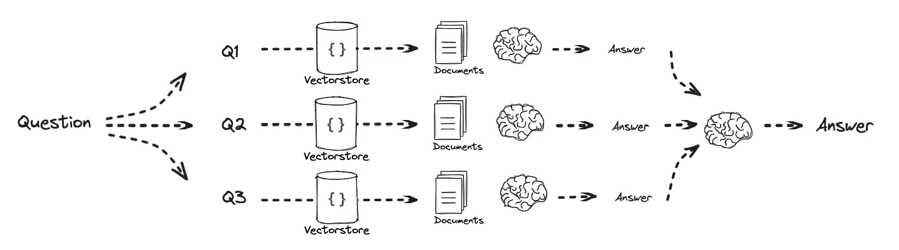

```Python
def format_qa_pairs(questions, answers):
    formatted_string = ""
    for i, (question, answer) in enumerate(zip(questions, answers), start=1):
        formatted_string += f"Question {i}: {question}\nAnswer {i}: {answer}\n\n"
    return formatted_string.strip()
context = format_qa_pairs(questions, answers)
```

### Step Back

从一个具体的问题出发，通过给一些 few-shot 的方式，生成一个更高层次、更抽象的问题，以便于检索到相关文档。例如从问某人的学习成绩到问对某人的评价。

### HyDE（Hypothetical Document Embeddings）

与以上不同，HyDE 根据用户输入的 question 生成一些假设的 doc，这些 doc 与文档更接近，利用这些 doc 检索相关的知识。这样做的直觉是：由模型生成的回答会包含与查询语义相关的词汇和信息，可以作为查询的丰富语义表示，从而找到那些没有直接关键词匹配但语义相关的文档。

HyDE 大致可以分为三个步骤：

- 首先使用一个生成式语言模型（如 GPT）根据输入查询生成一篇内容丰富的**假设性回答文档**（即使这个文档在知识库中并不存在）；

- 然后将生成的假设文档输入编码器生成嵌入向量表示；

- 最后利用该向量去检索知识库中与之**语义相似**的真实文档。

**HyDE 的优点**：

对于专业领域或长尾问句，直接基于关键词的匹配效果可能不佳，而通过生成一个"理想答案"再去搜索，能显著提高召回的相关性和丰富度。在没有大规模标注数据的情况下，HyDE 属于一种**零样本**的增强检索策略，对垂直领域（金融、医疗等）的长尾问题尤其有效。

**样例**：用户查询"保险销售技巧"。传统检索可能只针对"销售"或"保险"检索，结果不一定全面。应用 HyDE 时，我们先让 LLM 根据这一查询生成一段**假设回答**，例如："保险销售技巧包括了解客户需求、建立信任、提供专业建议"，假设回答丰富了查询关键词，有更大概率找到相关的文档。

```python
def hyde_retrieval(query: str, embed_model, doc_embeddings, doc_ids):
    # 1. 使用LLM生成假设文档
    prompt = f"请针对以下问题给出详细的回答：{query}"
    response = openai.ChatCompletion.create(
        model="gpt-3.5-turbo",
        messages=[{"role": "user", "content": prompt}]
    )
    hypo_doc = response["choices"][0]["message"]["content"]

    # 2. 将生成的文档进行向量化
    query_vector = embed_model.encode(hypo_doc)

    # 3. 在向量空间中检索相似文档
    # （这里假设已有知识库文档向量 doc_embeddings 和对应的 doc_ids 列表）
    # 计算与所有文档向量的余弦相似度，并选取最高的若干
    import numpy as np
    sims = np.dot(doc_embeddings, query_vector)
    top_idx = sims.argsort()[-5:][::-1]  # 取前5个相似度最高的文档索引
    results = [(doc_ids[i], sims[i]) for i in top_idx]
    return results
```

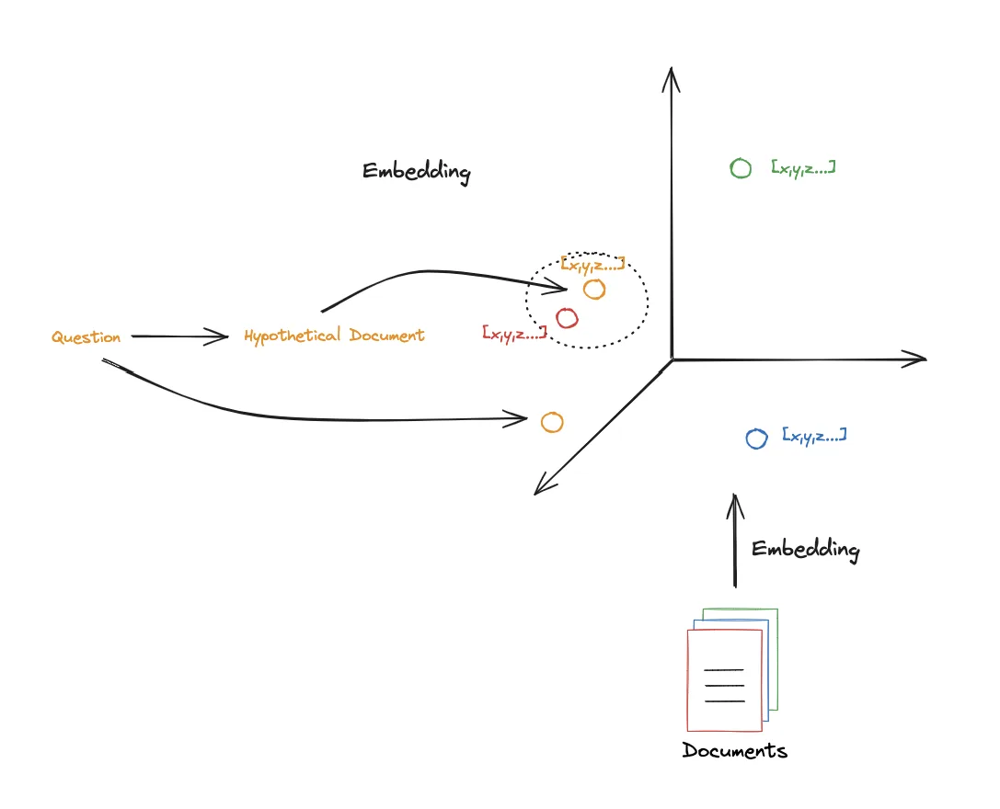

## Routing

属于 RAG Pipeline 的第二个阶段，目的是根据 question 查到正确的数据源，实际是一个分类任务。首先要根据用户问题做意图识别：

- **基于规则的方法**：使用预先定义的关键词或模式来判断意图。根据领域知识，列出与各类意图相关的关键词集合，匹配用户 query 中出现的词来分类。此方法实现简单直接，对已知意图效果好。缺点是对未包含的表达方式鲁棒性差，需人工维护规则库。

    - 例子：如果用户 query 中包含"**报销**""**费用**"等关键词，判定为**报销流程查询**；如果包含"**销售**""**技巧**"等词，判定为**保险产品销售技巧**。

- **基于机器学习的方法**：收集大量的意图识别的样本，对预训练的模型（如 BERT）继续微调。相比规则方法，ML 模型对同义表达更鲁棒，能捕获上下文语义特征。缺点是需要标注数据进行训练。

- **基于提示词工程的方法**：通过精心设计的 Prompt 直接让大模型判断意图类别。可以提供若干意图类别描述，让模型选择最适合的类别。此方法不需要额外训练数据，在零样本或少样本场景下效果好。

识别出意图之后，就可以将用户问题 route 到最相关的资源库中进行查询。

### Logical Routing

拥有多个资源库，将用户查询 route 到最相关的资源库中进行查询。

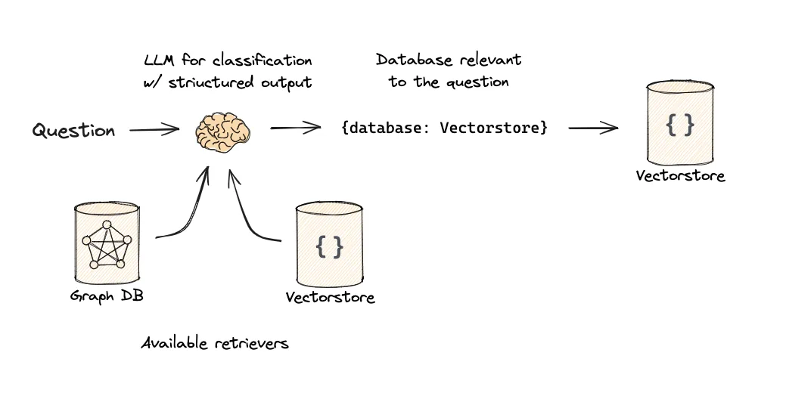

### Semantic Routing

通过语义相似度进行路由，一种特别有用的技术是使用 embeddings 将 query 路由到最相关的 prompt。

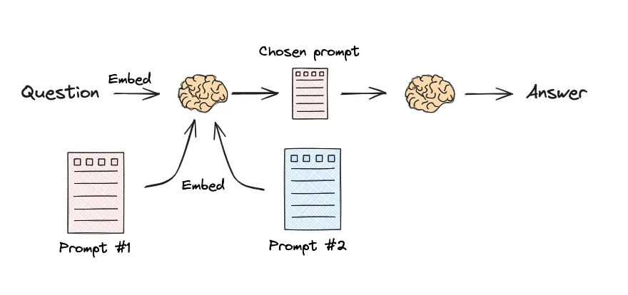

## Query Construction

Query Construction 是 RAG Pipeline 的第三个阶段，利用命名实体识别等技术将自然语言 question 转成合适的搜索和过滤参数，根据关键词从数据库中进行搜索。

用户 query：how to use multi-modal models in an agent, only videos under 5 minutes

输出：

- content_search: multi-modal models agent

- title_search: multi-modal models agent

- max_length_sec: 300

## Indexing

RAG Pipeline 的第四阶段，将文档拆成 vector 形式，建立索引。

### Chunking

分块（Chunking）是将大块文本分解成小段的过程，直接影响系统的检索质量和生成效果：

- **检索精度和相关性**：合理的切分能保证每个 chunk 的语义完整性，更准确的匹配用户意图，降低不相关内容被一同检索的可能性。

- **向量表示与相似度计算**：能产生更精确的语义向量表示，使相似度计算更加准确，并且可以加速相似度计算和索引查找过程。

- **生成质量优化**：合理的切分能在不超过模型最大输入限制的情况下提供足够上下文，提高输入给模型的信息密度和质量，减轻模型幻觉。

- **实际应用考量**：不同领域可能有不同的切分策略，保留和添加适当的元数据可以提升检索效果。

**现有的一些分块方案：**

- FastGPT、Langchain-Chat、Baidu 千帆知识库、星火知识库、Jina

基于 **Langchain** 的分块方案：

- **Character**：按固定字符数分割。可以设置重叠字符来保持上下文。

- **Recursive**：Langchain 的默认文本分割器，它按不同的字符递归地分割文档（默认使用 ["nn", "n", " ", ""]），按照顺序逐个遍历列表中的分隔符直到块足够小为止，可以实现结构化的文档切分。可以设置重叠字符来保持上下文。

- **Token**：按照 token 数量进行分块。常用的分词器有 BPE、tiktoken 等。

- **Document**：使用特定的分隔符或规则进行分割，如 markdown 中的标题符号、Python 代码中的类和函数等。

- **Semantic**：通过计算句子间 embedding 距离，把具有相似主题或内容的句子分为一块。

- **Agentic**：最高级别的 chunking 方法，通过 LLM 做决策，将文本分块为独立的命题。

**分块时应该考虑的因素：**

1. **被索引内容的性质是什么**？是处理较长的文档（如文章或书籍），还是处理较短的内容（如微博或即时消息）？

2. **使用的是哪种 Embedding 模型**？例如，sentence-transformer 模型在单个句子上工作得很好，但像 text-embedding-ada-002 这样的模型在包含 256 或 512 个 tokens 的块上表现得更好。

3. **对用户查询的长度和复杂性有什么期望**？用户输入的问题文本是简短而具体的还是冗长而复杂的？这也直接影响到我们选择分组内容的方式，以便在嵌入查询和嵌入文本块之间有更紧密的相关性。

4. **如何使用检索结果**？例如，它们是否用于语义搜索、问答、摘要或其他目的？

- **一个比较好的文档解析**

    - **统一文档解析与 OCR 改进**：构建通用的解析模块，针对不同格式分别处理：

        - **PDF 解析**：优先使用文本层提取（如 pdfplumber 或 PyMuPDF 读取），保持读取顺序；对于扫描 PDF 或嵌入的图片，调用 OCR 引擎（如 Tesseract 或 PaddleOCR）。特别地，OCR 时针对表格区域采用专门处理（例如先检测表格边框或使用表格 OCR 算法），确保按单元格顺序输出文本；对于代码块图片，可设置 OCR 保持换行和空格格式。（这里推荐 Marker 和 MinerU）

        - **PPT 解析**：利用幻灯片结构提取标题和文本框内容。每页幻灯片输出时保留其标题，项目符号列表作为子内容。对于包含图片的幻灯片，可对图片执行 OCR（如截图后 OCR）以提取其中的文字说明。

        - **纯文本解析**：直接按行/段读取，识别格式中的特殊标记（例如 Markdown 的 `代码` 块或表格格式）加以处理。确保代码块保留缩进和换行，表格按行列分隔保存。

        - **视频解析**：先通过语音识别得到逐句字幕，再按时间戳或内容语义将字幕合并成段落。可以利用现有 ASR 工具获取准确的转录文本，并根据视频内容结构（章节或 PPT 同步内容）对转录文本分段。

    - **智能 Chunk 切分（规则 + 语义融合）**：在得到完整文本后，按照文档的自然结构和语义连贯性进行分块：

        - **基于规则的切分**：利用文档格式特征，如章节标题、段落换行、列表项、表格边界等作为切分点。一旦检测到新的章节点或列表起始，就结束当前 Chunk 开启新 Chunk。对于表格和代码块，整段内容视为一个 Chunk，避免中途截断。

        - **语义连贯的调整**：在规则初切分后，检查相邻 Chunks 的内容连贯性。如果发现某 Chunk 过短且与前后段落语义上紧密相关（例如上一个 Chunk 以冒号结尾或内容未完结），则可以和相邻 Chunk 合并，确保信息完整。例如跨页的段落，如果下页开头并非新章标题，则应与前页末尾合并为同一 Chunk。再如表格跨越多页时，将各页片段合成为一个整体表格 Chunk。通过简单的 NLP 或 embedding 相似度检测，也可判断段落主题是否延续，辅助决定是否合并或继续切分。

        - **长度和平衡**：在保证语义完整的前提下控制 Chunk 长度，使其适合向量检索和后续模型处理（例如不超过 512 字或一定 token 数）。过长则适当按语义次级节点再拆分，过短则与相邻补充。最终每个 Chunk 都应是自含意义明确的一段内容。

    - **层级结构与标签管理**：为每个 Chunk 附加丰富的元数据标签，保留其在原文档中的位置和语境：

        - **章节层级标签**：在解析阶段捕获文档的层次结构（例如章节编号/标题、二级标题等）。实现方式可以是依据格式（PPT 的标题框、PDF 文本的字体大小/序号）识别标题行，并维护一个层级栈。例如检测到"1 总则"属于一级标题、"1.1 范围"属于二级标题等。分块时，将当前 Chunk 所属的所有上级标题作为一个层级列表存入标签。如此每个 Chunk 都带有类似"总则 > 范围"的层级路径。检索时可以将这些标题一起参与索引，提高召回率（例如用户搜索某章节名时也能匹配相关 Chunk）。

        - **内容类别标签**：标注 Chunk 的内容类型和主题类别。例如标记 Chunk 是否为"表格"、"代码块"或普通文本，"政策条例"还是"操作指南"等。这可通过解析时的内容特征判断（如检测到多列文本则标记表格，包含代码格式则标记代码段）。也可以结合业务定义的类别（如财务制度、销售策略）作为标签。这些标签在检索时可用于过滤或作为额外特征提高准确匹配度。

        - **引用与来源**：每个 Chunk 还应记录来源文档名、页码或幻灯片编号等，以便命中后追溯原文。同时这些信息可在生成答案时用于引用出处。

### Multi-representation Indexing

将用于答案生成的文档与用于检索的参考文档解耦。

建库时建立一个包含完整文档的 **docstore**，再利用 LLM 对文档做总结，建立一个 **vectorstore** 用于检索。对于输入的 question，先与每个文档的总结进行相似度匹配，再根据匹配到的总结在完整的 docstore 中查询。

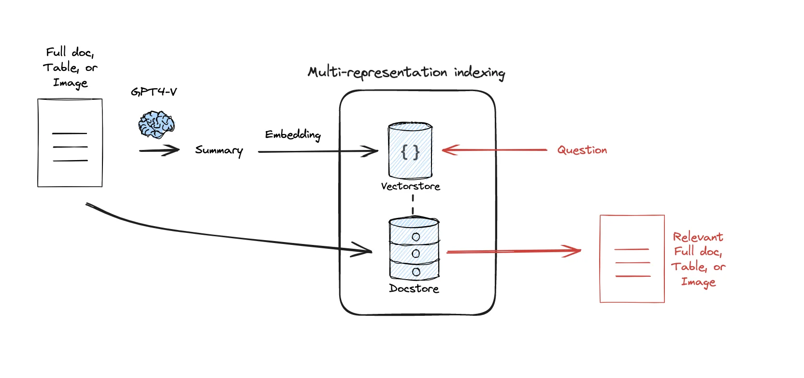

该方法特别适用于图像和表格，解决了直接嵌入表格或图像（多模态嵌入）的挑战，使用总结作基于文本相似性搜索。

### RAPTOR

"低层次"的 query，指那些只需要单一文档就可以回答的 query；"高层次"的问题，指那些需要多个文档结合才会回答的 query。此时，典型的 kNN 检索可能并不适用，因为 kNN 检索只能检索有限数量的文档块。

通过创建捕捉更高层次概念的文档摘要来解决这个问题。嵌入并聚类文档，然后总结每个聚类。以**递归**的方式这样做，产生一个包含越来越高层次概念的**摘要树**。摘要和起始文档一起被索引，覆盖用户 query 的范围。

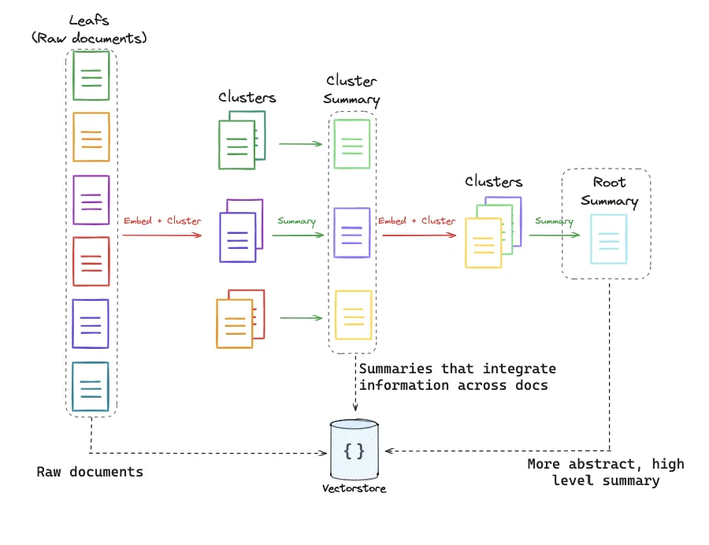

### ColBERT

文档和问题都先被分解成一个个词（Tokens），然后分别对每个词进行嵌入，得到词级别的嵌入向量。对于问题中的每个词的嵌入，分别与文档中每个词的嵌入进行相似度计算，找到与问题中每个词嵌入最相似的文档词嵌入，并记录下它们之间的最大相似度。然后，每个文档的得分是问题嵌入与文档嵌入中任何一个最大相似度的总和：

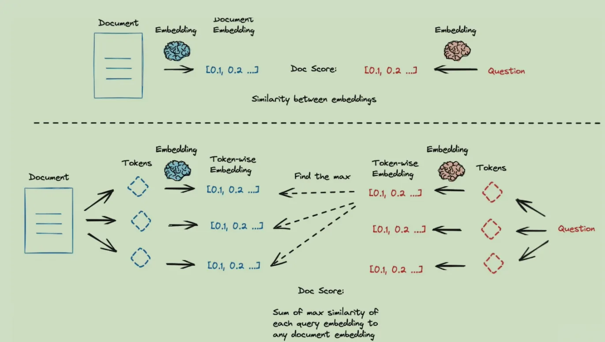

## Retrieval

### 混合索引

检索模块要根据用户查询，从索引中召回最相关的文档片段。首先使用 Indexing 阶段相同的 embedding 模型将用户查询向量化，然后计算用户查询与向量库中文档的相似度，选取排名最高的前 K 个文档或文档片段作为与查询最相关的文档。检索之后还可以进行重新排序，以提高检索结果的质量。

基础的检索算法有密集检索和稀疏检索两种：向量语义检索擅长捕捉语义相似度，能找到包含同义表述的相关文档，但可能忽略精确的关键词匹配；而 BM25 等传统关键词检索对匹配查询关键词的文档非常有效。

#### 稀疏检索

代表算法 BM25，是一种基于关键词的检索算法，通过计算查询词与文档中的关键词匹配程度来评估文档的相关性。它使用 TF-IDF（词频-逆文档频率）权重来衡量关键词的重要性。

- **词频（TF）**：一个词在文档中出现的频率。一个词在文档中出现的次数越多，它就越重要：

$TF(t, d) = \frac{词汇t在文档d中出现的次数}{文档d中的总词数}$

- **逆文档频率（IDF）**：反映了一个词在整个文档集合中有多罕见。如果一个词在很多文档中都出现，那么它的重要性就低；反之，如果它在少数文档中出现，则它的重要性就高。

$IDF(t) = log(\frac{文档总数}{包含词汇t的文档数量})$

- **TF-IDF**：$TF-IDF(t,d)=TF(t,d) \times IDF(t)$

- BM25 的核心思想是计算查询词项和文档词项之间的相关性得分，然后综合这些得分来评估整个文档的相关性：

$$BM25(q,d) = \sum_{t \in q} IDF(t) \cdot \frac{TF(t,d) \cdot (k_1+1)}{TF(t,d) + k_1 \cdot (1-b+b \cdot \frac{|d|}{avgdl})}$$

$$IDF(t) = \log\left(\frac{N - n_t + 0.5}{n_t + 0.5} + 1\right)$$

BM25 的优点在于其简单性和有效性，它能够快速计算文档与查询的相关性得分，并且通常在实际应用中表现良好。然而，BM25 也有局限性，例如它不考虑词语的顺序和语义。

#### 密集检索

计算用户查询向量与文档之间的相似性，代表性指标有：

$$\text{cosine}(q, d) = \frac{q \cdot d}{\|q\| \|d\|}$$

**提供一个比较好的混合检索方案**：

1. **意图识别与路由**：通过简单的规则或训练分类模型对查询进行分类。如果检测到查询是流程/制度类问题（通常包含"制度"、"流程"等关键词），则可以对 BM25 检索给予更高权重；如果是开放性思考类问题（包含"如何"、"怎么办"等），则侧重向量检索结果。此前置步骤保证不同查询走最合适的检索路径。

2. **BM25 检索**：构建文档的关键词倒排索引（可使用 Elasticsearch 或其他搜索库），检索出 Top N 候选文档片段。BM25 根据查询词在文档中的频率、文档长度等打分。对于短查询，可直接采用 BM25 结果；对于长查询，BM25 结果可作为补充。

3. **向量检索**：利用 Embedding 模型将查询编码成向量，在 Milvus 向量数据库中进行近邻搜索，获取 Top N 候选片段。向量检索能找出语义相关的内容，即使字面不匹配。

4. **结果合并与去重**：将两种检索的候选列表合并。由于 BM25 分数和向量相似度分值不在同一量纲，需进行归一化处理。例如，可将 BM25 分数归一到 0-1 区间，向量相似度天然在 0-1（如余弦相似度）。然后按一定策略融合，如线性加权组合或者直接取两者结果集的并集。在组合过程中处理重复文档（相同 chunk 多次出现）以避免干扰。

5. **提高召回率**：混合检索确保潜在相关结果进入候选集。尤其在只用向量或只用 BM25 无法检索到某些答案时，另一种方式可以补充，使真正相关的片段不被漏掉。

### Embedding 模型训练

参考：《[Fine-Tune Embedding: The Secret to Improve Response Rates | iWeaver AI](https://www.iweaver.ai/blog/fine-tune-embedding-the-secret-to-improve-response-rates#:~:text=Through%20fine,boosting%20answer%20rates%20and%20quality)》

预训练的 Embedding 模型可能在下游任务上表现不佳，体现在以下方面：

- **语义理解偏差**：模型可能将一般语境下相似的词判为相关，但在下游领域可能意义不同（例如"保费" vs "费用"）。

- **同义词识别**：领域内常见的不同表述（如"推广"与"推销"）需要模型识别为相似。

- **重点概念强化**：通过训练让模型强调领域高频概念，从而在嵌入空间上将相关主题的文档聚类更紧密，提升召回**准确率**和**召回率**。

为了解决以上问题，可以收集大量下游任务的数据，特别收集用户问题和答案对作为正样本。再选择对 Embedding 模型进行**有监督微调、继续预训练或 Cross-Encoder 蒸馏**。

- **有监督微调**：使用领域问答对或相关性标注的数据，通过**度量学习**损失函数（如 **Triplet Loss** 或 **MultipleNegativesRankingLoss** 等）训练模型，使得相似问句-文档对的向量距离更近，不相关对更远。

- **继续预训练**：将 Embedding 模型（如 BGE）在大量无监督文本上继续训练（如通过 **Masked Language Model** 任务或者**对比学习**），让模型嵌入空间更贴合领域分布。

- **Cross-Encoder 蒸馏**：用一个强大的**交叉编码器**（如一个微调后的 BERT 问答模型）生成 query-doc 相关性得分，然后微调 bi-encoder 的 Embedding 模型去拟合这些得分，实现知识蒸馏。

### Rerank

经过混合检索得到的文档可能只有部分与问题相关（这一过程也被称为粗排），这就需要进行 rerank 精排。常用的 rerank 模型是 **Cross-Encoder** 架构：将查询和候选段落拼接输入一个 Transformer 模型，直接输出一个相关性分数，然后根据分数对候选段落排序。由于 Cross-Encoder 在编码时考虑到了查询和文档之间的双向交互（Attention），相关性判断更准确，但计算成本较高，只适合对少量候选做精排。

更详细介绍见 3.4 Rerank 篇。

### 检索评估指标

参考：《[Evaluation Metrics for Search and Recommendation Systems | Weaviate](https://weaviate.io/blog/retrieval-evaluation-metrics#:~:text=You%20can%20calculate%20the%20NDCG%40K,IDCG)》

- **MRR（Mean Reciprocal Rank，平均倒数排名）**：关注第一个相关结果出现的位置，反映用户是否能很快找到答案。MRR 是所有查询 Reciprocal Rank 的平均值，其中每个查询的 Reciprocal Rank = 1/(相关结果的排名)。如果相关结果总是排在第一，MRR=1；如果相关结果平均排在第三位，MRR≈0.33。MRR 适合评估问答场景下**第一个正确答案**的易得性。

- **NDCG（Normalized Discounted Cumulative Gain，归一化折损累计增益）**：考察整个排名列表的质量，包括多个相关结果的贡献。它考虑结果的相关性等级和排名次序，通过折损因子（如 1/log2(rank+1)）给排名靠后的相关结果降低权重。NDCG 进行归一化以便不同查询间可比，值在 0 到 1 之间，1 表示理想排序。NDCG@K 通常用于评估 Top K 结果的综合相关性排序。

- **Precision@K（P@K，前 K 精度）**：衡量在返回的前 K 个结果中，有多少比例是相关的。例如 Precision@5 = 前 5 个结果中相关结果数量/5。它直接反映用户看前 K 条结果能找到多少正确答案，**不考虑顺序**（非 rank-aware 指标）。常和 **Recall@K**（在所有相关文档中前 K 找到多少）一起使用。

- **Recall@K（召回率）**：相关文档中有多大比例在前 K 结果里。由于问答系统往往每问只需一两个相关片段即可回答，有时 Precision 和 MRR 更受关注，但在多文档综合场景下 Recall 也重要。

**总结以上的方法：**

- **混合检索**：结合 **BM25** 和**向量相似度**，弥补单一检索缺陷，确保不同类型查询都能召回相关文档。

- **Embedding 模型微调**：在下游语料上微调 Embedding，使模型更懂领域语言，提高语义匹配效果。

- **结果重排**：采用 Cross-Encoder 对候选段落重新打分排序，显著提升相关结果排名靠前的概率。

- **评估指标**：用 **MRR、NDCG、P@K** 等指标验证召回和排序效果的提升，指导迭代优化。

- 混合检索和模型微调侧重**提高召回率**，重排序侧重**提升准确率**。

## Generation

将检索到的相关文档与原始查询合并，形成更丰富的上下文信息，作为生成模型的输入，生成连贯、准确且信息丰富的回答或文本。

```Python
from langchain.prompts import ChatPromptTemplate
# 一个参考模板
template = """你是一个xx领域的专家，请结合从知识库中检索到的相关文档，回答用户问题：

### 答案:
"""
prompt = ChatPromptTemplate.from_template(template)
```

生成阶段面临的问题：

1. **多轮对话的语义连贯性不足**：在用户多轮提问时，如果新问题是对上一轮回答的跟进（例如用户问："这个怎么申请？"），系统需要理解"这个"指代什么。缺少对话上下文的关联可能导致 LLM 误解提问，给出不相关或幻觉的答案。

2. **多模态知识的利用困难**：金融保险领域的知识库包含 PDF 手册、PPT 演示、文本说明、视频讲解等多种形式。如果不对这些不同格式的数据进行预处理和结构化，检索时可能遗漏关键信息，导致答案不全面。

3. **缺少来源引用降低可解释性**：用户希望了解答案出处以建立信任。如果生成的答案没有标注来源，用户无法追溯信息真实性。特别是从长文档提取内容时，不注明具体出处会降低答案的可信度和可检查性。

针对以上问题，解决方案如下：

1. **维护对话上下文，确保连贯**：在每次用户提问时，检测问题是否包含代词或省略（如"这个""它"等）以判断是否为跟进问答。如果是跟进问题，将**之前的相关问答摘要**或**关键术语**添加到当前查询中。一种常见做法是**问题重写**：将用户的新问题与上下文合并重写成完整问题，再送入检索和 LLM。与此同时，系统应维护一个对话历史状态，让 LLM 参考之前的问答或已检索的知识，避免因缺少背景造成误解。

2. **整合多模态知识，提高答案全面性**：预先对 PDF、PPT、文本、视频等资料进行解析和结构化处理，存入统一的向量数据库以便检索。比如：

    - **PDF/PPT**：提取文字内容，保留章节标题、表格数据等结构信息，将长文档按段落或页面切分成知识片段（chunks），并为每个片段添加文档名称、页码/幻灯片编号等元数据。

    - **视频**：对讲解视频执行语音转文本（ASR），获得字幕稿。根据时间戳将字幕稿切分成短段，并存储视频 ID 和时间段元数据。必要时可结合视频说明文字或关键帧截图的文字说明。

    - 将不同模态的数据转换为统一的文本嵌入向量，以便用同一种检索方式获取相关片段（例如使用同一嵌入模型表示文本和语音转文本）。或者采用**多模态检索**策略：分别在文本库、图像/视频库中检索，再融合结果。

    - 在生成答案时，允许 LLM 综合多个来源的片段。例如同时引用保单 PDF 中的条款和培训视频中的说明，以形成完整答案。

3. **在答案中加入来源引用，增强可解释性**：设计提示（Prompt）要求 LLM 在给出答案时**标注信息来源**。例如，让模型在句末用括号注明来源文档名称或索引编号。实现方法可以是：在将检索到的文档片段传递给 LLM 时，附加标记（如【1】、【2】）或者直接提供"引用格式"的文本，让模型仿照引用格式回答。对于长文档的引用，如果答案来自同一资料的不同部分，可以拆分引用为【文档 A，第 10 页】、【文档 A，第 15 页】等，精确指明出处。生成策略上，可以使用 RAG 的**引用增强模式**，即模型严禁脱离提供的知识片段编造答案，确保每句都有据可依。最终答案输出时，将源文件名称或链接映射为用户可查看的引用，以便用户点开核实内容。这种动态插入引用的方式保证了答案的可溯源性，减少幻觉，增加用户信任。

## RAG 面临的问题

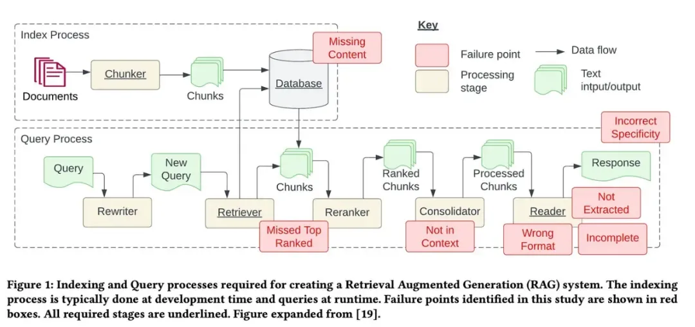

1. **内容缺失**：知识库中缺失上下文，RAG 只能提供不精确、甚至是错误的答案。

- 解决方案：可以通过**数据清洗**和 **prompt 优化**（比如在 prompt 中加入"如果你不确定答案是什么，就告诉我你不知道"的提示，防止模型胡说八道）缓解。

2. **错过排名靠前的文档**：由于检索时缺乏上下文，导致检索到的关键文档排名靠后，没有返回给用户。

- 解决方案：可以通过 **chunk_size** 和 **similarity_top_k** 平衡计算效率和质量，以及采用 **Rerank 算法**。

3. **不在上下文中**：无法将检索到的文档全部放在输入模型的上下文中，尤其是检索到大量文档时。

- 解决方案：使用**长上下文**的方法，例如需要对文档进行合并、插值等。

4. **未提取**：LLM 倾向于检索近似值而不是精确值，导致包含很多不相关的甚至互相矛盾的信息，可能因为这些噪音损害响应质量。

- 解决方案：**数据清洗，压缩 prompt**，避免**中部丢失问题**（模型对输入上下文开头和结尾的信息理解能力更强，应避免将关键的信息放在中部）。

5. **格式错误**：LLM 忽视了提取特定格式的信息（如表格或列表）的指令。

- 解决方案：prompt 中给出**示例**，简化清晰 prompt，对**输出进行解析**。

6. **特异度不正确**：输出的粒度与输入不一致，比如用户问题很具体，模型回答很宏观；或者用户问题包含详细的上下文，模型生成简短的回复。

- 解决方案：改进检索策略，如从**小到大检索、句子窗口检索、递归检索**；在 prompt 中引导模型生成特定粒度的内容。

7. **不完整**：输出只回答了输入的部分问题。

- 解决方案：之前 RAG 的文章中提到的一些方法，如 **routing** 到最相关的文档库，用户查询重写和分解成子问题。

## RAG 效果评估

可以从以下角度进行评估。

### 准确率/召回率评估

评估 RAG 系统回答问题的正确性和检索相关性，更多指标详见 3.1.6 Retrieval 检索评估指标。主要包括：

- **答案准确率**：比较生成的答案与标准答案的匹配程度，可使用自然语言处理中的评价指标如 **BLEU**（衡量 n 元语法匹配程度）、**ROUGE**（衡量召回的 n 元语法覆盖率）等来量化答案与参考答案的相似度。

- **检索召回率**：评估检索模块是否找到了包含正确答案的文档。例如计算 **Top-k 召回率**（正确答案所在文档是否出现在前 k 个检索结果中）以及 **MRR（平均倒数排名）、NDCG（归一化折损累计增益）**，以衡量正确文档在检索结果中的位置（MRR 越高表示相关文档排名越靠前）。

### 可信度评估

衡量生成的答案在多大程度上有文档支持，以及答案内容和检索到的文档是否一致、可靠。具体包括：

- **答案与支持文档匹配度**：验证生成答案中的关键信息是否能在检索文档中找到。可以计算答案和支持文档之间的相似度或重合率，例如关键词重叠度。

- **文档覆盖率**：检查检索到的文档是否覆盖了回答所需的所有要点。如果答案涉及多个要点，评估这些要点是否均能在提供的文档集合中找到依据。

### 响应速度评估

评估 RAG 系统处理查询的速度，包括：

- **平均响应时间**：系统处理单个查询的平均用时。

- **P95/P99 延迟**：95% 和 99% 的请求在多少时间内完成（尾部延迟），用于评估最慢响应的情况。

- **整体响应分布**：可以绘制响应时间分布图（如直方图）来了解大部分查询的延迟范围。

### 可扩展性评估

测试 RAG 系统在不同数据规模和负载下的性能表现，包括：

- **数据规模扩展**：增大知识库或文档集规模，观察检索和生成性能的变化（如响应时间是否随数据量线性增长，检索准确率是否保持稳定）。

- **吞吐量**：衡量系统每秒可处理的查询数（QPS），以及在高并发情况下的性能表现。

### 用户体验评估

系统给用户带来的主观感受和易用性，包括：

- **人工满意度评价**：通过人工评估或用户反馈来打分，衡量用户对答案的满意度。例如收集用户评分（1-5 分）或对答案是否解决问题的二元反馈，以计算平均满意度分或满意率。

- **答案可读性**：评价生成答案表述的清晰易懂程度。可以使用**可读性评分**（如基于句子长度和词汇复杂度的指标）来定量分析答案文本的可读性，确保答案语言简洁明了，便于用户理解。

## RAG 加速

想要实现 RAG 系统加速，也就是提升首字响应速度，就要首先找到消耗时间最长的步骤，并对其进行加速。RAG 的时间占用主要分为 4 个部分：

- **查询向量 embedding**

- **向量检索**

- **构建上下文**

- **infra 时间**，包括网络 / 队列 / I/O 等。

### Embedding 阶段

假设此阶段调用 OpenAI API 实现。

**存在问题：**

- **批量 Embedding**：可以把待嵌入的多个查询或文本段组合成数组传入单次 API 调用，避免逐条请求所带来的网络开销。请求不能超出最大 token 限制。

- **并发调用与异步处理**：异步非阻塞调用能让 CPU 空闲时间用于处理其它任务，从而提升整体吞吐。通过 Python 的 `asyncio` 等异步框架，可以在等待一个 Embedding 结果时并行触发其他请求。实践中 OpenAI 对并发请求有一定限制，过高并发可能引起排队延迟，一般将并发控制在个位数，并监控接口返回的速率限制信息。

- **缓存 Embedding 结果**：对于常见问题或频繁查询，可以在首次获取 Embedding 后将 `query->embedding` 键值对存入内存或 Redis 缓存。下次遇到相同查询时直接复用缓存向量，跳过 API 调用，从而显著降低延迟。需要设计缓存键（可用查询字符串或其哈希）并考虑到语义相近但不完全相同的查询不会命中缓存的情况。对于文档语料，**尽量预先计算并存储 Embedding**，避免在查询时现算。

```Python
pip install openai redis tiktoken
import os, json, asyncio, hashlib, redis, tiktoken, openai
openai.api_key = os.getenv("OPENAI_API_KEY")
MODEL, DIM = "text-embedding-3-small", 1536
enc = tiktoken.encoding_for_model(MODEL)
redis_cli = redis.Redis(host="localhost", decode_responses=True)
def _key(text):
    return "emb:" + hashlib.sha1(" ".join(text.split()).lower().encode()).hexdigest()
async def _embed_batch(batch):
    resp = await openai.Embedding.acreate(model=MODEL, input=batch)
    return [d["embedding"] for d in resp["data"]]
async def embed(texts, concurrency=5, token_cap=8191):
    # ① 批量分组
    batch, cur, out, sem = [], 0, [], asyncio.Semaphore(concurrency)
    async def run(b):           # ② 异步 + 并发
        async with sem: return await _embed_batch(b)
    async def push():           # 发起单批
        nonlocal batch, cur; out.extend(await run(batch)); batch, cur = [], 0
    tasks = []
    for txt in texts:
        if (vec := redis_cli.get(_key(txt))):   # ③ 缓存命中
            out.append(json.loads(vec)); continue
        tok = len(enc.encode(txt))
        if cur + tok > token_cap and batch: tasks.append(asyncio.create_task(push()))
        batch.append(txt); cur += tok
    if batch: tasks.append(asyncio.create_task(push()))
    await asyncio.gather(*tasks)
    # ④ 把新算的结果写缓存
    for t, v in zip(texts, out):
        redis_cli.set(_key(t), json.dumps(v), ex=86400)
    return out
```

### 向量检索阶段

假设采用 Milvus 数据库。

- **优化索引**：采用近似最近邻算法构建索引，例如 **IVF**、**HNSW** 等，以大幅提升检索速度。IVF 索引可调节细分簇数量 `nlist` 和查询探测范围 `nprobe`，HNSW 可调节每层节点数 `efConstruction`。

- **批量查询与并发连接**：Milvus 支持在一次请求中执行**批量搜索**（即传入多个查询向量一起检索），这相比逐一查询能减少网络开销和调度开销，适用于需要同时回答多子问题或多用户批量请求的场景。对于并发请求量高的系统，可在客户端维护连接池或使用多线程/协程并发查询 Milvus。Milvus 2.x 的无锁架构对并发查询有良好支持，但仍需确保后端资源充足（CPU/内存不成为瓶颈）。如果 QPS 需求特别高，可以增加检索副本：Milvus 允许在内存中加载数据的多个副本来提高并行查询能力。通过在 `Collection.load()` 时设置 `replica_number>1`，可以启用多副本使查询负载分摊到不同 Query Node，从而提升整体吞吐。例如，将副本数设为 4 可显著提高 QPS 上限。同样，需要搭配增加 Milvus 后端的 QueryNode 实例数和计算资源，以充分利用副本带来的并行度。

- **优化数据分片与过滤**：利用 Milvus 的分区和过滤功能缩小检索范围，从而减少每次查询需要遍历的向量数量。如果先验知道查询只涉及某部分语料（例如按来源、时间分区的数据），可将向量集合按属性切分成分区，查询时指定相应分区检索，避免全库扫描。对于规模超大的向量集合，合理分片（sharding）有助于降低单机内检索延迟。同时剔除过期或低相关的向量（例如对知识库定期清理无用数据）可减小索引规模，使查询更高效。

- **系统配置与硬件加速**：调整 Milvus 的配置以匹配性能需求。例如，在保证召回的前提下将搜索参数 `efSearch`（对 HNSW）或 `nprobe`（对 IVF）设为较小值以加快查询。确保在查询前调用 `collection.load()` 将数据加载至内存，并设置合适的 `cache_config`（Milvus 会将常用数据页缓存在内存）。如果数据规模巨大或需要亚毫秒级查询延迟，可考虑 GPU 加速：使用 Milvus 的 GPU 版本或将向量数据托管到支持 GPU 的向量引擎上，以利用 GPU 的并行计算能力执行向量点积运算。不过 GPU 方案需要权衡部署成本，通常在超大规模或低延迟（如实时推荐）场景才需要。总体而言，充分利用 Milvus 的并行和内存特性。

```Python
# pip install pymilvus==2.3.4
from pymilvus import connections, FieldSchema, CollectionSchema, DataType, Collection

connections.connect(host="127.0.0.1", port="19530")

fields = [
    FieldSchema("id",  DataType.INT64,  is_primary=True, auto_id=True),
    FieldSchema("vec", DataType.FLOAT_VECTOR, dim=DIM),
    FieldSchema("txt", DataType.VARCHAR, max_length=1024)
]
col = Collection("rag_docs", CollectionSchema(fields))
# ① HNSW 索引（只建一次）
if not col.indexes:      
    col.create_index("vec", {"index_type":"HNSW", "metric_type":"IP",
                             "params":{"M":16, "efConstruction":128}})

# ② 把向量加载到内存，并开 4 副本
col.load(replica_number=4)         

def search(vecs, k=5, ef=64):
    p = {"metric_type":"IP", "params":{"ef":ef}}
    res = col.search(vecs, "vec", p, k=k, output_fields=["txt"])
    return [[hit.entity.txt for hit in hits] for hits in res]
```

### 系统层级优化

- **异步架构与并发设计**：采用异步非阻塞架构以充分利用服务器资源，提高整体吞吐量。例如使用 Python 的 `asyncio` 或多线程池，让 Embedding 计算、向量检索、LLM 生成等步骤能够流水线并行或重叠执行，同时处理多个用户请求，在生成回答的同时预取下次检索。针对高并发的场景，可引入任务队列（如 RabbitMQ、Kafka）和工作进程批量处理请求。例如积攒一定数量的查询统一进行 Embedding 或检索操作，以摊薄单次处理开销。同时，可以部署**多实例 LLM 服务**（如果使用自托管模型）或使用 **OpenAI 多 API Key 分流**，请求端做负载均衡以避免单点瓶颈。

```python
#全链路异步流水线
async def rag_once(question, k=3):
    q_vec = (await embed([question]))[0]           # ① embed
    docs = search([q_vec], k=k)[0]                 # ② retrieval
    prompt = build_prompt(question, docs)          # ③ prompt
    print("n[AI] ", end="", flush=True)
    await stream_chat(prompt)                      # ④ generate

# Demo
# asyncio.run(rag_once("量子计算的基本原理？"))

# 服务化（FastAPI + 线程池）
# pip install fastapi uvicorn
from fastapi import FastAPI
import uvicorn, asyncio
from concurrent.futures import ThreadPoolExecutor
pool = ThreadPoolExecutor(20)     # Milvus + OpenAI 并发

app = FastAPI()

@app.post("/rag")
async def api(req: dict):
    q = req["question"]
    loop = asyncio.get_event_loop()
    # 把阻塞 I/O 移出事件循环
    await loop.run_in_executor(pool, lambda: asyncio.run(rag_once(q)))
    return {"ok": True}

if __name__ == "__main__":
    uvicorn.run(app, host="0.0.0.0", port=8080)
```

- **引入缓存层（Redis 等）**：在系统中增加缓存机制，用空间换时间，避免重复计算开销。缓存可存在多个层次：**（1）Embedding 缓存**：缓存常见查询文本的向量表示，下次出现直接复用；缓存文档向量同样重要，静态语料库可以离线算好全部向量并存入 Milvus 或 KV 存储。**（2）检索结果缓存**：对于经常被查询的问题，其检索到的文档列表往往相同，可缓存这些文档 ID 列表，下次查询时直接使用缓存结果而无需访问向量库。**（3）答案缓存**：对于高度重复且答案固定的提问（如 FAQ），可以直接缓存上一次的完整回答文本。下次相同提问立即返回缓存答案，实现近乎零延迟响应。需要注意对于有时效性的数据（如新闻、股价），缓存过久可能失准，需设置适当 TTL 或在数据更新时主动清除相关缓存。使用 Redis 这类内存 KV 存储可以提供毫秒级的读取性能，适合做共享缓存层。同时通过哈希 key（例如将 query 字符串规范化后哈希）索引缓存内容，并采用 LRU 策略淘汰冷门条目。总之，缓存系统的引入能大幅减少重复调用 OpenAI API 和向量库的次数，从架构上加快响应。

```python
# Embedding缓存
EMB_TTL = timedelta(days=30)       # 静态文档可更长

async def get_embed_cached(text: str):
    key = f"emb:{_hash(text)}"
    if (vec := _get(key)):
        return vec                 # 命中缓存
    vec = (await embed([text]))[0]
    _set(key, vec, EMB_TTL)
    return vec

# 检索结果缓存
SEARCH_TTL = timedelta(days=1)     # 语料相对稳定，可按需调整

def search_cached(question: str, q_vec, k=3):
    key = f"srch:{_hash(question)}:{k}"
    if (hits := _get(key)):
        return hits
    hits = search([q_vec], k=k)[0]         # 调 Milvus
    _set(key, hits, SEARCH_TTL)
    return hits

# 答案缓存
ANS_TTL = timedelta(days=7)        # FAQ 可更长；时效数据可减小

async def answer_cached(question: str):
    key = f"ans:{_hash(question)}"
    if (ans := _get(key)):
        return ans                 # 秒级返回

    # —— 缓存未命中：正常 RAG 流程 ——
    q_vec  = await get_embed_cached(question)
    docs   = search_cached(question, q_vec, k=3)
    prompt = build_prompt(question, docs)

    # 不需要流式时可直接用 openai.ChatCompletion
    chunks = []
    async for tok in stream_chat(prompt):   # 自行实现 yield token
        chunks.append(tok)
    answer = "".join(chunks)

    _set(key, answer, ANS_TTL)
    return answer
```