# ReRank

**ReRank（重排序）** 作为 RAG 模型中在 retrieve 和 generation 之间的一个重要环节，主要负责在大范围检索完成后对候选文档进行再**精排序**，从而提升最终大模型生成结果的质量和关联性。

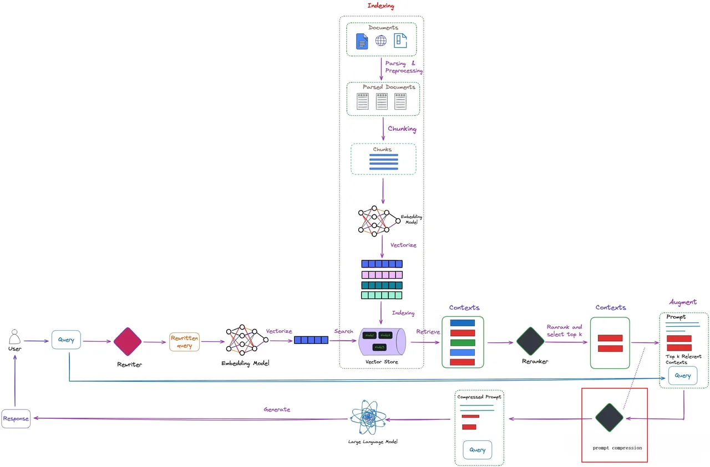

**ReRank 的作用：**

- **提升检索结果相关性**：RAG 粗排返回的文档质量和相关性可能较差，ReRank 采用更精细的语义匹配模型，过滤掉与用户问题相关性较低的文档，以及噪声和不相关的信息。

- **复杂语义理解**：ReRank 能帮助大模型更好地理解和利用检索到的信息，强化相关文档的影响，从而提升生成结果的相关性和准确性。

- **降低生成模型负担**：RAG 检索到的文档数量较多，通过 ReRank 能减少输入文档数量，缩短上下文长度。

## 综述

首先从综述《Large Language Models for Information Retrieval: A Survey》来了解学术界 ReRank 的做法：

现有的涉及 LLM 的重排方法大致可以分为三类：**监督式重排**、**无监督式重排**以及**利用 LLM 做训练数据的增强**。

### 监督式重排

由于在 LLM 预训练阶段缺少 ReRank 意识，因此需要在任务相关的排序数据集上进行微调（例如 MS MARCO passage ranking dataset，这种数据集针对每个条目都包含了相关和不相关的信息），使其能够更好地衡量查询与文档之间的相关性，并理解重排任务的要求。

#### Encoder

使用基于编码器（Encoder）的 LLMs 进行文档重排。将查询和文档拼接为一个序列，例如 "[CLS] query [SEP] document [SEP]"，通过计算 "[CLS]" 位置的表示向量，输入到线性层中，得到相关性分数。使用交叉熵损失函数进行优化，以学习用户查询与文档之间的相关性。

- **代表方法**：monoBERT。

- **优点**：利用现有的预训练模型（如 BERT），通过简单的微调即可应用于重排任务，简单高效。

#### Encoder-Decoder

使用基于编码器-解码器（Encoder-Decoder）的 LLMs 进行文档重排。一般作为生成任务训练，将查询和文档作为输入，训练模型生成一个特定的标记（如 "true" 或 "false"）来表示文档的相关性。在推理阶段，通过计算生成标记的 logits，使用 softmax 函数计算相关性分数。

- **代表方法**：monoT5、DuoT5、RankT5。

- **优点**：能够通过生成任务的形式来学习查询与文档之间的复杂语义关系。

#### Decoder

使用基于解码器（Decoder-only）的 LLMs 进行文档重排，通过解码器的最后一层表示向量计算相关性分数。也可以利用现有的 ranking 算法（Cohere 等）来辅助训练重排模型。

- **代表方法**：RankLLaMA、TSARankLLM、Q-PEFT、PE-Rank。

- **优点**：解码器模型在生成任务上表现优异，能够生成高质量的相关性标记。

### 无监督重排

随着大模型参数量的激增，微调大模型也变得困难。可以通过 prompt 工程来提升 ReRank 效果，不依赖标注数据，而是直接利用 LLM 的语言能力来评估查询与文档的相关性，通过 prompt 引导模型生成相关性评分。这种方法可以分为三种：**Pointwise**、**Listwise** 和 **Pairwise**。

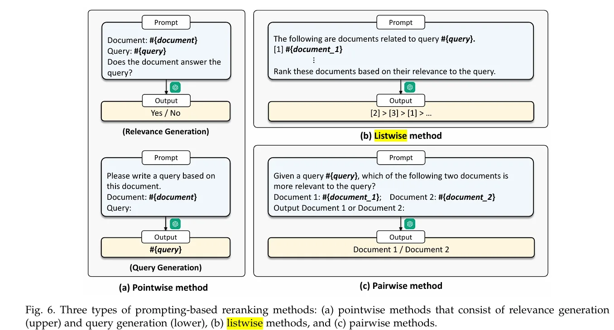

#### Pointwise

Pointwise 方法通过评估单个文档与查询的相关性来对文档进行重排。这些方法可以进一步细分为两类：**相关性生成（Relevance Generation）** 和 **查询生成（Query Generation）**。

- Relevance Generation 方法直接要求 LLM 输出"真"或"假"标签。基于生成的标签计算相关性分数，通常使用 softmax 函数计算"是"和"否"的概率。Query-Document 的相关性分数为：

$$S(q,d) = \frac{e^{S_Y}}{e^{S_Y} + e^{S_N}}$$

其中 $S_Y$ 和 $S_N$ 表示"真"或"假"的 log-likelihood 分数。

- Query Generation 基于 Document 生成一个预测 Query，然后基于生成查询的 log-likelihood 计算相关性分数：

$$\text{score} = \frac{1}{|q|} \sum_i \log p(q_i | q_{<i}, d, \mathcal{P})$$

其中 $|q|$ 表示 Query 的 token 数，$d$ 表示 Document，$\mathcal{P}$ 表示预测 prompt。

- **举例**：**Discrete Prompt Optimization via Constrained Generation for Zero-shot Re-ranker**

定义 $\rho^*$ 作为指导 LLM 生成最接近于用户 Query 的 prompt：

$$\rho^* = \arg\max_\rho \mathbb{E}_{(d_i, q_i) \in D}[P(q_i | d_i, \rho)]$$

其中 $D$ 包含了所有的用户 Query 和其对应的检索到的相关 Document。为了解决寻找最优 prompt $\rho^*$ 的问题，本文用基于鉴别器的条件生成方法解决，该方法遵循**贝叶斯公式**：

$$P(\rho | D_s) = \frac{P(D_s | \rho) P(\rho)}{P(D_s)}$$

其中 $M_D$ 是 zero-shot 的重排器作为鉴别器，$M_G$ 作为 decoder-only 的大模型作为生成器，$D_s$ 为数据集 $D$ 的子集。

鉴别器 $M_D$ 用于衡量 prompt 能否指导大模型生成好的 Query，$P_{M_D}(D_s| \rho)$ 表示 Query-Document 对 $(q_i, d_i)$ 之间的相关性期望：

$$P_{M_D}(D_s | \rho) = \mathbb{E}_{(q_i, d_i) \in D_s}[S_{M_D}(q_i, d_i)]$$

由于直接计算词表中所有的 token 耗时过长，因而生成器 $M_G$ 只从鉴别器衡量过的 prompt 进行采样。生成器采用 beam search 的方式选取每一轮的 token。整体训练如下：

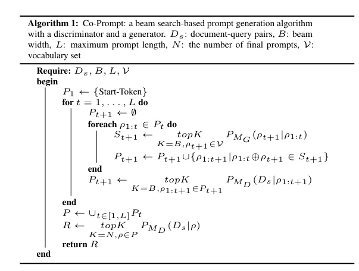

#### Listwise

LLM 的输入是用户 Query 和一些检索到的 Document，要求 LLM 对其进行排序。由于 LLM 的上下文长度有限，这里也会采用一些 Long Context 的方法（例如**滑动窗口、分批次排序**）。能够同时考虑多个文档的相关性，生成更全局的重排结果，使用 GPT-4 做 LLM 的方法取得了比较好的性能。

**缺点：**

- 只有在使用很大的模型（例如 GPT-4）才能取得良好的性能

- 对 Document 在 prompt 中的**顺序敏感**，当 Document 随机时，其效果甚至差于 BM25

- 滑动窗口大小限制了一次能排序的文档数量，相邻窗口之间的依赖限制了并行推理

- **举例**：**Zero-Shot Listwise Document Reranking with a Large Language Model**

作者提出使用如下 prompt 来让 LLM 实现 Document 的重排，方括号后生成一系列按相关性重新排序后的 Passage ID。为了解决输入长度的限制，作者采用滑动窗口的方法。

#### Pairwise

Pairwise 方法利用了大模型天生擅长做对比的特点，输入为用户查询和文档对，生成一个表示哪个文档更相关的标记。

- **举例**：**Large Language Models are Effective Text Rankers with Pairwise Ranking Prompting**

本文提出的 Pairwise Ranking Prompting (PRP) 支持生成式和打分式的输出，但是生成式可能生成无关内容，所以主要讨论打分式。PRP 的输入为三元组形式 $u(q, d_1, d_2)$，并且利用 LLM 对输入顺序敏感的特点，同一个三元组会变换顺序输入到模型两次，若两次结果相反，则认为两个 Document 得分一样。

基于 PRP，本文还提出三种变体：

1. **PRP-Allpair**：对所有的 Document 都进行比较，缺点是时间复杂度 $O(N^2)$

2. **PRP-Sorting**：使用快排或者堆排等算法，时间复杂度 $O(N \log N)$

3. **PRP-Sliding-K**：类似于冒泡排序，但是由于 ReRank 只关心 Top K 的文档，这里 $K$ 比较小，总体复杂度 $O(K \log N)$

### 利用 LLM 做训练数据的增强

训练数据增强的目标是通过生成额外的训练样本来扩充有限的标注数据集，从而提高模型的泛化能力和性能。ExaRanker 使用 GPT-3.5 生成检索数据库的解释，然后利用 Query-Document 对的解释来训练 seq2seq 排序模型来生成相关性标签。InPars-Light 提出利用 prompt 要求大模型基于 Document 生成 Query，ChatGPT-RetrievalQA 提出基于用户 Query 合成 Document。此外还有方法提出将 GPT 的 ranking 能力迁移到小模型，利用 GPT 生成 ranking 列表来训练较小的模型。

## ReRank 与 Embedding

首先分辨一下 ReRank 模型和 Embedding 模型的异同：

- **Embedding 模型**（例如 **Bi-Encoder**）的目的是将文本转化成向量表示，以便直接用于计算用户问题和文档之间的相似度。使用 Bi-Encoder 进行向量搜索时，**在创建 Document 文档时**就完成了所有繁重的 Transformer 计算。当用户发起查询时，**只需要运行一个 Transformer 计算生成查询向量**，在计算用户查询和 Document 之间的相似度，效率极高。

    **Embedding 模型存在的问题**

    - Embedding 模型只是将文本信息压缩为固定长度的向量，可能会导致**语义信息丢失**、**理解多义词困难**、**长文本语义平均化**等问题。

    - 因为**在用户提出问题之前就已经为文档创建了嵌入，无法理解用户问题的上下文信息**。

    - Embedding 模型计算整个查询和文档之间的相似度，难以捕捉**词级、句级或精确语义关系**。

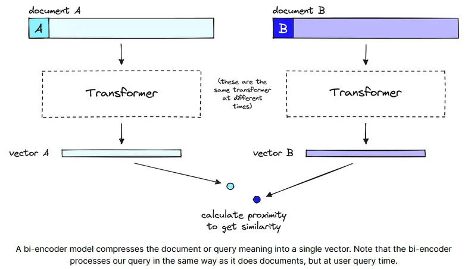

- **ReRank**（例如 **Cross-Encoder**）是在初步检索的基础上进行进一步的排序，在用户提出查询时才运行，这让我们能够针对具体查询分析文档的含义，而非仅生成一个泛化的、平均化的含义。缺点是要对用户查询和相关的多个文档一起运行 Transformer 推理，消耗更长的时间。

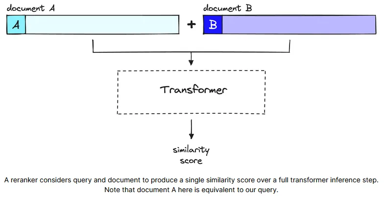

为什么 ReRank 精度更高？

- ReRanker 不进行预计算，而是将用户查询和一个文档一起输入到 Transformer 中，能更好的捕捉两者之间语义和上下文信息。

- Embedding 模型将用户查询和文档压缩到低维向量中，可能丢失细粒度语义。

**总结**：ReRank 模型的精度要更高，但其开销也更大。所以一般是用 Embedding 模型作初步筛选，再做 ReRank，也被称为 **Two-Stage Retrieval**（两阶段检索）。

## 传统Rerank模型

### 编码器模型（Bert）

参考：PASSAGE RE-RANKING WITH BERT

将 Bert-LARGE 模型作为一个分类模型，即使用 BERT 中的 **[CLS] 标记**，通过单层神经网络输入从而获取概率输出，根据这些概率对文本进行重排序，类似于 Cross-Encoder（将用户查询和单个文档一起交给一个bert模型，直接计算二者的相似度，不产生embedding）。输入格式类似于：

```Python
**Input**: [CLS] *query*_*token*_*ids* [SEP] *doc*_*token*_*ids* [SEP]
```

这里限制query最长64token，整个输入最长512个token。模型的输出是相关性打分。将预训练好的bert模型进行微调，使用的损失函数为：

$$\mathcal{L} = -\frac{1}{N} \sum_{i=1}^{N} [y_i \log(\hat{y}_i) + (1 - y_i) \log(1 - \hat{y}_i)]$$

实现代码：

```Python
# https://github.com/nyu-dl/dl4marco-bert/blob/master/convert_msmarco_to_tfrecord.py
def write_to_tf_record(writer, tokenizer, query, docs, labels,
                       ids_file=None, query_id=None, doc_ids=None):
  query = tokenization.convert_to_unicode(query)
  # 转化 query token id，在前面添加了 [CLS]  
  query_token_ids = tokenization.convert_to_bert_input(
      text=query, max_seq_length=FLAGS.max_query_length, tokenizer=tokenizer, 
      add_cls=True)

  query_token_ids_tf = tf.train.Feature(
      int64_list=tf.train.Int64List(value=query_token_ids))

  for i, (doc_text, label) in enumerate(zip(docs, labels)):
        # 转换为 doc token ids， 没有添加 [CLS]    
    doc_token_id = tokenization.convert_to_bert_input(
          text=tokenization.convert_to_unicode(doc_text),
          max_seq_length=FLAGS.max_seq_length - len(query_token_ids),
          tokenizer=tokenizer,
          add_cls=False)

    doc_ids_tf = tf.train.Feature(
        int64_list=tf.train.Int64List(value=doc_token_id))
        
        # 数据集标签    labels_tf = tf.train.Feature(
        int64_list=tf.train.Int64List(value=[label]))
        
    features = tf.train.Features(feature={
        'query_ids': query_token_ids_tf,
        'doc_ids': doc_ids_tf,
        'label': labels_tf,
    })
```

### 解码器模型（GPT）

参考：SGPT: GPTSentence Embeddings for Semantic Search

#### SGPT Cross-Encoder

通过 GPT 实现 Cross-Encoder 交叉编码器。具体的方法是将 query 和 document 拼接起来一起编码，然后基于获取的对数概率 (log probabilities) 来计算分数。

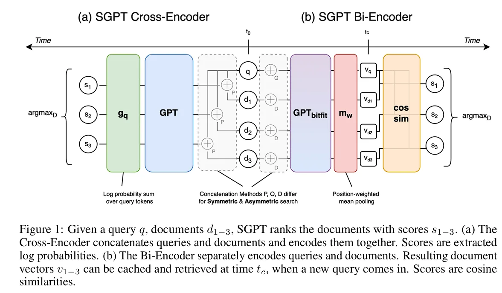

给定用户查询q，文档集合D，目标是查询最相关的文档d*，基于贝叶斯公式有：

$$P(d|q) = \frac{P(q|d)P(d)}{P(q)}$$

这里边P(q)是固定值，P(d)变化量比较小。这里限制了模型输出的query长度和原始用户query长度一样，并对过长的document进行了裁剪，由于用户query长度是固定的，比较P(q|d)也更容易。

实现代码：

```python
## https://github.com/Muennighoff/sgpt/blob/main/README.md#asymmetric-semantic-search-ce
prompt = 'Documents are searched to find matches with the same content.\nThe document "{}" is a good search result for "'
for query in queries:
    print(f"Query: {query}")
    for doc in docs:
        context = prompt.format(doc)

        context_enc = tokenizer.encode(context, add_special_tokens=False)
        continuation_enc = tokenizer.encode(query, add_special_tokens=False)
        ## 拼接 query 和 document         
        model_input = torch.tensor(context_enc+continuation_enc[:-1])
        continuation_len = len(continuation_enc)
        input_len, = model_input.shape
    
        ## 获取对数概率        
        logprobs = torch.nn.functional.log_softmax(model(model_input)[0], dim=-1).cpu()
        logprobs = logprobs[input_len-continuation_len:]
        ## Gather the log probabilities of the continuation tokens -> [continuation_len]        
        logprobs = torch.gather(logprobs, 1, torch.tensor(continuation_enc).unsqueeze(-1)).squeeze(-1)
        score = torch.sum(logprobs)
        ## The higher (closer to 0), the more similar        
        print(f"Document: {doc[:20] + '...'} Score: {score}")
```

## ReRank模型盘点

为了衡量检索系统的有效性，主要依赖两个指标:、

- **命中率**（Hit rate）：计算在前k个检索文档中**找到正确答案的查询比例**。简单来说，它是关于我们的系统在前几次猜测中正确的频率。

- **平均倒数排名**（MRR）：对于每个查询，MRR通过查看排**名最高的相关文档的排名来评估系统的准确性。**具体来说，它是所有查询中这些秩的倒数的平均值。因此，如果第一个相关文档是顶部结果，则倒数排名为1;如果是第二个，倒数是1/2，以此类推。

现有Embedding和ReRank模型的测评效果：

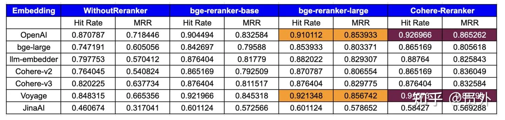

### cohere-reranker-v3.5

这是个闭源模型，也是采用two-stage retrieval，在第二阶段的rerank采用llm计算用户问题和文档之间的相关性得分。

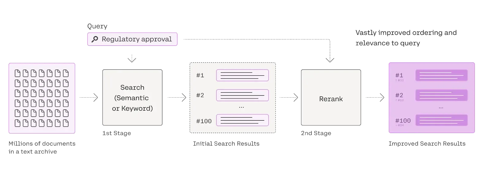

实现代码：

```Python
import cohere
co = cohere.Client("{apiKey}")
results = co.rerank(query=query, documents=documents, top_n=3, 
    model="rerank-multilingual-v2.0")
```

### BGE Re-Ranker v2.0

<https://huggingface.co/BAAI/bge-reranker-v2-m3>

如下图所示，系统会首先借助**向量模型**（BGE-M3-Dense）与**稀疏检索模型**（BGE-M3-Sparse）分别从向量数据库与倒排索引中初步获取粗粒度的候选文档（coarse-grained candidates）。紧接着，系统会进一步利用**排序模型**（BGE Re-Ranker）进一步过滤候选集，并最终获得精细的文档集（fine-grained candidates）。

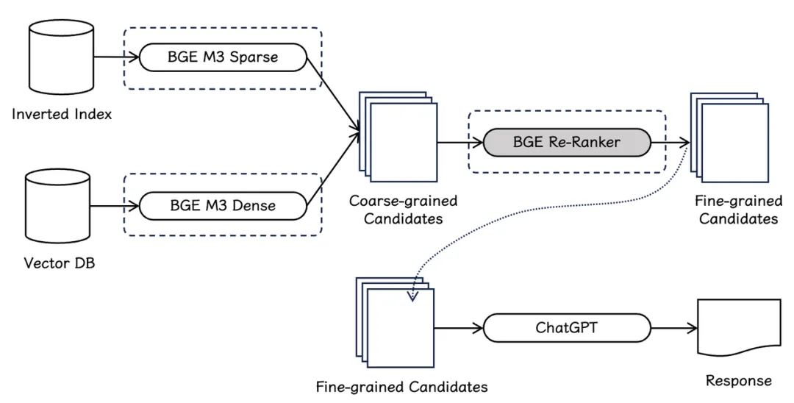

BGE Re-Ranker v2.0 系列排序模型采用了两种不同尺寸的模型基座，基座模型都在多语言数据上训练得到，并且通过引入由CLIP模型生成的vision token，具有文本+图片混合建模能力：

- **BGE Re-Ranker v2-LLM：**基于 MiniCPM-2B，Gemma-2B 等性能卓越的轻量化大语言模型。

- **BGE Re-Ranker v2-M3**：基于性能出色、参数量更小的 BGE-M3-0.5B 速度更快。

BGE Re-Ranker v2.0 采取了**分层自蒸馏**训练策略，用适度的计算开销换取显著的性能收益（下图 （C））。具体而言，模型最终排序得分（S(0)）被用作教师信号，利用知识蒸馏的方式，模型的各中间层也被学习并赋予了排序能力。在实际应用中，用户可以基于具体场景的算力条件及时延限制灵活选择排序模型的层数。

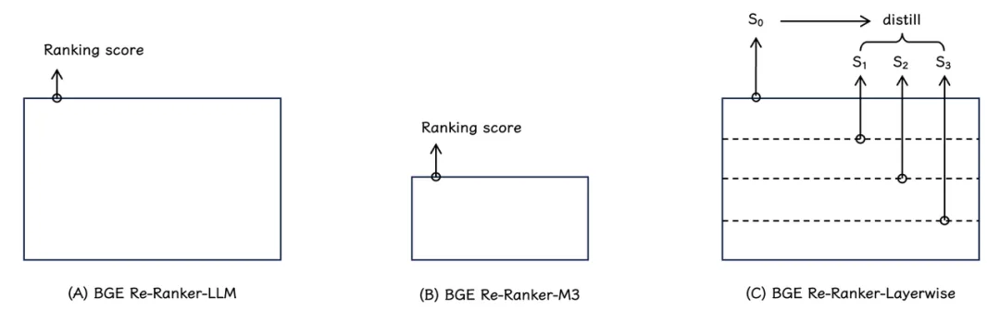

BGE Re-Ranker v2.0是由BGE-M3等embedding模型作为基座训练而来，由于BGE Re-Rank没有发表对应的论文，因此接下来介绍BGE最著名的模型 BGE M3的《BGE M3-Embedding: Multi-Lingual, Multi-Functionality, Multi-Granularity Text Embeddings Through Self-Knowledge Distillation》论文。

BGE-M3由北京智源研究院（BAAI）开发，基于Bi-Encoder架构，使用预训练的Transformer模型（ [**XLM-RoBERTa**](https://huggingface.co/FacebookAI/xlm-roberta-large)）对用户查询和文档进行联合编码，直接输出二者的相关性分数。该模型支持多语言、文本+图片检索方式和更长的文本长度。

#### 混合检索

M3-Embedding统一了密集检索、词汇（稀疏）检索和多向量检索。

- **密集检索**：用户查询首先经过一个encoder转换成隐层状态$H_q$，其中$H_q[0]$表示整个句子的向量，也就是**`\[CLS\]` 标记**，使用`\[CLS\]` 标记的归一化向量表示文本，通过内积计算相似度：

$$s_{\text{dense}}(q, d) = \left\langle \frac{H_q[0]}{\|H_q[0]\|}, \frac{H_d[0]}{\|H_d[0]\|} \right\rangle$$

- **稀疏检索**：定义词级权重为：

$$w_t = \text{MLP}(h_t)$$

如果一个单词出现了多次，则只统计最大的权重。相似度计算为共现词权重的乘积和：

$$s_{\text{sparse}}(q, d) = \sum_{t \in V} w_{q,t} \cdot w_{d,t}$$

- **多向量检索**：使用整个输出嵌入$H_q$来表示用户查询和文档，通过跨 token 交互计算相似度，其中N和M分别是用户查询和文档的长度：

$$s_{\text{multi}}(q, d) = \frac{1}{N} \sum_{i=1}^{N} \max_{j=1}^{M} \langle H_q[i], H_d[j] \rangle$$

最终查询时将这三个损失加权求和。

#### 自蒸馏

embedding模型的目的是区分出**正样本和负样本**，给正样本评分更高，负样本评分更低。对于以上三种检索方法，可以计算出3种**InfoNCE损失**：

$$\mathcal{L}_{\text{InfoNCE}} = -\log \frac{e^{s(q, p^+)/\tau}}{e^{s(q, p^+)/\tau} + \sum_{p' \in P'} e^{s(q, p')/\tau}}$$

其中p*和P'分别表示对于用户查询q来说的正负样本（相关文档和不相关文档），s()表示以上三种相似度的一种。

由于三种检索方式可能存在一定的冲突，为了统一三种损失，作者提出了**自蒸馏**的方法。将三种检索分数加权求和作为教师信号：

$$s_{\text{kd}} = s_{\text{dense}} + s_{\text{sparse}} + s_{\text{multi}}$$

对每个检索方法，使用教师信号指导其损失计算：

$$\mathcal{L}_{\text{kd}} = -\sum_{d \in D} p_{\text{kd}}(d) \log p_*(d)$$

其中p()表示softmax函数，$s_*$表示三种检索的相似性之一，然后将三种损失函数加权求和，

$$\mathcal{L} = \mathcal{L}_{\text{dense}} + \mathcal{L}_{\text{sparse}} + \mathcal{L}_{\text{multi}}$$

总损失函数为：$\mathcal{L}_{final} = (\mathcal{L}+\mathcal{L'})/2$。

BGD-M3的训练流程如下图所示:

- 先在适应**RetroMAE**方法的 **XLM-RoBERTa**模型上进行无监督预训练（RetroMAE的介绍详见Embedding篇），其中只有密集检索采用对比学习的形式。

- 利用自蒸馏微调embedding模型，在这阶段采用了有标签数据和合成数据。

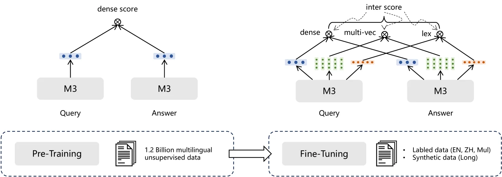

#### 高效批处理

embedding模型需要保持**batch-size足够大**才能充分学习文本之间的差异（也就是in-batch中包含足够多的负样本），传统的将长文本分块方法不适用于BGE-M3，因为本模型需要同时学习长文本和短文本。

为了从不同粒度的输入中学习，并保持大批量大小，作者提出了以下方法：

- 在训练数据预处理时就根据序列长度进行分组，每个batch的数据都来自于同一个组，以减少padding并充分利用GPU。

- 为不同的GPU进行数据采样时，采用固定的种子，保证负载均衡。

- 处理长序列数据时，将batch进一步**细分成sub-batch**，使用**梯度检查点**（Gradient Checkpointing）以降低显存，逐个sub-batch编码后合并结果。此外该方法能有效扩大batch-size，长文本（如 8192 token）批次大小提升 20 倍以上

- **跨 GPU 广播编码结果**，扩大负样本规模。

总结**BGE-M3**的特点：

1. **多语言统一表示**：通过大规模跨语言数据构建，支持 100+ 语言的语义对齐。

2. **多功能检索集成**：首次在单一模型中实现密集、稀疏、多向量检索的统一。

3. **自知识蒸馏框架**：通过集成不同检索功能的教师信号，显著提升模型鲁棒性。

4. **高效训练优化**：创新的批处理策略，显著提升长文本训练效率。

### Jina Reranker v2

<https://huggingface.co/jinaai/jina-reranker-v2-base-multilingual>

jina-Reranker-v2支持多语言，表格搜索，代码检索和函数调用，具有以下特点：

- 是一种**跨编码器（cross-encoder）**模型，只有278M 参数，轻量高效。

- 该模型能够处理多达 524,288 个token的序列，同时保持出色的速度。为了使模型能够处理超过 1024 个token的长文本，该模型使用**滑动窗口方法**将输入文本分块为较小的部分，并分别重新排列每个块。

- 使用** flash attention **进行快速推理，吞吐量比其前代产品高出 6 倍

**Jina Reranker v2训练pipeline**

1. **英文数据准备：**我们仅使用英语数据训练骨干模型，准备了第一个版本，包括配对数据（对比训练）或三元组（查询、正确响应、错误响应）、查询-函数模式配对和查询-表模式配对。

2. **添加跨语言数据：**在下一阶段，我们添加了跨语言配对和三元组数据集，专门改进骨干模型在检索任务上的多语言能力。

3. **添加**所有**多语言数据：**在这个阶段，我们主要专注于确保模型能看到最大量的数据。我们使用来自 100 多种低资源和高资源语言的所有配对和三元组数据集对第二阶段的模型检查点进行微调。

4. **使用挖掘的困难负样本进行微调：**在观察第三阶段的重排序性能后，我们通过添加更多三元组数据进行微调，特别是为现有查询添加更多困难负样本的例子——那些表面上看起来与查询相关，但实际上是错误的响应。

jina-Reranker-v2是在Jina Embeddings v2的基础上采用Cross Encoder，但没有发表专门的jina-Reranker-v2技术报告，因此以下介绍Jina Embeddings v2。

#### 预训练Bert

在修改的Bert模型上预训练，上下文扩展到8192个token。模型细节：

- **Attention with Linear Biases（ALiBi）：**ALiBi在每个注意力层的注意力分数矩阵中引入一个常数偏置项来编码位置信息**。**与原始的方法不同，使用了**对称encoder模型和双向自注意力**，其中$m_i$的计算为：

$$m_i = \begin{cases} b^{2i} & i < a \\ b^{1+2(i-a)} & i \geq a \end{cases}$$

$$a = 2^{\lfloor \log_2 n \rfloor} \quad b = 2^{\frac{-8}{\lfloor \log_2 n \rfloor}}$$

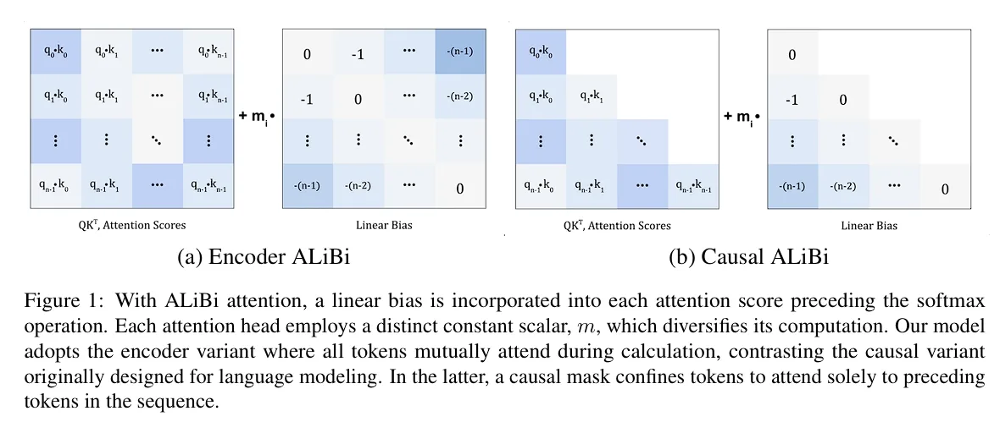

- **Gated Linear Units（GLU）：**对于small模型和base模型，使用GEGLU（GELU激活函数）；对于large模型，使用ReGLU（ReLU激活函数），以提高训练稳定性。

- **Layer Normalization（LN）**：采用post-norm的LN。

**预训练过程要点**：

- 采用**MLM**任务训练，随机掩盖输入词元的30%，使用全词掩盖策略，并让模型推断这些被掩盖的词元。被掩盖的词元中，80%被替换为[MASK]，10%被替换为随机词元，剩余10%保持不变。

- 预训练阶段序列长度限制在512以内，每个批次的全局批量大小为4096，由于序列长度不同，计算损失时每个批次包含的被掩盖词元数量也不同。

- 采用**AdamW**优化器和**FP16**动态混合精度训练

#### 微调

为了微调文本embedding模型，额外添加了一个**平均池化层**，平均文本中的token embedding以将将各token的嵌入向量平均合并为单个向量，无需额外可训练参数。该过程分为两个主要阶段：**基于文本对的微调** 和 **结合困难负样本的微调。**

- **基于文本对的微调：**

    - **数据来源**：约40种不同的数据源，包括标题-摘要对（提升聚类任务性能）。采用**一致性过滤**（Consistency Filtering）提升文本对质量。批次构建时，随机选择数据源并填充批次，不同数据源的采样率根据质量和数量动态调整。

    - **训练损失**：采用**InfoNCE**损失，并且同时计算查询到目标（q→p）和目标到查询（p→q）的损失，增强对称性。

- **结合困难负样本的微调**

    - 针对**检索任务**（如MSMarco、Natural Questions），每个批次包含一个正样本和15个**困难负样本**（通过检索模型筛选出的相似但无关的文档）。

    - 针对**非检索任务**（如Natural Language Inference），负样本随机选择。

    - 损失函数还是采用对称的形式，并且引入了更多**难负样本**：

$$\mathcal{L} = -\frac{1}{2} \left[ \log \frac{e^{s(q, p^+)/\tau}}{e^{s(q, p^+)/\tau} + \sum_{j=1}^{K} e^{s(q, n_j^-)/\tau}} + \log \frac{e^{s(p^+, q)/\tau}}{e^{s(p^+, q)/\tau} + \sum_{j=1}^{K} e^{s(n_j^-, q)/\tau}} \right]$$

对于embedding模型的训练来说，InfoNCE损失依赖批次内所有样本的对比，一般批次越大，对比信息越丰富，模型性能越好。但大的batch-size会导致显存资源吃紧，Jina Reranker v2采用了以下显存优化技术：

- **FP16混合精度训练**

- **deepspeed**

- **梯度检查点**

Jina Reranker v2的优点

- **多语言支持**：覆盖 100+ 种语言，打造真正无界的全球化搜索体验。

- **结构化数据处理**：支持表格搜索和函数调用，为 Agentic RAG 强势助力。

- **顶级性能**：在包括跨语言问答、英文信息检索、Text-to-SQL 等多个基准测试中表现非常出色。

- **速度为王**：性能较前代提升了 6 倍，搜索响应时间减半。

- **轻量高效**：仅用 278M 参数即达到顶尖性能，体积是同类模型的一半，大幅降低资源消耗。

### mGTE

阿里巴巴通义实验室推出的GTE-Multilingual系列模型，具备高性能、长文档支持、多语言处理及弹性向量表示等特性，显著提升了RAG系统的检索与排序效果。mGTE构建了两阶段RAG的训练流程：

- 首先利用**RoPE和unpadding**方法训练的编码器，该编码器经过两阶段**MLM**预训练得到

- 基于编码器训练用于检索的**混合文本表示模型**（TRM）用作第一阶段粗排，和**rerank模型**用作第二阶段精排。

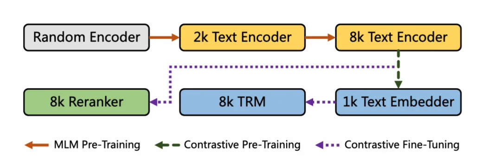

#### 文本编码器

对BERT模型采用了如下的改进：

- 用**RoPE**代替绝对位置编码

- 用**GLU**代替FFN

- 为了加速模型训练，padding后的embedding长度都是64的整数倍。通过**xFormers**框架实现**变长注意力**计算，减少填充（padding）带来的冗余计算，提升训练效率

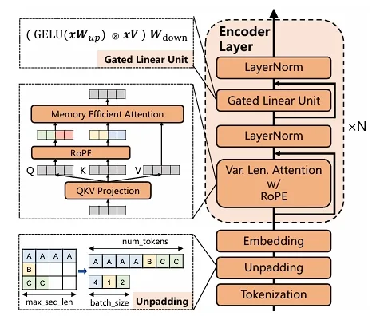

预训练阶段采用MLM任务，掩盖30%的token，采用AdamW优化器，学习率线性预热与衰减，混合精度训练（BF16）。为了保障多语言能力，提升数据少的语言的训练效果，从所有语言中根据概率采样某种语言的数据，其中$n_i$表示语言i的文档数量。

$$p(l_i) = \frac{n_i^\alpha}{\sum_j n_j^\alpha}$$

采用两阶段学习：

- **MLM-2048**：在2048 tokens上下文上预训练，RoPE基值设为10,000。

- **MLM-8192**：扩展至8192 tokens，RoPE基值调整为160,000，以适应更长的序列。

#### 文本表示模型

包含两个阶段：

- **对比学习预训练：**使用encoder输出中提取的[CLS]隐层表示计算余弦相似度，训练损失函数为InfoNCE。batch-size设置为16384，每个batch采用公式（1）中的采样策略。该阶段采用无监督数据集。

- **对比学习微调**：采用了**弹性嵌入（Matryoshka嵌入）策略，**降低存储与搜索成本；采用**稀疏表示**提升长文本检索效果。损失函数为以上两者的相加。该阶段采用有监督数据集，根据文本长度分组，不同长度采用不同批次大小（如短文本批次大，长文本批次小）。采用激活检查点（activation checkpointing）减少显存占用。

#### 文本重排序模型

- 采用Cross-Encoder模型，每个正样本搭配6个困难负样本和4个随机负样本，增强模型区分能力。

- 输入格式：拼接查询与文档为`\[CLS\] query \[SEP\] document`。

- 输出：通过[CLS]标记的隐藏状态预测相关性分数。

总结下ReRank模型的一些技术特点：

- 使用**Cross-Encoder**，将用户查询和文档拼接起来，交给Transformer编码器，能更好的建模两者之间的语义关系。

- 一般都采用**多阶段训练**的方式，逐步扩充上下文长度。

- 损失函数大多采用**InfoNCE**损失，并在对比学习中加入**难负样本**，增强模型的鲁棒性。

- 为了加速训练和节省显存，可能采用deepspeed、混合精度训练、激活检查点、动态批次划分等技术。

- 在性能上，使用了Rerank模型后的精度往往更高

## Qwen3-VL Embedding & Reranker

论文链接：<https://www.arxiv.org/pdf/2601.04720>

代码链接：<https://github.com/QwenLM/Qwen3-VL-Embedding>

### 架构解析

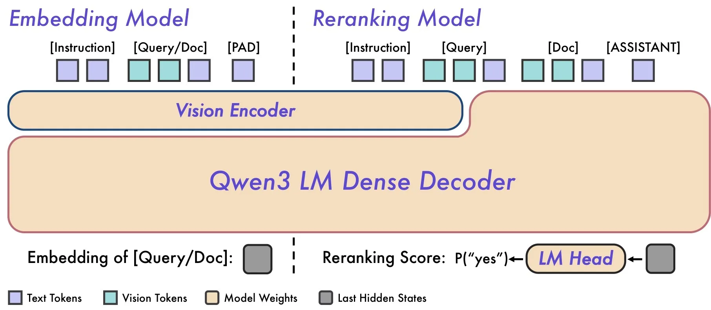

> 模型架构概览：**左图 (Embedding)**：展示了 Vision Encoder 和 LM Dense Decoder 的结合。注意末尾提取 embedding 的位置是在 PAD token 处，这与 BERT 时代的 `\[CLS\]` 类似，但适配了 LLM 的 Decoder-only 架构。 **右图 (Reranking)**：Query 和 Document 被拼接输入，通过 LM Head 直接输出"yes/no"的概率，实现了 token 级别的细粒度交互。

**Embedding 模型**

Embedding 模型采用双塔架构（Bi-encoder），负责将多模态输入转化为稠密向量。

- **核心机制**：输入不仅支持 Text，还支持 Image 和 Video Token。模型巧妙地使用了最后一个 PAD token (`\<\|endoftext\|\>`) 的隐藏状态（Last Hidden State）作为整个输入的向量表示。

- **输入模板**：

```Plain Text
<|im_start|>system {Instruction} <|im_end|>
<|im_start|>user {Instance} <|im_end|><|endoftext|>
```

- 这里 `Instance` 可以是纯文本、图片或视频。

**Reranker 模型 (Cross-encoder)**

Reranker 模型采用交叉编码器架构（Cross-encoder），虽然计算成本高，但能捕捉深层的图文交互。

- 判定逻辑：它不再输出向量，而是作为一个二分类器。通过计算模型预测下一个 Token 是"yes"还是"no"的概率差值，来得出相关性分数。

- 公式：$s = \text{sigmoid}(\text{logit}(\text{yes}) - \text{logit}(\text{no}))$

### 训练方法：三阶段训练流水线

本文中采用了精心设计的**三阶段训练范式**。这套流程将海量弱监督数据转化为高质量的检索能力，也很值得我们借鉴。

#### 训练数据

1. **构建种子池**：对原始图像/视频进行分辨率、长宽比、完整性过滤。再进行跨模态对齐，排除置信度低的标注和视觉-文本对应性差的样本。最后基于 Qwen3-VL-32B生成类别标签，对类别进行平衡（包括3类图像和4类视频任务）。

2. **正负样本优化**：两阶段实现：

    - **Recall阶段**：基于余弦相似度，筛选查询最相关的候选文档。

    - **相关性过滤**：保留高相关性正样本，以及与正样本相似度接近的硬负样本，提升模型判别能力。

#### 三阶段训练策略

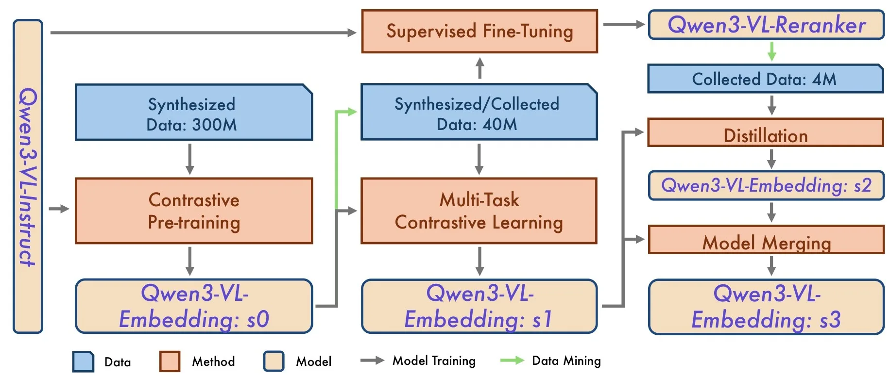

> Qwen3-VL-Embedding 和 Qwen3-VL-Reranker 的多阶段训练流程

**Stage 1: 对比预训练 (Contrastive Pre-training)**

在海量弱监督、噪声数据上进行对比学习，建立相关性理解的基本能力，产出 s0 版本模型。

- **检索任务：**第一阶段采用InfoNCE损失：

$L_{text{retrieval}} = - frac{1}{N} sum_{i}^{N} log frac{e^{s(q_i, d_i^+)/\tau}}{Z_i} $ 

其中$s()$表示余弦相似度， $Z_i$ 聚合了正样本$d_i^+$、难负样本$\{d_{i,k}^-\}_{k=1}^K$、其他批次$\{q_j\}_{j \neq i}$、其他批次中文档$\{d_j\}_{j \neq i}$与$d_i^+$对比、其他批次中文档$\{d_j\}_{j \neq i}$与$d_i^+$对比：

$Z_i = e^{(s(q_i, d_i^+) / \tau)} + \sum_{k}^{K} m_{ik} e^{(s(q_i, d_{i,k}^-) / \tau)} + \sum_{j \neq i} m_{ij} e^{(s(q_i, q_j) / \tau)} + \sum_{j \neq i} m_{ij} e^{(s(d_i^+, d_j) / \tau)} + \sum_{j \neq i} m_{ij} e^{(s(q_i, d_j) / \tau)}$

$m_{ij} = begin{cases} 
0, & text{if } s_{ij} > s(q_i, d_i^+) + 0.1 text{ or } d_j = d_i^+,  
1, & text{otherwise}, 
end{cases}$

$s_{ij}$表示相似度得分

第二阶段移除了query-query/doc-doc对比项。

- **分类数据：**也视为对比学习，待分类样本视为查询，其类别的标签视为文档$d^+$,负样本视为错误标签。

- **语义文本相似度**：数据是对称的（没有query和document区别），采用Cosent损失

$L_{\text{sts}} = \log \left( 1 + \sum_{\hat{s}(q_i, d_j) > \hat{s}(q_m, d_n)} \exp \left( \frac{\cos(q_m, d_n) - \cos(q_i, d_j)}{\tau} \right) \right)$

$\hat{s}(q_i, d_j)$表示这对数据的ground-truth分数。

**Stage 2: 多任务对比学习 (Multi-Task Contrastive Learning)**

基于s0模型数据挖掘出高质量数据，在各类任务上进行对比学习微调，每类任务采用定制化的对比目标，产出 s1 版本 Embedding 模型。损失函数与上一致。并同时训练出 Reranker 模型，训练目标为二分类交叉熵损失：其中标签 $l$ 为"yes"或"no"

$L_{\text{reranking}} = - \log p(l|I, q, d)$ 

最终相关性分数通过 logit 差值计算：$s = \text{sigmoid}(\text{logit}(\text{yes}) - \text{logit}(\text{no}))$

**Stage 3: 蒸馏与模型合并 (Distillation & Merging)**

利用 Reranker 的精细判别能力对 Embedding 模型进行知识蒸馏（产出 s2 版本 Embedding 模型）。最后通过模型合并技术平衡各项任务表现，得到最终的 s3 版本Embedding 模型。蒸馏损失为交叉熵，1个正样本，k个负样本：

$\mathcal{L}_{distill} = -\sum_{i=1}^{k+1} P_{reranker}\left(d_{i} | q\right) \log P_{embedding}\left(d_{i} | q\right)$

### 工程落地实战：MRL、QAT 与架构权衡

#### MRL：自定义维度的魔法

引入了 **Matryoshka Representation Learning (套娃表示学习)**。

- **原理**：训练时强迫模型把核心语义"往前排"。

- **效果**：你可以把 4096 维的向量直接砍成 512 维用。论文数据显示，从 1024 维降到 512 维，检索性能几乎无损，但存储成本砍半，检索速度翻倍。这对于拥有十亿级向量库的业务来说，是巨大的成本节省。

#### QAT：量化感知训练

支持 **Int8 甚至 Binary（二进制）量化**。

- **技术细节**：采用了 **LSQ (Learned Step Size Quantization)**，让模型在训练时就适应量化带来的噪声。这意味着我们可以直接部署 Int8 版本的向量，显存占用减少 75%，而不用担心精度崩塌。

#### 架构选择

最后，我们需要理性看待一个数据：在 MTEB 纯文本检索榜单上，Qwen3-VL-Embedding (69.4分) 确实略低于纯文本版的 Qwen3-Embedding (74.3分)。这是多模态对齐带来的必然代价（Alignment Tax）。因此：

- **如果你的业务主要是文字，偶尔有图**：建议依然采用双流架构。文字部分继续用 BGE 或 Qwen-Text 这种特种兵，保证高精度；只把 Qwen3-VL 当作处理图片的外援。最后用 **Qwen3-VL-Reranker** 做统一收口，因为它在重排序阶段能同时看懂图文，哪怕召回源头不同也能排得准。

- **如果你的业务是视觉密集型（如 PDF 解析、视频库）**：直接上全套 Qwen3-VL。在这种场景下，统一表征空间带来的维护便利性和对视觉信息的理解能力，远大于那 5% 的纯文本指标损失。特别是对于 Visual Document（图表混排文档），Qwen3-VL 的效果是碾压级的。
